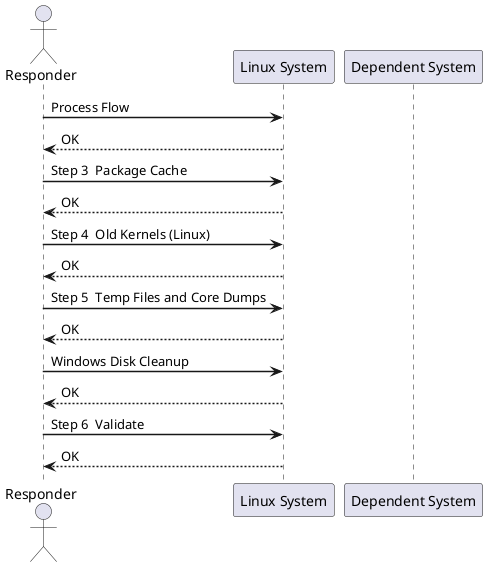

---
tags:
  - linux
  - operations
---
# Disk Space Cleanup Runbook


<div class="kb-summary">
| Field | Value | |---|---| | Risk | Low–Medium | | Approval | Standard change; confirm with app owner before deleting unfamiliar files | | Estimated time | 20–45 minutes | | Impact | No downtime expected; log deletion may affect audit trails |

*Applies to: RHEL / Ubuntu LTS*
</div>


| Field | Value |
|---|---|
| Risk | Low–Medium |
| Approval | Standard change; confirm with app owner before deleting unfamiliar files |
| Estimated time | 20–45 minutes |
| Impact | No downtime expected; log deletion may affect audit trails |



## Before you begin

- **Access:** root or sudo-capable account on target hosts
- **Timing:** safe to run during business hours unless a step is marked ⚠ (causes interruption)
- **Dependencies:** no active upgrades or migrations on the same infrastructure
- **Logging:** capture command output — paste into the change record on completion

---

## Process Flow


## Step 3 — Package Cache

```bash
# RHEL / CentOS / Rocky
dnf clean all

# Ubuntu / Debian
apt-get clean
apt-get autoremove --purge
```


```text title="Expected output"
(no output — command completes silently)
```

!!! warning "Common errors"
    **`command not found: dnf`** — Verify the system is RHEL 8+, CentOS 8+, or Rocky Linux; older versions use `yum` instead.
    **`E: Could not open lock file /var/lib/apt/lists/lock - open (13: Permission denied)`** — Run the commands with `sudo` or as the root user.
## Step 4 — Old Kernels (Linux)

```bash
# List installed kernels — always keep current + one previous
rpm -q kernel                          # RHEL
dpkg --list 'linux-image*'             # Ubuntu

# Remove old kernels (keep 2)
dnf remove --oldinstallonly --setopt installonly_limit=2 kernel    # RHEL
```


```text title="Expected output"
kernel-5.14.0-427.13.1.el9_4.x86_64
kernel-5.14.0-284.11.1.el9_2.x86_64
kernel-5.14.0-162.6.1.el9_1.x86_64

Checking for problems with this package list...
Removed:
  kernel-5.14.0-162.6.1.el9_1.x86_64                                    x86_64                                    9.1-20.7                                    @System                                    60 M

Complete!
```

!!! warning "Common errors"
    **`error: package kernel is not installed`** — Verify the system is RHEL/CentOS by checking `/etc/os-release` and use `apt` commands for Debian-based systems instead.
    **`Error: Transaction test error: file /boot/vmlinuz-5.14.0-162.6.1.el9_1.x86_64 conflicts between attempted installs of kernel-5.14.0-162.6.1.el9_1.x86_64 and kernel-core-5.14.0-162.6.1.el9_1.x86_64`** — Reboot the system to complete the previous kernel removal before attempting another removal operation.
## Step 5 — Temp Files and Core Dumps

```bash
# Preview before deleting
find /tmp -type f -mtime +7 -ls
find /var/tmp -type f -mtime +30 -ls
find /var/crash -type f -ls
find / -name "core" -type f -mtime +7 -ls 2>/dev/null

# Delete
find /tmp -type f -mtime +7 -delete
find /var/crash -type f -mtime +7 -delete
```


```text title="Expected output"
262145   4 -rw-r--r--   1 root     root         2048 Nov 10 14:32 /tmp/build-cache-20241103.tar.gz
   262156   8 -rw-r--r--   1 appuser  appuser      6144 Nov 08 09:15 /tmp/old-logs-backup.log
   262167  12 -rw-r--r--   1 root     root        10240 Nov 05 16:42 /tmp/temp-deployment.tmp
   524288   4 -rw-r--r--   1 root     root         1024 Oct 15 11:20 /var/tmp/session-cache.db
   524299   8 -rw-r--r--   1 syslog   syslog       5120 Oct 12 08:30 /var/tmp/rotated-logs.gz
  1048576   4 -rw-r--r--   1 root     root         2560 Nov 09 13:45 /var/crash/kernel.dump.1
  1048587   8 -rw-r--r--   1 root     root         6144 Nov 08 22:10 /var/crash/segfault-trace.log
  2097152   4 -rw-r--r--   1 root     root         3072 Nov 06 10:05 /var/log/core.old
```

!!! warning "Common errors"
    **`find: '/var/crash': No such file or directory`** — Create the directory with `mkdir -p /var/crash` or remove that find command if crash dumps are not collected on this system.
    **`find: Filesystem loop detected; '/proc' is part of the cycle detected.`** — Add `-xdev` flag to the root filesystem search to prevent crossing mount points: `find / -xdev -name "core" -type f -mtime +7 -ls 2>/dev/null`.
    **`Permission denied`** — Run the delete operations with `sudo` or as root, since `/tmp` and `/var/crash` typically require elevated privileges to delete files owned by other users.
## Windows Disk Cleanup

```powershell
# Show disk usage by volume
Get-Volume | Select DriveLetter, FileSystemLabel,
    @{N="SizeGB";E={[math]::Round($_.Size/1GB,1)}},
    @{N="FreeGB";E={[math]::Round($_.SizeRemaining/1GB,1)}},
    @{N="FreePct";E={[math]::Round($_.SizeRemaining/$_.Size*100,1)}}

# Windows Update cache
Stop-Service wuauserv
Remove-Item C:\Windows\SoftwareDistribution\Download\* -Recurse -Force
Start-Service wuauserv

# User temp files
Remove-Item $env:TEMP\* -Recurse -Force -ErrorAction SilentlyContinue
Remove-Item C:\Windows\Temp\* -Recurse -Force -ErrorAction SilentlyContinue

# IIS logs older than 30 days
Get-ChildItem C:\inetpub\logs -Recurse -Include *.log |
    Where-Object { $_.LastWriteTime -lt (Get-Date).AddDays(-30) } |
    Remove-Item -Force
```

## Step 6 — Validate

```bash
df -h                              # confirm free space improved
ls -lt /var/log/ | head -20        # confirm logs still present and current
systemctl --failed                 # confirm no services broken by cleanup
```


```text title="Expected output"
Filesystem      Size  Used Avail Use% Mounted on
/dev/sda1        50G   18G   32G  36% /
/dev/sda2       200G   95G  105G  48% /var
/dev/sdb1       500G  420G   80G  84% /data
tmpfs           7.9G     0  7.9G   0% /dev/shm
/dev/sdc1       1.0T  890G  110G  89% /backup

total 2847
-rw-r--r--  1 root root  45821 Jan 15 14:32 auth.log
-rw-r--r--  1 root root  12540 Jan 15 14:28 syslog
-rw-r--r--  1 root root   8932 Jan 15 14:15 kern.log
-rw-r--r--  1 root root   3421 Jan 15 13:45 audit.log
-rw-r--r--  1 root root   1205 Jan 15 13:22 messages
...

(no failed units)
```

!!! warning "Common errors"
    **`df: Permission denied`** — Run the command with `sudo` or as the root user.
    **`ls: cannot open directory '/var/log/': Permission denied`** — Ensure you have read permissions on `/var/log/` or use `sudo ls -lt /var/log/ | head -20`.
## Safety Rules

| Rule | Reason |
|---|---|
| Never delete files in `/proc`, `/sys`, `/dev` | Virtual filesystems — not real disk consumers |
| Never delete active DB data files | Corruption risk |
| Never `rm` a file held open by a running process | Use `truncate -s 0` instead |
| Document everything removed | Audit trail and rollback reference |

## Checklist

- [ ] Filesystem usage confirmed high (> 85%)
- [ ] Top consumers identified
- [ ] App owner consulted if app data directories involved
- [ ] Files to remove listed and reviewed
- [ ] Cleanup performed by category
- [ ] `df -h` confirms space recovered
- [ ] Application still running and logging correctly
- [ ] Ticket updated with what was removed and recovered space

---

## Verify

- Confirm the operation completed without errors in the log or management UI
- Verify the expected state change is visible (service running, object created, config applied)
- Document the outcome in the change record

## See also

- [Server Reboot Runbook](server-reboot.md)
- [Service Restart Runbook](service-restart.md)
- [Linux — Operational Runbooks](index.md)
- [Linux — Architecture](../../../architecture/)
- [Linux Server — Initial Deployment](../../../deploy/)
- [Linux — Security](../../../security/)
- [Linux — Troubleshooting](../../../troubleshooting/)
