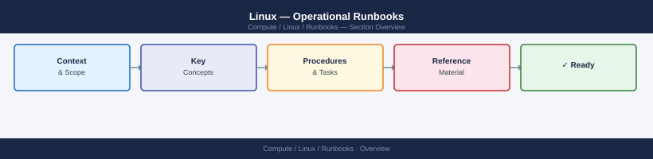

---
tags:
  - linux
  - operations
---
# Linux — Operational Runbooks

<div class="kb-summary">
Linux operational runbooks — routine maintenance, service recovery, backup validation, and performance checks.

*Applies to: RHEL / Ubuntu LTS*
</div>



<div class="kb-grid kb-grid-3">
<a class="kb-card" href="service-restart/"><strong>Service Restart</strong><span>Safe service restart runbook — pre-checks, restart sequence, and post-restart validation.</span></a>
<a class="kb-card" href="disk-space-cleanup/"><strong>Disk Space Cleanup</strong><span>Disk space reclamation runbook — log rotation, temp file cleanup, and LVM expansion steps.</span></a>
<a class="kb-card" href="server-reboot/"><strong>Server Reboot</strong><span>Planned server reboot runbook — service shutdown order, post-reboot checks, and sign-off.</span></a>
</div>

## Routine Daily Checks

| Check | Command | Pass Criteria |
|---|---|---|
| Disk usage | `df -h` | All mounts < 80% |
| Failed systemd services | `systemctl --failed` | 0 failed units |
| Recent OOM events | `dmesg | grep -i 'oom\|kill'` | No entries |
| SSH daemon running | `systemctl is-active sshd` | active |
| Log errors | `journalctl -p err --since "24h ago"` | No critical entries |

## Service Recovery Runbook

```bash
# 1. Check service status
systemctl status <service>
journalctl -u <service> -n 50 --no-pager

# 2. Attempt restart
systemctl restart <service>
sleep 5
systemctl status <service>

# 3. If restart fails — check config
<service> --test   # or: nginx -t, sshd -T, etc.

# 4. Check for port conflicts
ss -tlnp | grep <port>

# 5. Check resource limits
ulimit -a
systemctl show <service> | grep -i limit
```

**Expected output (step 2):** `Active: active (running)` after restart. If `Active: failed` or `Active: activating` for > 30 seconds, proceed to step 3.

## Disk Space Emergency

```bash
# Identify large directories
du -sh /* 2>/dev/null | sort -rh | head -20
du -sh /var/log/* | sort -rh | head -10

# Truncate large log file (don't delete open file)
> /var/log/large-app.log

# Clear old journal logs
journalctl --vacuum-time=7d

# Find and remove old temporary files
find /tmp -mtime +7 -exec rm -rf {} +
```

## Backup Validation

```bash
# Test backup file integrity
md5sum /backup/app-$(date +%F).tar.gz    # compare with stored hash

# Test archive extraction to temp dir
tar -tzf /backup/app-$(date +%F).tar.gz > /dev/null && echo "Archive OK"

# Test DB backup restore (on test instance)
mysql -u root -p test_restore < /backup/mysql-$(date +%F).sql
```

**Expected output:** `Archive OK` for the tar check. MD5 must match the stored hash from the backup job log. DB restore must complete without error output.

## Kernel and Package Update Runbook

```bash
# Check pending updates
dnf check-update          # RHEL/Rocky
apt list --upgradable     # Ubuntu

# Apply security updates only
dnf update --security -y
apt-get upgrade -y --with-new-pkgs

# Check if reboot required
needs-restarting -r       # RHEL
cat /var/run/reboot-required 2>/dev/null  # Ubuntu
```

**Expected output:** `needs-restarting -r` exits 0 (no reboot needed) or exits 1 (reboot required — schedule via server-reboot runbook). `/var/run/reboot-required` absent = no reboot needed.

## Verify

| Step | Pass Criteria |
|---|---|
| Service recovery | `systemctl is-active <service>` returns `active` |
| Disk cleanup | `df -h` shows affected mount < 80% |
| Backup validation | `Archive OK` and MD5 hash match confirmed |
| Package updates | `dnf check-update` exits 0 (no pending security updates) |
