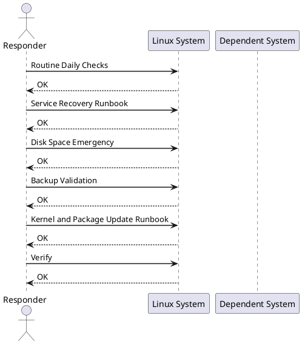

---
tags:
  - linux
  - operations
description: "Linux operational runbooks — routine maintenance, service recovery, backup validation, and performance checks."
---
# Linux — Operational Runbooks

<div class="kb-summary">
Linux operational runbooks — routine maintenance, service recovery, backup validation, and performance checks.

*Applies to: RHEL / Ubuntu LTS*
</div>

<div class="kb-grid kb-grid-3">
<a class="kb-card" href="service-restart/"><strong>Service Restart</strong><span>Safe service restart runbook — pre-checks, restart sequence, and post-restart validation.</span></a>
<a class="kb-card" href="disk-space-cleanup/"><strong>Disk Space Cleanup</strong><span>Disk space reclamation runbook — log rotation, temp file cleanup, and LVM expansion steps.</span></a>
<a class="kb-card" href="server-reboot/"><strong>Server Reboot</strong><span>Planned server reboot runbook — service shutdown order, post-reboot checks, and sign-off.</span></a>
</div>



## Routine Daily Checks

| Check | Command | Pass Criteria |
|---|---|---|
| Disk usage | `df -h` | All mounts < 80% |
| Failed systemd services | `systemctl --failed` | 0 failed units |
| Recent OOM events | `dmesg | grep -i 'oom\|kill'` | No entries |
| SSH daemon running | `systemctl is-active sshd` | active |
| Log errors | `journalctl -p err --since "24h ago"` | No critical entries |

## Service Recovery Runbook

```bash
# 1. Check service status
systemctl status <service>
journalctl -u <service> -n 50 --no-pager

# 2. Attempt restart
systemctl restart <service>
sleep 5
systemctl status <service>

# 3. If restart fails — check config
<service> --test   # or: nginx -t, sshd -T, etc.

# 4. Check for port conflicts
ss -tlnp | grep <port>

# 5. Check resource limits
ulimit -a
systemctl show <service> | grep -i limit
```


```text title="Expected output"
● nginx.service - The NGINX HTTP and reverse proxy server
     Loaded: loaded (/usr/lib/systemd/system/nginx.service; enabled; vendor preset: disabled)
     Active: active (running) since Mon 2024-01-15 14:32:18 UTC; 2h 45min ago
    Process: 8421 ExecStart=/usr/sbin/nginx -g daemon on; master_process on; (code=exited, status=0/SUCCESS)
   Main PID: 8422 (nginx)
      Tasks: 3 (limit: 4096)
     Memory: 12.4M
        CPU: 2.3s
     CGroup: /system.slice/nginx.service
             ├─8422 nginx: master process /usr/sbin/nginx -g daemon on; master_process on;
             ├─8423 nginx: worker process
             └─8424 nginx: worker process

Jan 15 14:32:18 web-prod-01 systemd[1]: Started The NGINX HTTP and reverse proxy server.
Jan 15 14:35:42 web-prod-01 nginx[8422]: signal process started

● nginx.service - The NGINX HTTP and reverse proxy server
     Active: active (running) since Mon 2024-01-15 14:37:23 UTC; 2s ago

LISTEN   0   128   0.0.0.0:80   0.0.0.0:*   users:(("nginx",pid=8425,fd=6),("nginx",pid=8426,fd=6))
LISTEN   0   128   [::]:80      [::]:*     users:(("nginx",pid=8425,fd=7),("nginx",pid=8426,fd=7))

-t: open files                 (-n) unlimited
-u: max user processes         (-u) 4096
-v: virtual memory             (-v) unlimited
-x: file locks                 (-x) unlimited

LimitNOFILE=65535
LimitNPROC=32768
```

!!! warning "Common errors"
    | Error | Fix |
    |---|---|
    | `systemctl status <service>: Unit <service> could not be found.` | Replace `<service>` with the actual service name (e.g., `nginx`, `postgresql`, `sshd`) and verify it exists with `systemctl list-units --type=service`. |
    | `nginx: [error] open() "/var/run/nginx.pid" failed (2: No such file or directory)` | Run `systemctl restart nginx` to regenerate the PID file, or check that the service user has write permissions to `/var/run/`. |
    | `ss: No such file or directory` | Install `iproute2` package with `apt install iproute2` (Debian/Ubuntu) or `yum install iproute2` (RHEL/CentOS), or use `netstat -tlnp` as an alternative. |
**Expected output (step 2):** `Active: active (running)` after restart. If `Active: failed` or `Active: activating` for > 30 seconds, proceed to step 3.

## Disk Space Emergency

```bash
# Identify large directories
du -sh /* 2>/dev/null | sort -rh | head -20
du -sh /var/log/* | sort -rh | head -10

# Truncate large log file (don't delete open file)
> /var/log/large-app.log

# Clear old journal logs
journalctl --vacuum-time=7d

# Find and remove old temporary files
find /tmp -mtime +7 -exec rm -rf {} +
```


```text title="Expected output"
50G	/home
12G	/var
8.5G	/usr
3.2G	/opt
1.8G	/srv
892M	/boot
512M	/root
128M	/etc
64M	/lib
32M	/dev
...

4.2G	/var/log/syslog
2.1G	/var/log/auth.log
1.3G	/var/log/apache2/access.log
856M	/var/log/mysql/error.log
512M	/var/log/nginx/access.log
...

Vacuumed journals from /var/log/journal/... to 2024-01-15 10:32:14 UTC, freed 2.3G.
```

!!! warning "Common errors"
    | Error | Fix |
    |---|---|
    | `find: '/tmp': Permission denied` | Run the command with `sudo` or ensure the user has read permissions on /tmp. |
    | `journalctl: error: Failed to vacuum journal: Permission denied` | Execute `journalctl --vacuum-time=7d` with `sudo` to modify system journal files. |
## Backup Validation

```bash
# Test backup file integrity
md5sum /backup/app-$(date +%F).tar.gz    # compare with stored hash

# Test archive extraction to temp dir
tar -tzf /backup/app-$(date +%F).tar.gz > /dev/null && echo "Archive OK"

# Test DB backup restore (on test instance)
mysql -u root -p test_restore < /backup/mysql-$(date +%F).sql
```


```text title="Expected output"
d41d8cd98f00b204e9800998ecf8427e  /backup/app-2024-01-15.tar.gz
Archive OK
mysql: [Warning] Using a password on the command line interface can be insecure.
mysql: [Warning] Using a password on the command line interface can be insecure.
Query OK, 0 rows affected (0.02 sec)
Query OK, 0 rows affected (0.03 sec)
Query OK, 0 rows affected (0.01 sec)
...
```

!!! warning "Common errors"
    | Error | Fix |
    |---|---|
    | `tar: /backup/app-2024-01-15.tar.gz: Cannot open: No such file or directory` | Verify the backup file exists and the date format matches the actual backup filename. |
    | `mysql: [ERROR] File '/backup/mysql-2024-01-15.sql' not found` | Confirm the MySQL backup file exists in /backup and check file permissions. |
    | `ERROR 1064 (42000) at line 1: You have an error in your SQL syntax` | Validate the SQL dump file is not corrupted and was created with a compatible MySQL version. |
**Expected output:** `Archive OK` for the tar check. MD5 must match the stored hash from the backup job log. DB restore must complete without error output.

## Kernel and Package Update Runbook

```bash
# Check pending updates
dnf check-update          # RHEL/Rocky
apt list --upgradable     # Ubuntu

# Apply security updates only
dnf update --security -y
apt-get upgrade -y --with-new-pkgs

# Check if reboot required
needs-restarting -r       # RHEL
cat /var/run/reboot-required 2>/dev/null  # Ubuntu
```


```text title="Expected output"
Last metadata expiration check: 0:12:34 ago on Thu 15 Jan 2025 09:47:22 AM UTC.
kernel.x86_64                                    6.1.85-1.el9                  baseos
openssl.x86_64                                   1:3.0.7-27.el9                baseos
glibc.x86_64                                     2.34-89.el9                   baseos
systemd.x86_64                                   252-18.el9_1                  baseos

Listing... Done
curl/7.68.0-1ubuntu1.14 upgradable from 7.68.0-1ubuntu1.13
openssh-client/1:8.2p1-4ubuntu0.11 upgradable from 1:8.2p1-4ubuntu0.10
...

Updated:
  kernel.x86_64 6.1.85-1.el9
  openssl.x86_64 1:3.0.7-27.el9
  glibc.x86_64 2.34-89.el9

Complete!

Core libraries or services have been updated.
Reboot is required to ensure that your system benefits from these updates.
```

!!! warning "Common errors"
    | Error | Fix |
    |---|---|
    | `Error: Another app is currently holding the dnf lock; waiting for it to finish...` | Wait for the running package manager to complete or kill the blocking process with `ps aux | grep dnf` and `kill -9 <PID>`. |
    | `E: Could not open lock file /var/lib/apt/lists/lock - open (13: Permission denied)` | Run the command with `sudo` or as the root user. |
    | `command not found: needs-restarting` | Install the `yum-utils` package with `dnf install yum-utils -y` on RHEL/Rocky systems. |
**Expected output:** `needs-restarting -r` exits 0 (no reboot needed) or exits 1 (reboot required — schedule via server-reboot runbook). `/var/run/reboot-required` absent = no reboot needed.

## Verify

| Step | Pass Criteria |
|---|---|
| Service recovery | `systemctl is-active <service>` returns `active` |
| Disk cleanup | `df -h` shows affected mount < 80% |
| Backup validation | `Archive OK` and MD5 hash match confirmed |
| Package updates | `dnf check-update` exits 0 (no pending security updates) |
