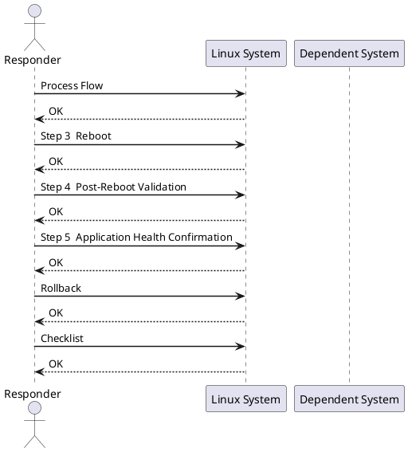

---
tags:
  - linux
  - operations
---
# Server Reboot Runbook


<div class="kb-summary">
| Field | Value | |---|---| | Risk | Medium | | Approval | Change ticket required; maintenance window recommended for production | | Estimated time | 15–30 minutes (excludes application validation) | | Impact | Server and hosted services unavailable during reboot |

*Applies to: RHEL / Ubuntu LTS*
</div>


| Field | Value |
|---|---|
| Risk | Medium |
| Approval | Change ticket required; maintenance window recommended for production |
| Estimated time | 15–30 minutes (excludes application validation) |
| Impact | Server and hosted services unavailable during reboot |



## Before you begin

- **Access:** root or sudo-capable account on target hosts
- **Timing:** safe to run during business hours unless a step is marked ⚠ (causes interruption)
- **Dependencies:** no active upgrades or migrations on the same infrastructure
- **Logging:** capture command output — paste into the change record on completion

---

## Process Flow


**Windows:**
```powershell
Stop-Service <service> -Force
Get-Service <service>    # confirm Stopped
```

## Step 3 — Reboot

**Linux:**
```bash
sudo shutdown -r +1 "Rebooting for maintenance — <reason>"
# or immediate:
sudo reboot
```

**Windows:**
```powershell
Restart-Computer -Force
# With delay:
shutdown /r /t 60 /c "Rebooting for maintenance"
```

**VMware VM via PowerCLI:**
```powershell
Restart-VMGuest -VM <vmname>
```

## Step 4 — Post-Reboot Validation

```bash
# Confirm online
ping -c 4 <server_ip>

# Boot time and uptime
uptime
who -b

# Failed services
systemctl --failed

# Critical service status
systemctl status <service1> <service2>

# Review boot errors
journalctl -b -p err
```

**Windows:**
```powershell
# Services set to Automatic but not running
Get-Service | Where-Object { $_.Status -ne 'Running' -and $_.StartType -eq 'Automatic' }

# Recent system errors since boot
Get-EventLog -LogName System -EntryType Error -Newest 20
```

## Step 5 — Application Health Confirmation

Confirm with the application owner or run the service's own health check before closing the ticket.

```bash
curl -sf https://<app-host>/health && echo OK
```

## Rollback

A reboot is inherently non-reversible. If a service fails to start post-reboot:

1. Check `journalctl -u <service> -n 100` or Windows Event Viewer
2. Restore from last known-good config backup if a config change caused the failure
3. Escalate to application owner if service cannot be recovered within SLA

## Checklist

- [ ] Change approved and maintenance window confirmed
- [ ] Active users notified and logged off
- [ ] Active jobs confirmed clear
- [ ] Application services stopped gracefully
- [ ] Reboot initiated
- [ ] Server responds to ping
- [ ] All services running
- [ ] Application health confirmed by owner
- [ ] Monitoring alert cleared
- [ ] Change ticket closed

---

## Verify

- Confirm the operation completed without errors in the log or management UI
- Verify the expected state change is visible (service running, object created, config applied)
- Document the outcome in the change record

## See also

- [Disk Space Cleanup Runbook](disk-space-cleanup.md)
- [Service Restart Runbook](service-restart.md)
- [Linux — Operational Runbooks](index.md)
- [Linux — Architecture](../../architecture/)
- [Linux Server — Initial Deployment](../../deploy/)
- [Linux — Security](../../security/)
- [Linux — Troubleshooting](../../troubleshooting/)
