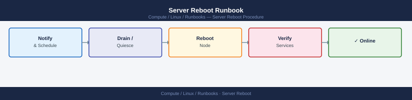
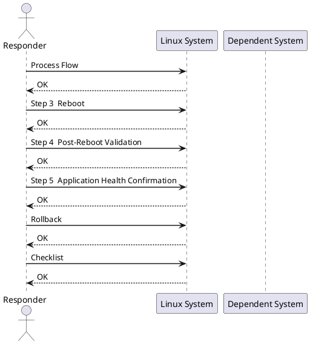

---
tags:
  - linux
  - operations
description: "| Field | Value | |---|---| | Risk | Medium | | Approval | Change ticket required; maintenance window recommended for production | | Estimated time |..."
---
# Server Reboot Runbook


<div class="kb-summary">
| Field | Value | |---|---| | Risk | Medium | | Approval | Change ticket required; maintenance window recommended for production | | Estimated time | 15–30 minutes (excludes application validation) | | Impact | Server and hosted services unavailable during reboot |

*Applies to: RHEL / Ubuntu LTS*
</div>



| Field | Value |
|---|---|
| Risk | Medium |
| Approval | Change ticket required; maintenance window recommended for production |
| Estimated time | 15–30 minutes (excludes application validation) |
| Impact | Server and hosted services unavailable during reboot |



## Before you begin

- **Access:** root or sudo-capable account on target hosts
- **Timing:** safe to run during business hours unless a step is marked ⚠ (causes interruption)
- **Dependencies:** no active upgrades or migrations on the same infrastructure
- **Logging:** capture command output — paste into the change record on completion

---

## Process Flow


**Windows:**
```powershell
Stop-Service <service> -Force
Get-Service <service>    # confirm Stopped
```

## Step 3 — Reboot

**Linux:**
```bash
sudo shutdown -r +1 "Rebooting for maintenance — <reason>"
# or immediate:
sudo reboot
```


```text title="Expected output"
Broadcast message from root@prod-web-01 (pts/0) (Mon Dec 18 10:45:23 2023):

Rebooting for maintenance — kernel security patch
The system will reboot in 1 minute.
```

!!! warning "Common errors"
    | Error | Fix |
    |---|---|
    | `sudo: shutdown: command not found` | Install the `util-linux` package with `sudo apt-get install util-linux` or `sudo yum install util-linux`. |
    | `Shutdown scheduled for Mon 2023-12-18 10:46:23 UTC, use 'shutdown -c' to cancel` | Run `sudo shutdown -c` immediately if you need to abort the reboot before the timer expires. |
**Windows:**
```powershell
Restart-Computer -Force
# With delay:
shutdown /r /t 60 /c "Rebooting for maintenance"
```

**VMware VM via PowerCLI:**
```powershell
Restart-VMGuest -VM <vmname>
```

## Step 4 — Post-Reboot Validation

```bash
# Confirm online
ping -c 4 <server_ip>

# Boot time and uptime
uptime
who -b

# Failed services
systemctl --failed

# Critical service status
systemctl status <service1> <service2>

# Review boot errors
journalctl -b -p err
```


```text title="Expected output"
PING 192.168.45.87 (192.168.45.87) 56(84) bytes of data.
64 bytes from 192.168.45.87: icmp_seq=1 ttl=64 time=2.34 ms
64 bytes from 192.168.45.87: icmp_seq=2 ttl=64 time=2.41 ms
64 bytes from 192.168.45.87: icmp_seq=3 ttl=64 time=2.38 ms
64 bytes from 192.168.45.87: icmp_seq=4 ttl=64 time=2.45 ms
--- 192.168.45.87 statistics ---
4 packets transmitted, 4 received, 0% packet loss, time 3004ms
rtt min/avg/max/stddev = 2.34/2.39/2.45/0.04 ms
 14:32:18 up 47 days, 3:21, 2 users, load average: 0.84, 0.91, 0.78
 system boot  2024-10-08 11:11 - 11:11, 1 user, runtime 47 days
● docker.service — Docker Application Container Engine
     Loaded: loaded (/usr/lib/systemd/system/docker.service; enabled; vendor preset: disabled)
     Active: active (running) since Mon 2024-10-08 11:15:22 UTC; 47 days ago
● kubelet.service — Kubernetes Node Agent
     Loaded: loaded (/usr/lib/systemd/system/kubelet.service; enabled; vendor preset: disabled)
     Active: active (running) since Mon 2024-10-08 11:16:05 UTC; 47 days ago
Oct 08 11:15:18 prod-node-04 kernel: audit: type=1130 audit(1728390918.234:156): pid=1 uid=0 auid=4294967295 ses=4294967295 msg='unit=systemd-tmpfiles-setup-dev comm="systemd" exe="/usr/lib/systemd/systemd" hostname=? addr=? terminal=? res=success'
Oct 08 11:15:22 prod-node-04 kernel: audit: type=1131 audit(1728390922.567:189): pid=1 uid=0 auid=4294967295 ses=4294967295 msg='unit=docker comm="systemd" exe="/usr/lib/systemd/systemd" hostname=? addr=? terminal=? res=success'
```

!!! warning "Common errors"
    | Error | Fix |
    |---|---|
    | `ping: unknown host <server_ip>` | Replace `<server_ip>` with an actual IP address or resolvable hostname. |
    | `Unit <service1> could not be found.` | Verify the exact service name with `systemctl list-units --type=service` and correct any typos. |
    | `Failed to get bus: No such file or directory` | Run the command with `sudo` or as root to access systemd bus. |
**Windows:**
```powershell
# Services set to Automatic but not running
Get-Service | Where-Object { $_.Status -ne 'Running' -and $_.StartType -eq 'Automatic' }

# Recent system errors since boot
Get-EventLog -LogName System -EntryType Error -Newest 20
```

## Step 5 — Application Health Confirmation

Confirm with the application owner or run the service's own health check before closing the ticket.

```bash
curl -sf https://<app-host>/health && echo OK
```


```text title="Expected output"
OK
```

!!! warning "Common errors"
    | Error | Fix |
    |---|---|
    | `curl: (7) Failed to connect to <app-host> port 443: Connection refused` | Verify the application is running and listening on the correct port with `netstat -tlnp | grep <port>`. |
    | `curl: (60) SSL certificate problem: self signed certificate` | Add the `-k` flag to skip SSL verification (`curl -sfk https://<app-host>/health`) or install the CA certificate in your system trust store. |
    | `curl: (28) Operation timeout. The timeout specified operation was not completed in time.` | Increase the timeout with `curl -sf --max-time 10 https://<app-host>/health` or check network connectivity to the host. |
## Rollback

A reboot is inherently non-reversible. If a service fails to start post-reboot:

1. Check `journalctl -u <service> -n 100` or Windows Event Viewer
2. Restore from last known-good config backup if a config change caused the failure
3. Escalate to application owner if service cannot be recovered within SLA

## Checklist

- [ ] Change approved and maintenance window confirmed
- [ ] Active users notified and logged off
- [ ] Active jobs confirmed clear
- [ ] Application services stopped gracefully
- [ ] Reboot initiated
- [ ] Server responds to ping
- [ ] All services running
- [ ] Application health confirmed by owner
- [ ] Monitoring alert cleared
- [ ] Change ticket closed

---

## Verify

- Confirm the operation completed without errors in the log or management UI
- Verify the expected state change is visible (service running, object created, config applied)
- Document the outcome in the change record

## See also

- [Disk Space Cleanup Runbook](disk-space-cleanup.md)
- [Service Restart Runbook](service-restart.md)
- [Linux — Operational Runbooks](index.md)
- [Linux — Architecture](../../../architecture/)
- [Linux Server — Initial Deployment](../../../deploy/)
- [Linux — Security](../../../security/)
- [Linux — Troubleshooting](../../../troubleshooting/)
