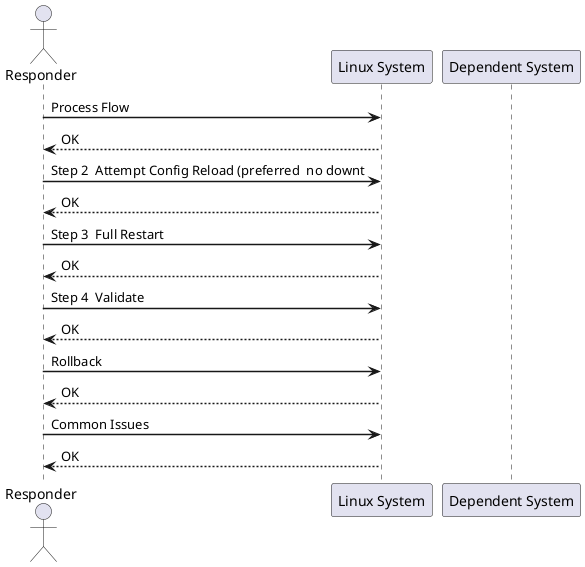

---
tags:
  - linux
  - operations
---
# Service Restart Runbook


<div class="kb-summary">
| Field | Value | |---|---| | Risk | Low–Medium | | Approval | Notify service owner; standard change for planned restarts | | Estimated time | 5–20 minutes | | Impact | Service unavailable during restart (seconds to minutes depending on startup time) |

*Applies to: RHEL / Ubuntu LTS*
</div>


| Field | Value |
|---|---|
| Risk | Low–Medium |
| Approval | Notify service owner; standard change for planned restarts |
| Estimated time | 5–20 minutes |
| Impact | Service unavailable during restart (seconds to minutes depending on startup time) |



## Before you begin

- **Access:** root or sudo-capable account on target hosts
- **Timing:** safe to run during business hours unless a step is marked ⚠ (causes interruption)
- **Dependencies:** no active upgrades or migrations on the same infrastructure
- **Logging:** capture command output — paste into the change record on completion

---

## Process Flow


**Stop here if** logs show a configuration error or missing dependency — fix the root cause before restarting, otherwise the service will fail again immediately.

## Step 2 — Attempt Config Reload (preferred — no downtime)

```bash
# If the service supports reload (nginx, apache, haproxy, etc.)
systemctl reload <service>
systemctl status <service>
```

Only proceed to a full restart if reload is not supported or did not resolve the issue.

## Step 3 — Full Restart

```bash
# Preferred: explicit stop then start (cleaner than restart for some services)
systemctl stop <service>
sleep 2
systemctl start <service>

# Or combined
systemctl restart <service>
```

**Windows:**
```powershell
Stop-Service <service> -Force
Start-Service <service>
# or
Restart-Service <service>
```

## Step 4 — Validate

```bash
# Service status
systemctl status <service>

# Listening on expected port
ss -tnlp | grep <port>

# No errors in recent logs
journalctl -u <service> -n 50 --no-pager --since "5 minutes ago"
```

**Application-level check:**
```bash
curl -sf https://<app-host>/health && echo OK
nc -zv <host> <port>
```

**Windows:**
```powershell
Get-Service <service>    # should show: Running
Get-EventLog -LogName System -Source 'Service Control Manager' -Newest 10
```

## Rollback

If the restart made things worse (e.g., bad config loaded on start):

```bash
# Restore previous config from backup
cp /etc/<service>/<service>.conf.bak /etc/<service>/<service>.conf

# Validate config before starting
<service> -t                  # nginx, apache
systemctl start <service>
```

## Common Issues

| Issue | Check | Action |
|---|---|---|
| Service won't stop cleanly | Active connections or hung threads | `systemctl kill -s SIGKILL <service>`; check for orphaned processes |
| Service fails to start | Config error | `journalctl -u <service> -n 100`; validate config file |
| Port not listening after start | Wrong port in config / bind error | Check config; confirm no other process holds the port (`ss -tnlp`) |
| Restart loop (rapid crash) | Critical dependency missing | Check for missing files, certs, DB connections |

## Checklist

- [ ] Service owner notified
- [ ] Current state and logs reviewed
- [ ] Root cause identified (or confirmed transient)
- [ ] Active connections drained
- [ ] Reload attempted (if applicable)
- [ ] Service restarted
- [ ] Service shows Running
- [ ] Port listening confirmed
- [ ] Application health check passed
- [ ] Monitoring alert cleared

---

## Verify

- Confirm the operation completed without errors in the log or management UI
- Verify the expected state change is visible (service running, object created, config applied)
- Document the outcome in the change record

## See also

- [Disk Space Cleanup Runbook](disk-space-cleanup.md)
- [Server Reboot Runbook](server-reboot.md)
- [Linux — Operational Runbooks](index.md)
- [Linux — Architecture](../../../architecture/)
- [Linux Server — Initial Deployment](../../../deploy/)
- [Linux — Security](../../../security/)
- [Linux — Troubleshooting](../../../troubleshooting/)
