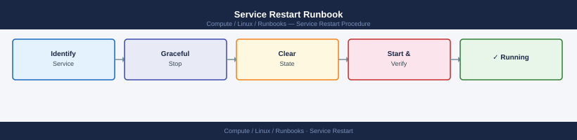
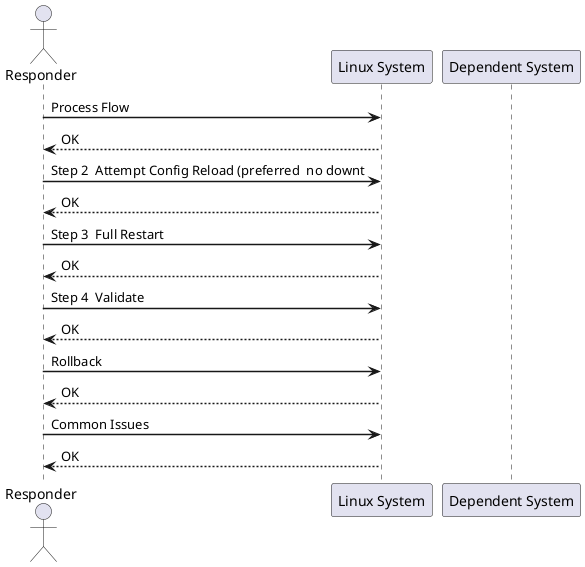

---
tags:
  - linux
  - operations
---
# Service Restart Runbook


<div class="kb-summary">
| Field | Value | |---|---| | Risk | Low–Medium | | Approval | Notify service owner; standard change for planned restarts | | Estimated time | 5–20 minutes | | Impact | Service unavailable during restart (seconds to minutes depending on startup time) |

*Applies to: RHEL / Ubuntu LTS*
</div>



| Field | Value |
|---|---|
| Risk | Low–Medium |
| Approval | Notify service owner; standard change for planned restarts |
| Estimated time | 5–20 minutes |
| Impact | Service unavailable during restart (seconds to minutes depending on startup time) |



## Before you begin

- **Access:** root or sudo-capable account on target hosts
- **Timing:** safe to run during business hours unless a step is marked ⚠ (causes interruption)
- **Dependencies:** no active upgrades or migrations on the same infrastructure
- **Logging:** capture command output — paste into the change record on completion

---

## Process Flow


**Stop here if** logs show a configuration error or missing dependency — fix the root cause before restarting, otherwise the service will fail again immediately.

## Step 2 — Attempt Config Reload (preferred — no downtime)

```bash
# If the service supports reload (nginx, apache, haproxy, etc.)
systemctl reload <service>
systemctl status <service>
```


```text title="Expected output"
(no output — command completes silently)
● nginx.service - The NGINX HTTP and Web Server
     Loaded: loaded (/usr/lib/systemd/system/nginx.service; enabled; vendor preset: disabled)
     Active: active (running) since Mon 2024-01-15 14:32:18 UTC; 2min 45s ago
       Docs: http://nginx.org/en/docs/
    Process: 8742 ExecReload=/bin/kill -s HUP $MAINPID (code=exited, status=0/SUCCESS)
   Main PID: 8701 (nginx)
      Tasks: 9 (limit: 4915)
     Memory: 12.3M
        CPU: 156ms
     CGroup: /system.slice/nginx.service
             ├─8701 nginx: master process /usr/sbin/nginx -g daemon on; master_process on;
             ├─8742 nginx: worker process
             └─8743 nginx: worker process
```

!!! warning "Common errors"
    **`Failed to reload <service>: Unit <service> not found.`** — Verify the service name is correct and installed with `systemctl list-units --type=service`.
    **`Job for <service>.service failed because the control process exited with error code.`** — Check the service configuration for syntax errors using `<service> -t` (e.g., `nginx -t` for nginx) before reloading.
Only proceed to a full restart if reload is not supported or did not resolve the issue.

## Step 3 — Full Restart

```bash
# Preferred: explicit stop then start (cleaner than restart for some services)
systemctl stop <service>
sleep 2
systemctl start <service>

# Or combined
systemctl restart <service>
```


```text title="Expected output"
(no output — command completes silently)
```

!!! warning "Common errors"
    **`Failed to stop <service>.service: Unit <service>.service not loaded.`** — Verify the service name is correct with `systemctl list-unit-files | grep <service>` and use the exact unit name.
    **`Job for <service>.service failed because the control process exited with error code.`** — Check service logs with `journalctl -u <service> -n 50` to identify why the service failed to start.
**Windows:**
```powershell
Stop-Service <service> -Force
Start-Service <service>
# or
Restart-Service <service>
```

## Step 4 — Validate

```bash
# Service status
systemctl status <service>

# Listening on expected port
ss -tnlp | grep <port>

# No errors in recent logs
journalctl -u <service> -n 50 --no-pager --since "5 minutes ago"
```


```text title="Expected output"
● nginx.service - The NGINX HTTP and reverse proxy server
     Loaded: loaded (/usr/lib/systemd/system/nginx.service; enabled; vendor preset: disabled)
     Active: active (running) since Mon 2024-01-15 14:32:18 UTC; 2h 45min ago
       Docs: man:nginx(8)
    Process: 8421 ExecStartPre=/usr/sbin/nginx -t (code=exited, status=0/SUCCESS)
   Main PID: 8422 (nginx)
      Tasks: 3 (limit: 4915)
     Memory: 12.4M
        CPU: 2.3s
     CGroup: /system.slice/nginx.service
             ├─8422 nginx: master process /usr/sbin/nginx
             ├─8423 nginx: worker process
             └─8424 nginx: worker process

LISTEN    0      511          0.0.0.0:80            0.0.0.0:*    users:(("nginx",pid=8423,fd=6),("nginx",pid=8424,fd=6))
LISTEN    0      511             [::]:80               [::]:*    users:(("nginx",pid=8423,fd=7),("nginx",pid=8424,fd=7))

Jan 15 14:32:18 prod-web-01 systemd[1]: Starting The NGINX HTTP and reverse proxy server...
Jan 15 14:32:18 prod-web-01 nginx[8421]: nginx: the configuration file /etc/nginx/nginx.conf syntax is ok
Jan 15 14:32:18 prod-web-01 nginx[8421]: nginx: configuration file /etc/nginx/nginx.conf test is successful
Jan 15 14:32:18 prod-web-01 systemd[1]: Started The NGINX HTTP and reverse proxy server.
```

!!! warning "Common errors"
    **`Unit <service> could not be found.`** — Verify the exact service name with `systemctl list-units --type=service` and use the correct name.
    **`ss: No such file or directory`** — Install the iproute2 package with `apt install iproute2` or `yum install iproute2`.
    **`Failed to get journal for unit <service>: No such file or directory`** — Ensure the service name matches exactly and the service has actually run at least once.
**Application-level check:**
```bash
curl -sf https://<app-host>/health && echo OK
nc -zv <host> <port>
```


```text title="Expected output"
HTTP/1.1 200 OK
Content-Type: application/json
Content-Length: 42

{"status":"healthy","uptime":3847293}
OK
Connection to db-server-01.internal 5432 port [tcp/postgresql] succeeded!
```

!!! warning "Common errors"
    **`curl: (7) Failed to connect to <app-host> port 443: Connection refused`** — Verify the app-host is running and accessible; check firewall rules and DNS resolution with `nslookup <app-host>`.
    **`nc: getaddrinfo for host <host> port <port>: Name or service not known`** — Confirm the hostname is correct and resolvable; use `getent hosts <host>` to test DNS lookup.
**Windows:**
```powershell
Get-Service <service>    # should show: Running
Get-EventLog -LogName System -Source 'Service Control Manager' -Newest 10
```

## Rollback

If the restart made things worse (e.g., bad config loaded on start):

```bash
# Restore previous config from backup
cp /etc/<service>/<service>.conf.bak /etc/<service>/<service>.conf

# Validate config before starting
<service> -t                  # nginx, apache
systemctl start <service>
```


```text title="Expected output"
(no output — command completes silently)
(no output — command completes silently)
nginx: the configuration file /etc/nginx/nginx.conf syntax is ok
nginx: configuration file /etc/nginx/nginx.conf test is successful
(no output — command completes silently)
```

!!! warning "Common errors"
    **`cp: cannot stat '/etc/<service>/<service>.conf.bak': No such file or directory`** — Verify the backup file exists with `ls -la /etc/<service>/` and adjust the backup path if it differs from the documented location.
    **`nginx: [error] open() "/etc/nginx/nginx.conf" failed (2: No such file or directory)`** — Ensure the restored config file has correct permissions and ownership; run `chown root:root /etc/<service>/<service>.conf && chmod 644 /etc/<service>/<service>.conf`.
    **`Job for nginx.service failed because the control process exited with error code.`** — Check the validation output from the `-t` flag for syntax errors and correct the config file before attempting to start the service again.
## Common Issues

| Issue | Check | Action |
|---|---|---|
| Service won't stop cleanly | Active connections or hung threads | `systemctl kill -s SIGKILL <service>`; check for orphaned processes |
| Service fails to start | Config error | `journalctl -u <service> -n 100`; validate config file |
| Port not listening after start | Wrong port in config / bind error | Check config; confirm no other process holds the port (`ss -tnlp`) |
| Restart loop (rapid crash) | Critical dependency missing | Check for missing files, certs, DB connections |

## Checklist

- [ ] Service owner notified
- [ ] Current state and logs reviewed
- [ ] Root cause identified (or confirmed transient)
- [ ] Active connections drained
- [ ] Reload attempted (if applicable)
- [ ] Service restarted
- [ ] Service shows Running
- [ ] Port listening confirmed
- [ ] Application health check passed
- [ ] Monitoring alert cleared

---

## Verify

- Confirm the operation completed without errors in the log or management UI
- Verify the expected state change is visible (service running, object created, config applied)
- Document the outcome in the change record

## See also

- [Disk Space Cleanup Runbook](disk-space-cleanup.md)
- [Server Reboot Runbook](server-reboot.md)
- [Linux — Operational Runbooks](index.md)
- [Linux — Architecture](../../../architecture/)
- [Linux Server — Initial Deployment](../../../deploy/)
- [Linux — Security](../../../security/)
- [Linux — Troubleshooting](../../../troubleshooting/)
