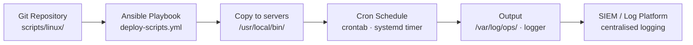

# Linux — Scripts

Automation scripts and reusable code.

Scripts stored in the team's Git repository. All are idempotent and safe to run on production systems. Output logged to `/var/log/ops/` and forwarded to the central logging platform.

## Script Deployment Flow



## system-health-check.sh

Checks disk, memory, load, failed services, and recent auth failures:

```bash
#!/bin/bash
THRESHOLD=80
echo "=== System Health Check: $(hostname) at $(date) ==="

# Disk usage
echo "--- Disk Usage ---"
df -h | awk -v t=$THRESHOLD 'NR>1 && int($5) > t {print "WARNING: "$6" is "$5" full"}'

# Memory
echo "--- Memory ---"
free -m | awk '/Mem/ {printf "Used: %dMB / Total: %dMB (%.0f%%)\n", $3, $2, $3/$2*100}'

# Load average
echo "--- Load Average ---"
uptime | awk -F'load average:' '{print "Load:" $2}'

# Failed services
echo "--- Failed Services ---"
systemctl --failed --no-legend | awk '{print "FAILED: "$1}'

# Recent auth failures
echo "--- Auth Failures (last hour) ---"
journalctl -u sshd --since "1 hour ago" | grep "Failed password" | wc -l | xargs echo "SSH failed logins:"
```

## log-archival.sh

Compresses rotated logs older than 30 days to NFS archive:

```bash
#!/bin/bash
ARCHIVE_PATH="/mnt/nfs-archive/logs/$(hostname)"
LOG_PATH="/var/log"
mkdir -p "$ARCHIVE_PATH"

find "$LOG_PATH" -name "*.log-*" -mtime +30 -type f | while read f; do
    gzip -9 "$f" && mv "${f}.gz" "$ARCHIVE_PATH/" && \
    logger "Archived $f to $ARCHIVE_PATH"
done
```

## patch-status-report.sh

Reports pending updates and last patch date:

```bash
#!/bin/bash
echo "=== Patch Status: $(hostname) at $(date) ==="

# RHEL/CentOS
if command -v dnf &>/dev/null; then
    echo "Available updates:"
    dnf check-update --quiet 2>/dev/null | grep -v "^$" | wc -l | xargs echo "  Packages:"
    rpm -qa --last | head -5 | xargs echo "  Last installed:"
fi

# Ubuntu/Debian
if command -v apt-get &>/dev/null; then
    apt-get -q --just-print upgrade 2>/dev/null | grep "^Inst" | wc -l | xargs echo "  Packages pending:"
fi
```

## user-audit.sh

Lists local users, sudo group members, and last login dates:

```bash
#!/bin/bash
echo "=== User Audit: $(hostname) at $(date) ==="
echo "--- Local users with shell access ---"
awk -F: '$7 !~ /nologin|false/ {print $1, $7}' /etc/passwd

echo "--- Sudo group members ---"
getent group sudo wheel 2>/dev/null

echo "--- Last 10 logins ---"
last -n 10 | head -10

echo "--- Currently logged in ---"
who
```

## disk-alert.sh

Sends alert if any filesystem exceeds threshold — designed for cron:

```bash
#!/bin/bash
THRESHOLD=80
ALERT_EMAIL="ops@corp.local"

df -H | awk -v t=$THRESHOLD 'NR>1 && int($5) > t {
    print "DISK ALERT on " ENVIRON["HOSTNAME"] ": " $6 " is " $5
}' | while read -r line; do
    echo "$line" | mail -s "[DISK ALERT] $(hostname)" "$ALERT_EMAIL"
    logger "$line"
done
```

## Deployment

Scripts are deployed and scheduled via Ansible:

```yaml
# tasks/deploy-scripts.yml
- name: Copy operational scripts
  copy:
    src: "{{ item }}"
    dest: /usr/local/bin/
    mode: "0750"
    owner: root
    group: root
  loop:
    - system-health-check.sh
    - disk-alert.sh

- name: Schedule disk alert via cron
  cron:
    name: disk-alert
    minute: "0"
    hour: "*/4"
    job: /usr/local/bin/disk-alert.sh
    user: root
```
