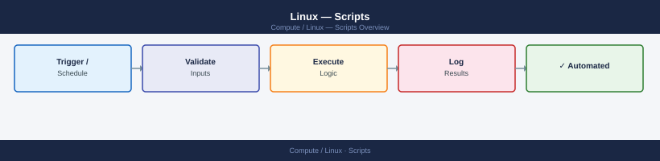
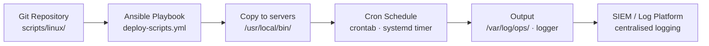

---
tags:
  - linux
  - operations
---
# Linux — Scripts


<div class="kb-summary">
Automation scripts and reusable code. Scripts stored in the team's Git repository. All are idempotent and safe to run on production systems. Output logged to `/var/log/ops/` and forwarded to the central logging platform.

*Applies to: RHEL / Ubuntu LTS*
</div>



Automation scripts and reusable code.

Scripts stored in the team's Git repository. All are idempotent and safe to run on production systems. Output logged to `/var/log/ops/` and forwarded to the central logging platform.

```d2
direction: right

center: "Linux" {shape: rectangle}
script_deployment_flow: "Script Deployment Flow" {shape: rectangle}
patchstatusreportsh: "patch-status-report.sh" {shape: rectangle}
userauditsh: "user-audit.sh" {shape: rectangle}
diskalertsh: "disk-alert.sh" {shape: rectangle}
deployment: "Deployment" {shape: rectangle}
verify: "Verify" {shape: rectangle}

center -> script_deployment_flow
center -> patchstatusreportsh
center -> userauditsh
center -> diskalertsh
center -> deployment
center -> verify
```

## Before you begin

- **Access:** root or sudo-capable account on target hosts
- **Timing:** safe to run during business hours unless a step is marked ⚠ (causes interruption)
- **Dependencies:** no active upgrades or migrations on the same infrastructure
- **Logging:** capture command output — paste into the change record on completion

---

## Script Deployment Flow




## patch-status-report.sh

Reports pending updates and last patch date:

```bash
#!/bin/bash
echo "=== Patch Status: $(hostname) at $(date) ==="

# RHEL/CentOS
if command -v dnf &>/dev/null; then
    echo "Available updates:"
    dnf check-update --quiet 2>/dev/null | grep -v "^$" | wc -l | xargs echo "  Packages:"
    rpm -qa --last | head -5 | xargs echo "  Last installed:"
fi

# Ubuntu/Debian
if command -v apt-get &>/dev/null; then
    apt-get -q --just-print upgrade 2>/dev/null | grep "^Inst" | wc -l | xargs echo "  Packages pending:"
fi
```

## user-audit.sh

Lists local users, sudo group members, and last login dates:

```bash
#!/bin/bash
echo "=== User Audit: $(hostname) at $(date) ==="
echo "--- Local users with shell access ---"
awk -F: '$7 !~ /nologin|false/ {print $1, $7}' /etc/passwd

echo "--- Sudo group members ---"
getent group sudo wheel 2>/dev/null

echo "--- Last 10 logins ---"
last -n 10 | head -10

echo "--- Currently logged in ---"
who
```

## disk-alert.sh

Sends alert if any filesystem exceeds threshold — designed for cron:

```bash
#!/bin/bash
THRESHOLD=80
ALERT_EMAIL="ops@corp.local"

df -H | awk -v t=$THRESHOLD 'NR>1 && int($5) > t {
    print "DISK ALERT on " ENVIRON["HOSTNAME"] ": " $6 " is " $5
}' | while read -r line; do
    echo "$line" | mail -s "[DISK ALERT] $(hostname)" "$ALERT_EMAIL"
    logger "$line"
done
```

## Deployment

Scripts are deployed and scheduled via Ansible:

```yaml
# tasks/deploy-scripts.yml
- name: Copy operational scripts
  copy:
    src: "{{ item }}"
    dest: /usr/local/bin/
    mode: "0750"
    owner: root
    group: root
  loop:
    - system-health-check.sh
    - disk-alert.sh

- name: Schedule disk alert via cron
  cron:
    name: disk-alert
    minute: "0"
    hour: "*/4"
    job: /usr/local/bin/disk-alert.sh
    user: root
```

---

## Verify

- Confirm the operation completed without errors in the log or management UI
- Verify the expected state change is visible (service running, object created, config applied)
- Document the outcome in the change record

---

## See also

- [Linux — Procedures](../procedures/)
- [Linux — CLI Reference](../cli-reference/)
- [Linux — Health Checks](../health-checks/)
