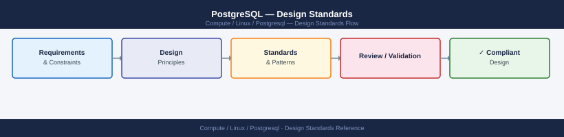

---
tags:
  - architecture
  - linux
description: "PostgreSQL design standards — HA patterns (streaming + Patroni), connection pooling, sizing guidelines, schema conventions, and backup requirements."
---
# PostgreSQL — Design Standards

PostgreSQL design standards — HA patterns (streaming + Patroni), connection pooling, sizing guidelines, schema conventions, and backup requirements.

*Applies to: PostgreSQL 15.x / 16.x*

## High-Availability Topologies

| Pattern | Description | Use case |
|---|---|---|
| Streaming replication (1+1) | Primary + hot standby; manual failover with `pg_promote` | Simple HA; minimal tooling |
| Patroni | Streaming + etcd/ZooKeeper; automatic failover; leader election | Production HA; cloud-native |
| Pgpool-II | Connection proxy; read splitting; failover | Simpler proxy; less common now |
| Citus | Distributed PostgreSQL; sharding | Large-scale analytics |

## Connection Pooling (Required in Production)

PgBouncer between app and PostgreSQL:
- `transaction` mode: best performance; connection returned after each transaction
- `session` mode: safer; connection held for full client session
- Typical: 20–100 PgBouncer connections per PostgreSQL max_connections

## Sizing Guidelines

| Resource | Baseline |
|---|---|
| `shared_buffers` | 25% of RAM |
| `effective_cache_size` | 75% of RAM |
| `work_mem` | RAM × 0.25 ÷ max_connections |
| `max_connections` | 100–200; use PgBouncer to serve more app threads |

## Naming Conventions

- Databases: lowercase, underscores — `app_prod`, `reporting`
- Schemas: separate per app — `app`, `audit`, `reporting`
- Tables: lowercase plural — `users`, `order_lines`
- Indexes: `ix_<table>_<columns>` — `ix_users_email`

## Backup Requirements

| Tier | Method | RPO |
|---|---|---|
| Continuous WAL archiving | `archive_command` → S3/NFS | Seconds |
| Daily base backup | `pg_basebackup` | 24 h |
| PITR capability | WAL + base backup together | Any point |

Test restore to separate instance monthly. `pg_restore` time must be < RTO.

---

## See also

- [Postgresql — How It Works](../how-it-works/)
- [Postgresql — Integrations](../integrations/)
- [Postgresql — Deploy](../../deploy/)
