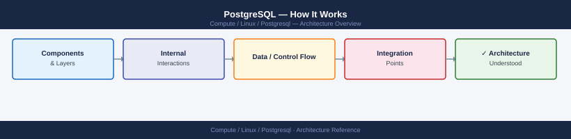
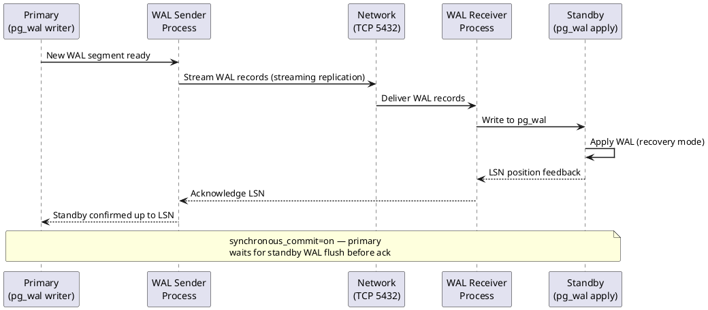

---
tags:
  - architecture
  - linux
---
# PostgreSQL — How It Works

<div class="kb-summary">
PostgreSQL architecture — process model, shared buffer cache, WAL, MVCC, autovacuum, streaming replication, and query planner internals.

*Applies to: PostgreSQL 15.x / 16.x*
</div>



```d2
direction: right

center: "PostgreSQL" {shape: hexagon}
process_model: "Process Model" {shape: rectangle}
shared_buffer_cache: "Shared Buffer Cache" {shape: rectangle}
wal_writeahead_log: "WAL (Write-Ahead Log)" {shape: rectangle}
mvcc_and_autovacuum: "MVCC and Autovacuum" {shape: rectangle}
key_configuration_parameters: "Key Configuration Parameters" {shape: rectangle}

center -> process_model
center -> shared_buffer_cache
center -> wal_writeahead_log
center -> mvcc_and_autovacuum
center -> key_configuration_parameters
```



## Process Model

PostgreSQL uses a multi-process model (not multi-threaded):

| Process | Role |
|---|---|
| `postgres` (postmaster) | Listener; spawns backend for each connection |
| Backend | One per client connection; handles queries |
| `autovacuum` | Cleans dead tuples; updates stats; runs on schedule |
| `walwriter` | Flushes WAL buffers to disk |
| `bgwriter` | Writes dirty shared buffer pages to disk |
| `checkpointer` | Periodic checkpoint: flush all dirty pages, advance WAL recovery point |
| `wal sender` | Sends WAL to streaming replicas |
| `wal receiver` | Receives WAL on replica |

## Shared Buffer Cache

`shared_buffers` is the in-memory page cache. Set to 25% of RAM (OS page cache handles the rest via `effective_cache_size`). Access path:

```text
Query → shared_buffers (hit?) → OS page cache → disk
```

## WAL (Write-Ahead Log)

All changes are written to WAL before data files:
- WAL files in `pg_wal/` — each 16 MB by default
- `wal_level`: `minimal` / `replica` / `logical` — must be `replica` for streaming
- `archive_mode=on` + `archive_command` → PITR

## MVCC and Autovacuum

PostgreSQL uses MVCC: old row versions remain until vacuumed. Dead tuples accumulate and cause table bloat. `autovacuum` reclaims space and updates planner statistics.

```sql
-- Check table bloat / dead tuples
SELECT relname, n_dead_tup, n_live_tup, last_autovacuum
FROM pg_stat_user_tables
ORDER BY n_dead_tup DESC LIMIT 10;
```

## Key Configuration Parameters

| Parameter | Default | Notes |
|---|---|---|
| `shared_buffers` | 128MB | Set to 25% of RAM |
| `effective_cache_size` | 4GB | Hint to planner; set to 75% of RAM |
| `work_mem` | 4MB | Per-sort/hash; multiply by max_connections for total |
| `maintenance_work_mem` | 64MB | For VACUUM, CREATE INDEX; set to 1–2 GB |
| `max_connections` | 100 | Each connection ~5–10 MB RAM |
| `wal_level` | replica | Must be `replica` for streaming replication |

---

## See also

- [Postgresql — Design Standards](design-standards/)
- [Postgresql — Integrations](integrations/)
- [Postgresql — Deploy](../deploy/)
