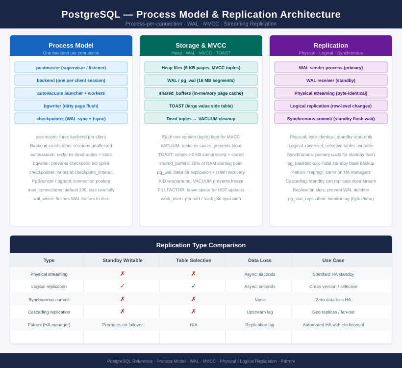

---
tags:
  - architecture
  - linux
---
# PostgreSQL — Architecture

<div class="kb-summary">
Architecture overview, design standards, and integrations.

*Applies to: PostgreSQL 15.x / 16.x*
</div>

```text
┌──────────────────────── PostgreSQL — Advanced Open-Source RDBMS Architecture ─────────────────────────┐
│                                                                                                       │
│  MVCC concurrency; streaming replication + WAL archiving for HA; Patroni for                          │
│  automated failover; pgBouncer for connection pooling; PITR for recovery.                             │
│                                                                                                       │
│   ┌──────────────────────────────────────────────┐  ┌─────────────────────────────────────────────┐   │
│   │              Core Architecture               │  │                Process Model                │   │
│   │         MVCC: concurrent read+write          │  │           Postmaster: main process          │   │
│   │             WAL: write-ahead log             │  │         Per-connection: backend fork        │   │
│   │            PGDATA: data directory            │  │          Autovacuum: background GC          │   │
│   │         Shared buffers: memory cache         │  │             Walwriter: WAL flush            │   │
│   │           Tablespace: disk layout            │  │          Checkpointer: dirty flush          │   │
│   └──────────────────────────────────────────────┘  └─────────────────────────────────────────────┘   │
│                                                                                                       │
│  shared_buffers at 25% of RAM; effective_cache_size at 75% for query planner.                         │
│                                                                                                       │
│                          ▼                                                 ▼                          │
│                                                                                                       │
│   ┌──────────────────────────────────────────────┐  ┌─────────────────────────────────────────────┐   │
│   │              HA and Replication              │  │            Connection and Pooling           │   │
│   │        Streaming: primary to standby         │  │            pgBouncer: conn pooler           │   │
│   │         WAL shipping: archive-based          │  │         Transaction: PgBouncer mode         │   │
│   │            Patroni: auto failover            │  │         pg_hba.conf: access control         │   │
│   │         etcd/Consul: DCS leader lock         │  │          SSL: encrypt client conns          │   │
│   │         PITR: point-in-time restore          │  │             HAProxy: frontend LB            │   │
│   └──────────────────────────────────────────────┘  └─────────────────────────────────────────────┘   │
│                                                                                                       │
│  Physical Infrastructure (the hardware everything above runs on):                                     │
│  Linux VMs; local NVMe for PGDATA (latency-sensitive); separate mount for WAL;                        │
│  etcd cluster (3 nodes) required for Patroni; pgBouncer as separate VM.                               │
│                                                                                                       │
│  Key terms:                                                                                           │
│                                                                                                       │
│  PostgreSQL     = advanced open-source RDBMS; supports JSON, extensions, partitioning                 │
│  MVCC           = Multi-Version Concurrency Control; reads never block writes                         │
│  WAL            = Write-Ahead Log; pg_wal directory; basis of streaming replication                   │
│  Patroni        = HA manager for PostgreSQL; uses etcd/Consul for leader election                     │
│  etcd           = distributed KV store; Patroni uses it to hold leader lock                           │
│  pgBouncer      = connection pooler; reduces connection overhead on busy servers                      │
│  PGDATA         = PostgreSQL data directory; contains base/, pg_wal/, pg_tblspc/                      │
│  Streaming replication= primary sends WAL stream to standby in real time                              │
│  PITR           = Point-in-Time Recovery; restore to any moment using WAL archive                     │
│  Autovacuum     = background process; reclaims space from updated/deleted rows                        │
│  shared_buffers = PostgreSQL memory cache; set to 25% RAM; key tuning parameter                       │
│  DCS            = Distributed Configuration Store; etcd/Consul/ZooKeeper for Patroni                  │
│                                                                                                       │
└───────────────────────────────────────────────────────────────────────────────────────────────────────┘
```


<div class="kb-grid kb-grid-3">
  <a class="kb-card" href="how-it-works/">How It Works</a>
  <a class="kb-card" href="design-standards/">Design Standards</a>
  <a class="kb-card" href="integrations/">Integrations</a>
</div>
