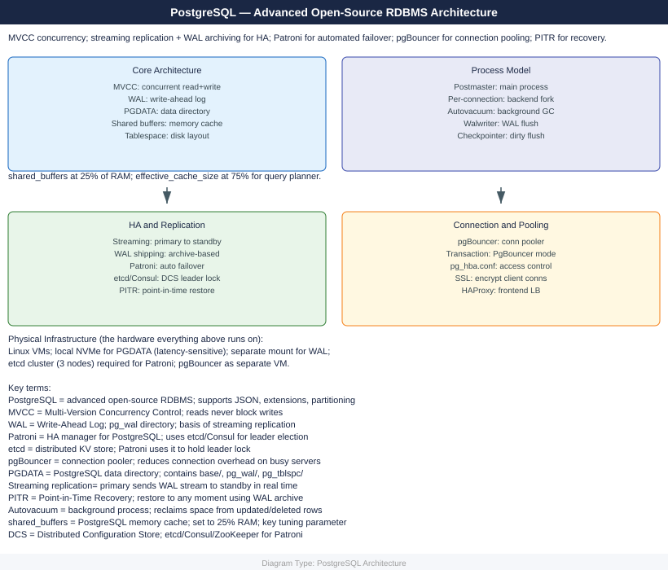

---
tags:
  - architecture
  - linux
description: "PostgreSQL architecture: primary-standby streaming replication, logical replication for migrations, shared_buffers and wal_level sizing, and storage..."
---
# PostgreSQL — Architecture

PostgreSQL architecture: primary-standby streaming replication, logical replication for migrations, shared_buffers and wal_level sizing, and storage layout.

*Applies to: PostgreSQL 15.x / 16.x*

  <a class="kb-card" href="how-it-works/">How It Works</a>
  <a class="kb-card" href="design-standards/">Design Standards</a>
  <a class="kb-card" href="integrations/">Integrations</a>

