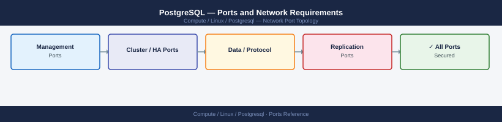

---
tags:
  - postgresql
  - database
  - linux
  - networking
  - firewall
  - ports
description: "Firewall port reference for PostgreSQL. Covers client connections, replication (streaming and logical), pgBouncer connection pooler, and Patroni HA..."
---
# PostgreSQL — Ports and Network Requirements

<div class="kb-summary">
Firewall port reference for PostgreSQL. Covers client connections, replication (streaming and logical), pgBouncer connection pooler, and Patroni HA cluster.

*Applies to: PostgreSQL 14+ / Patroni 3.x*
</div>


## Inbound — Client Connections

| Port | Protocol | Source | Purpose |
|---|---|---|---|
| 5432 | TCP | Application servers, DBA workstations | PostgreSQL standard client connections |
| 6432 | TCP | Application servers | pgBouncer connection pooler (if deployed in front of PostgreSQL) |

## Streaming Replication (Primary to Replica)

| Port | Protocol | Between | Purpose |
|---|---|---|---|
| 5432 | TCP | Replica → Primary | WAL streaming replication — replica connects to primary on 5432 |

## Patroni HA (Cluster Management)

| Port | Protocol | Between | Purpose |
|---|---|---|---|
| 8008 | TCP | Patroni nodes (and HAProxy health check) | Patroni REST API — leader election, health check |
| 2379 | TCP | Patroni → etcd cluster | etcd client port (consensus store for Patroni) |
| 2380 | TCP | etcd nodes ↔ etcd nodes | etcd peer replication |
| 5000 | TCP | App servers → HAProxy | HAProxy write VIP (primary) |
| 5001 | TCP | App servers → HAProxy | HAProxy read VIP (replica) |

## Monitoring

| Port | Protocol | Source | Purpose |
|---|---|---|---|
| 9187 | TCP | Prometheus server | postgres_exporter — PostgreSQL metrics |

## Firewall Zone Summary

| From | To | Ports | Notes |
|---|---|---|---|
| App servers | PostgreSQL / pgBouncer | 5432 or 6432 | Client connections |
| PostgreSQL replica | PostgreSQL primary | 5432 | Streaming replication |
| Patroni nodes | etcd | 2379 | Cluster consensus |
| etcd nodes | etcd nodes | 2380 | etcd peer replication |
| HAProxy health | Patroni | 8008 | Leader detection |
| Prometheus | PostgreSQL | 9187 | Metrics |

## Verify

```bash
# From app server
psql -h <postgres-host> -U appuser -d appdb -c "SELECT version();"

# Test pgBouncer
psql -h <postgres-host> -p 6432 -U appuser -d pgbouncer -c "SHOW POOLS;"

# Patroni cluster status
patronictl -c /etc/patroni/config.yml list

# Replication lag
psql -c "SELECT now() - pg_last_xact_replay_timestamp() AS replication_lag;"
```


```text title="Expected output"
version
────────────────────────────────────────────────────────────────────────────────
 PostgreSQL 14.8 on x86_64-pc-linux-gnu, compiled by gcc (GCC) 9.4.0, 64-bit
(1 row)

 database | user    | cl_active | cl_waiting | sv_active | sv_idle | sv_used | sv_tested | sv_login | maxwait
──────────┼─────────┼───────────┼────────────┼───────────┼─────────┼─────────┼───────────┼──────────┼────────
 appdb    | appuser |         3 |          0 |         5 |       2 |       7 |         0 |        0 |      0
(1 row)

+ Cluster: prod-pg-cluster (7227849263894729231)
| Member          | Host           | Role    | State   | TL | Lag in MB
+-----------------+----------------+---------+---------+----+-----------
| pg-primary-01   | 10.42.1.15     | Leader  | running |  4 | 0
| pg-replica-01   | 10.42.1.16     | Replica | running |  4 | 12
| pg-replica-02   | 10.42.1.17     | Replica | running |  4 | 8

 replication_lag
─────────────────
 00:00:00.234567
(1 row)
```

!!! warning "Common errors"
    **`psql: error: could not translate host name "<postgres-host>" to address: Name or service not known`** — Replace `<postgres-host>` with the actual PostgreSQL server hostname or IP address.
    **`psql: error: FATAL: remaining connection slots are reserved for non-replication superuser connections`** — Increase `max_connections` in postgresql.conf or reduce active connections before retrying.
    **`connection refused`** — Verify pgBouncer is running on port 6432 with `systemctl status pgbouncer` and check firewall rules allow access from the app server.
## See also

- [PostgreSQL — Architecture](../how-it-works/)
- [PostgreSQL — Operations](../../operations/)
- [MySQL — Ports](../../mysql/architecture/ports.md)
- [Linux — Ports](../../architecture/ports.md)
