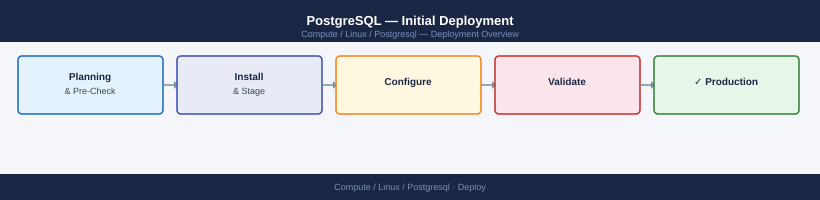

---
tags:
  - deployment
  - linux
search:
  boost: 1.5
---
# PostgreSQL — Initial Deployment

<div class="kb-summary">
PostgreSQL initial deployment — installation on RHEL/Ubuntu, postgresql.conf baseline tuning, pg_hba.conf access control, firewall, and first-connection validation.

*Applies to: RHEL / Ubuntu LTS*
</div>



```mermaid
flowchart TD
    s0["Before you begin"]
    s1["Install on RHEL / Rocky"]
    s2["Install on Ubuntu"]
    s3["Initial Configuration (`postgresql.conf`)"]
    s4["`pg_hba.conf` Access Control"]
    s5["Firewall"]
    s6["Create Application User and Database"]
    s7["✓ Validation"]
    s8["✓ Verify"]
    s0 --> s1 --> s2 --> s3 --> s4 --> s5 --> s6 --> s7 --> s8
    style s7 fill:#2e7d32,color:#fff,stroke:#1b5e20
    style s8 fill:#2e7d32,color:#fff,stroke:#1b5e20
```

```d2
direction: right

plan: "Plan" {shape: oval}
install_on_rhel_rocky: "Install on RHEL / Rocky" {shape: rectangle}
install_on_ubuntu: "Install on Ubuntu" {shape: rectangle}
initial_configuration_postgresqlconf: "Initial Configuration (`postgresql.conf`)" {shape: rectangle}
pghbaconf_access_control: "`pg_hba.conf` Access Control" {shape: rectangle}
firewall: "Firewall" {shape: rectangle}
create_application_user_and_database: "Create Application User and Database" {shape: rectangle}
validate: "Validate" {shape: oval}

plan -> install_on_rhel_rocky
install_on_rhel_rocky -> install_on_ubuntu
install_on_ubuntu -> initial_configuration_postgresqlconf
initial_configuration_postgresqlconf -> pghbaconf_access_control
pghbaconf_access_control -> firewall
firewall -> create_application_user_and_database
create_application_user_and_database -> validate
```

## Before you begin

- **Access:** root or sudo-capable account on target hosts
- **Environment:** DNS, NTP, and network connectivity verified before starting
- **Change management:** change request approved; maintenance window scheduled
- **Rollback:** snapshot or backup taken immediately before deployment begins
- **Time estimate:** 30–90 minutes — do not start if less than 2 hours are available

---

## Install on RHEL / Rocky

```bash
sudo dnf install -y https://download.postgresql.org/pub/repos/yum/reporpms/EL-9-x86_64/pgdg-redhat-repo-latest.noarch.rpm
sudo dnf -qy module disable postgresql
sudo dnf install -y postgresql16-server
sudo /usr/pgsql-16/bin/postgresql-16-setup initdb
sudo systemctl enable --now postgresql-16
```

## Install on Ubuntu

```bash
sudo apt install -y postgresql postgresql-contrib
sudo systemctl enable --now postgresql
```

## Initial Configuration (`postgresql.conf`)

```ini
listen_addresses = 'localhost'
max_connections = 100
shared_buffers = 2GB
effective_cache_size = 6GB
maintenance_work_mem = 512MB
work_mem = 16MB
wal_level = replica
archive_mode = on
archive_command = 'cp %p /backup/wal/%f'
log_min_duration_statement = 1000
```

## `pg_hba.conf` Access Control

```text
# TYPE  DATABASE  USER      ADDRESS          METHOD
local   all       postgres                   peer
host    app_prod  appuser   10.0.1.0/24      scram-sha-256
host    all       all       127.0.0.1/32     scram-sha-256
```

After editing: `sudo systemctl reload postgresql-16`

## Firewall

```bash
sudo firewall-cmd --add-rich-rule='rule family=ipv4 source address=10.0.1.0/24 port port=5432 protocol=tcp accept' --permanent
sudo firewall-cmd --reload
```

## Create Application User and Database

```sql
CREATE USER appuser WITH ENCRYPTED PASSWORD 'StrongPass1!';
CREATE DATABASE app_prod OWNER appuser;
GRANT ALL ON DATABASE app_prod TO appuser;
```

## Validation

```bash
psql -U postgres -c "SELECT version(); SHOW shared_buffers;"
psql -U appuser -h 127.0.0.1 -d app_prod -c "SELECT 1 AS alive;"
```

---

## Verify

- `systemctl status postgresql` shows `active (running)`
- `psql -U postgres -c "SELECT version();"` returns the expected PostgreSQL version
- Application user can connect: `psql -U appuser -h 127.0.0.1 -d app_prod -c "SELECT 1 AS alive;"`
- `pg_lsclusters` shows the cluster as `online`

---

## See also

- [Postgresql — Procedures](../operations/procedures/)
- [Postgresql — Common Issues](../troubleshooting/common-issues/)
- [Postgresql — How It Works](../architecture/how-it-works/)
