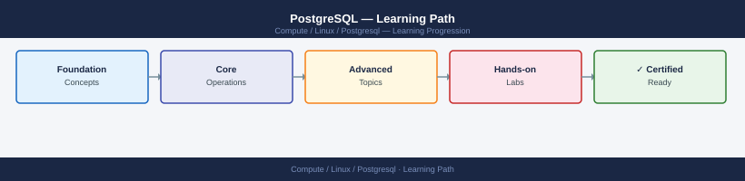

---
tags:
  - learning-path
  - linux
---
# PostgreSQL — Learning Path

<div class="kb-summary">
Recommended reading order for PostgreSQL on Linux. Follow these stages in order to build a complete mental model before working with it in production.

*Applies to: PostgreSQL 15.x / 16.x*
</div>



| Stage | Focus | Time investment |
|-------|-------|----------------|
| 1 — Architecture | WAL, MVCC, streaming replication, autovacuum | 4–5 h |
| 2 — Deployment | Installation, postgresql.conf baseline, streaming replica | 2–3 h |
| 3 — Operations | Health checks, VACUUM, backup cadence, CLI | ongoing |
| 4 — Security | Role model, pg_hba.conf, TLS, pg_audit | 2–3 h |
| 5 — Troubleshooting | EXPLAIN ANALYZE, bloat, replication slot buildup | as needed |

---

```d2
direction: right

stage_1_architecture: "Stage 1 — Architecture" {shape: rectangle}
stage_2_deployment: "Stage 2 — Deployment" {shape: rectangle}
stage_3_operations: "Stage 3 — Operations" {shape: rectangle}
stage_4_security: "Stage 4 — Security" {shape: rectangle}
stage_5_troubleshooting: "Stage 5 — Troubleshooting" {shape: rectangle}

stage_1_architecture -> stage_2_deployment: next
stage_2_deployment -> stage_3_operations: next
stage_3_operations -> stage_4_security: next
stage_4_security -> stage_5_troubleshooting: next
```

## Stage 1 — Architecture

**Goal**: Understand PostgreSQL's process model, WAL-based durability, MVCC implementation, and how streaming replication builds on WAL before designing a production cluster.

**Read in this order**:

- [How It Works](../architecture/how-it-works/) — postmaster process tree (one backend process per connection), shared buffers cache, WAL writer, background writer, checkpointer, autovacuum launcher/workers, MVCC dead-tuple model (updated rows leave old versions visible to concurrent transactions), and the checkpoint mechanism that limits recovery time after a crash
- [Design Standards](../architecture/design-standards/) — tablespace design for separating indexes from table data onto different volumes, table partitioning strategy (range, list, hash), index type selection (B-tree for most, GIN for JSONB and full-text, GiST for geometric, BRIN for time-series), and streaming replication topology (primary + sync standby + async standby)
- [Integrations](../architecture/integrations/) — PgBouncer connection pooling (transaction mode for web apps, session mode for long-running connections), `pg_basebackup` for initial replica seeding and physical backup, Patroni for automatic HA failover with etcd/Consul/ZooKeeper as DCS, and Prometheus `postgres_exporter` for metrics

**Key concepts before moving on**:

- PostgreSQL uses MVCC — `UPDATE` does not modify the row in place; it inserts a new version and marks the old one dead. VACUUM must reclaim dead tuple space; failure to run VACUUM causes table bloat and eventually transaction ID wraparound
- `shared_buffers` should be 25% of RAM (PostgreSQL manages its own cache in addition to OS page cache)
- Streaming replication streams WAL from primary to standby — the standby continuously applies WAL and is always slightly behind the primary
- A replication slot that is not consumed causes WAL to accumulate on the primary until disk is full — monitor `pg_replication_slots.active` and WAL directory size

**Why first**: PostgreSQL's VACUUM behaviour and WAL configuration have major performance and availability implications. Understanding them before tuning prevents table bloat, replication issues, and transaction ID wraparound emergencies.

---

## Stage 2 — Deployment

**Goal**: Install PostgreSQL with a secure baseline, configure WAL archiving, and establish streaming replication before accepting application traffic.

**Read**:

- [Deploy](../deploy/) — PGDG repository installation, `initdb -D /var/lib/postgresql/16/main`, `postgresql.conf` baseline (`shared_buffers`, `wal_level = replica`, `max_wal_senders`, `archive_mode`, `archive_command`), `pg_hba.conf` initial host entries, and streaming replica seeding with `pg_basebackup -R`
- [Install & Upgrade](../operations/install-upgrade/) — minor version upgrade (stop → upgrade package → start; data directory is compatible), major version upgrade via `pg_upgrade -b oldbin -B newbin -d olddata -D newdata`, and extension upgrade with `ALTER EXTENSION name UPDATE`

**Deployment principles**:

- Separate WAL (`pg_wal`) onto its own volume — WAL writes are sequential and should not compete with random I/O from table reads
- Enable `archive_mode = on` from day one — you cannot enable WAL archiving without a restart, and you need archives for PITR
- Test replica promotion before you need it — run `pg_ctl promote` on a standby in a lab environment and verify application reconnection

---

## Stage 3 — Operations

**Goal**: Maintain PostgreSQL health — monitoring replication lag, autovacuum progress, bloat, and query performance on every shift.

**Read in this order**:

- [Health Checks](../operations/health-checks/) — run the routine first on every shift; `pg_stat_replication` for lag and standby state, `pg_stat_user_tables.n_dead_tup` for bloat, `pg_stat_activity` for blocking queries and long transactions, `max_connections` headroom, and WAL directory and archive destination disk usage
- [CLI Reference](../operations/cli-reference/) — `psql`, `pg_dump --format=custom`, `pg_restore`, `pg_basebackup`, `pg_ctl status/reload/restart`, `vacuumdb --analyze --verbose`, `reindexdb`, and `pgbench -i -s 100` for load testing
- [Procedures](../operations/procedures/) — standby promotion to primary, adding a replica with `pg_basebackup -R`, manual `VACUUM FREEZE` on a bloated table, tablespace move for a table or index, and PITR restore from WAL archive
- [Backup & Restore](../operations/backup-restore/) — `pg_dump` logical backup schedule per database, WAL archiving to S3 with `pgBackRest` or `WAL-G`, `pg_basebackup` weekly physical backup, PITR restore procedure and recovery target validation, and monthly restore test on a spare host
- [Scripts](../operations/scripts/) — table bloat detection query (`pgstattuple`), replication lag alerting, autovacuum per-table tuning (`ALTER TABLE t SET (autovacuum_vacuum_scale_factor = 0.01)`), and connection pooler health check script

**Daily rhythm**: Replication lag → bloated tables → blocking queries → WAL archive lag → connection count headroom.

---

## Stage 4 — Security

**Goal**: Enforce role-based database access, protect data at rest and in transit, and audit all privileged operations end to end.

**Read**:

- [Access Control](../security/access-control/) — PostgreSQL role model (`CREATE ROLE`, `GRANT`, `REVOKE`, role inheritance), row-level security (`CREATE POLICY`), schema privilege separation (public schema lockdown), and `pg_hba.conf` authentication rules (client IP → auth method)
- [Authentication](../security/authentication/) — `scram-sha-256` as the password authentication method (replace `md5` everywhere), SSL client certificate authentication for service accounts, LDAP `ldapsimpleauth`/`ldapbind` configuration in `pg_hba.conf`, and RADIUS for centralised auth
- [Encryption](../security/encryption/) — `ssl = on` in `postgresql.conf` with a valid TLS certificate, `hostssl` entries in `pg_hba.conf` to require TLS for connections, `pgcrypto` extension for application-layer column encryption, and OS-level LUKS encryption for the data directory
- [Hardening](../security/hardening)] — superuser account restrictions (never connect as `postgres` from applications), `pg_audit` extension for statement and object audit logging, connection restrictions in `pg_hba.conf` (reject before allow), and `shared_preload_libraries = 'pg_audit'` for audit log persistence

---

## Stage 5 — Troubleshooting

**Goal**: Diagnose slow queries, replication issues, table bloat, and crash recovery without data loss.

**Read**:

- [Common Issues](../troubleshooting/common-issues/) — autovacuum not keeping up (table bloat grows, transaction ID wrapped), replication slot accumulating WAL (consumer offline), long-running transaction blocking autovacuum, `max_connections` exhausted (PgBouncer misconfigured), transaction ID wraparound warning in logs, and `ERROR: could not write to file "pg_wal"` (WAL disk full)
- [Diagnostics](../troubleshooting/diagnostics/) — `EXPLAIN (ANALYZE, BUFFERS)` plan reading (look for Seq Scan on large tables, high Buffers Hit miss), `pg_stat_activity` blocking query chain with `pg_blocking_pids()`, `pg_locks` deadlock analysis, `pg_stat_bgwriter` for checkpoint tuning, and `WAL-G wal-fetch` for archive troubleshooting
- [Escalation](../troubleshooting/escalation/) — PostgreSQL mailing list (pgsql-general) and community Slack for configuration questions, EDB/Crunchy Data/Percona commercial support for production subscriptions, and data recovery specialists for corrupt cluster files (`pg_filedump` for data file inspection)

**Why last**: Troubleshooting makes most sense once you understand MVCC, autovacuum, WAL, and what normal `pg_stat_*` values look like on a healthy cluster at your workload level.

---

## See also

- [Postgresql — Deploy](../../deploy/)
- [Postgresql — Procedures](../../operations/procedures/)
- [Postgresql — Common Issues](../../troubleshooting/common-issues/)
