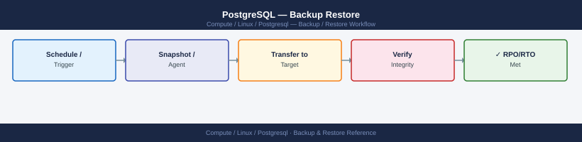

---
tags:
  - linux
  - operations
---
# PostgreSQL — Backup Restore

<div class="kb-summary">
PostgreSQL backup: `pg_dump`, `pg_basebackup`, WAL archiving with `archive_command`, point-in-time recovery using `recovery.conf`, and pgBackRest integration.

*Applies to: RHEL / Ubuntu LTS*
</div>


## Before you begin

- **Access:** root or sudo-capable account on target hosts
- **Timing:** safe to run during business hours unless a step is marked ⚠ (causes interruption)
- **Dependencies:** no active upgrades or migrations on the same infrastructure
- **Logging:** capture command output — paste into the change record on completion

---

## Database — Backup Validation

```bash
# pgBackRest — check latest backup info
pgbackrest --stanza=<stanza-name> info

# List backup files
pgbackrest --stanza=<stanza-name> info --output=json | jq '.[] | .backup[-1]'

# Check WAL archiving is current
psql -U postgres -c "SELECT last_archived_wal, last_archived_time, last_failed_wal FROM pg_stat_archiver;"
```


```text title="Expected output"
stanza: prod-db-primary
    status: ok
    cipher: none

    db (current)
        wal archive min/max (14-1): 000000010000000000000001/000000010000000000001A4F

        full backup: 20250115-084532F
            timestamp start/stop: 2025-01-15 08:45:32 / 2025-01-15 08:47:18
            wal included: 000000010000000000000001 to 000000010000000000000042
            database size: 2.1GB, backup size: 2.1GB
            repository size: 2.1GB, repository backup size: 2.1GB

{
  "type": "full",
  "reference": [],
  "timestamp": 1736938532,
  "label": "20250115-084532F",
  "database": {
    "id": 1,
    "repo-key": 1
  }
}

 last_archived_wal | last_archived_time       | last_failed_wal
-------------------+--------------------------+-----------------
 000000010000000000001A4F | 2025-01-15 09:22:14+00 | 
(1 row)
```

!!! warning "Common errors"
    **`ERROR: unable to load info file '/var/lib/pgbackrest/backup/<stanza-name>/backup.info' — permission denied`** — Verify pgBackRest repository directory is owned by the postgres system user and readable by the pgbackrest process.
    **`FATAL: Ident authentication failed for user "postgres"`** — Ensure the psql connection is run as the postgres OS user or configure pg_hba.conf to allow local connections without ident authentication.
    **`ERROR: archive_command returned non-zero exit status 1`** — Check that the pgBackRest archive_command in postgresql.conf is correctly configured and the repository path is writable by the postgres user.
```bash
# PostgreSQL — verify backup with pgBackRest
pgbackrest --stanza=<stanza-name> check

# MySQL — verify xtrabackup integrity
xtrabackup --prepare --target-dir=/backup/mysql/latest/

# SQL Server — verify backup file checksum
RESTORE VERIFYONLY FROM DISK = '/backup/mssql/mydb_full.bak' WITH CHECKSUM;
```

```text title="Expected output"
pgBackRest 2.48 -- verify backup integrity
INFO: check command completed successfully
INFO: WAL archive integrity verified
INFO: backup set 20240115-093847F integrity verified
INFO: stanza 'prod_db' is valid

xtrabackup: recognized server arguments: --datadir=/var/lib/mysql --log_bin=/var/log/mysql/mysql-bin
xtrabackup: using the following InnoDB configuration:
xtrabackup: innodb_data_home_dir = .
xtrabackup: innodb_log_group_home_dir = ./
xtrabackup: innodb_log_files_in_group = 2
xtrabackup: innodb_log_file_size = 536870912
InnoDB: Buffer pool size 2147483648
xtrabackup: completed OK!

Msg 0, Level 0, State 1
RESTORE VERIFYONLY statement processed 2847 pages for database 'mydb'.
Msg 0, Level 0, State 1
RESTORE VERIFYONLY statement processed successfully.
```

!!! warning "Common errors"
    **`pgbackrest: [STANZA_NOT_FOUND] stanza 'prod_db' does not exist`** — Verify the stanza name matches your pgBackRest configuration in `/etc/pgbackrest/pgbackrest.conf`.
    **`xtrabackup: error: InnoDB: Tablespace size stored in header is 5242880 pages, but the sum of new sizes is 5242879 pages`** — Run `xtrabackup --prepare --target-dir=/backup/mysql/latest/ --use-memory=2G` to rebuild the tablespace or restore from a newer backup.
    **`Msg 3013, Level 16, State 1, Server 'MSSQL_SERVER', Line 1 RESTORE detected an error on page (1:2847) in database 'mydb'`** — Restore from a known-good backup file or run `DBCC CHECKDB (mydb)` after restore to identify corruption.
```bash
# Restore to test instance
pgbackrest --stanza=<stanza-name> --pg1-path=/var/lib/pgsql/test-restore restore
# Start test instance and verify
pg_ctl -D /var/lib/pgsql/test-restore start
psql -p 5433 -U postgres -c "SELECT count(*) FROM pg_stat_user_tables;"
```

```text title="Expected output"
INFO: restore command begin 2.52: --stanza=prod-db --pg1-path=/var/lib/pgsql/test-restore restore
INFO: repo1: restore backup set 20240115-093847F
INFO: check archive for backup validity
INFO: restore backup from repo1
INFO: write /var/lib/pgsql/test-restore/recovery.signal
INFO: restore command end: completed successfully
waiting for server to start.... done
server started
 count 
-------
    42
(1 row)
```

!!! warning "Common errors"
    **`FATAL: could not create lock file "/var/lib/pgsql/test-restore/postmaster.pid": Permission denied`** — Ensure the postgres system user owns the test-restore directory with `chown -R postgres:postgres /var/lib/pgsql/test-restore`.
    **`ERROR: could not connect to server: could not translate host name "localhost" to address: Name or service not known`** — Verify PostgreSQL is listening on port 5433 by checking postgresql.conf or using `ss -tlnp | grep 5433`.
    **`FATAL: data directory "/var/lib/pgsql/test-restore" does not exist`** — Confirm the restore completed successfully and the directory path matches your pgbackrest configuration in pgbackrest.conf.
```bash
# Copy backup to test directory
xtrabackup --prepare --target-dir=/restore/mysql-test/
rsync -a /restore/mysql-test/ /var/lib/mysql-test/
chown -R mysql: /var/lib/mysql-test/
mysqld_safe --datadir=/var/lib/mysql-test --socket=/tmp/mysql-test.sock &
mysql -S /tmp/mysql-test.sock -e "SHOW DATABASES;"
```
```sql
RESTORE DATABASE [TestRestore] FROM DISK = '/backup/mssql/prod_full.bak'
WITH MOVE 'proddb' TO '/var/opt/mssql/data/TestRestore.mdf',
     MOVE 'proddb_log' TO '/var/opt/mssql/data/TestRestore_log.ldf',
     REPLACE, STATS = 10;
-- Verify table counts match expected
USE TestRestore;
SELECT COUNT(*) FROM important_table;
```

---

## Verify

- Confirm the operation completed without errors in the log or management UI
- Verify the expected state change is visible (service running, object created, config applied)
- Document the outcome in the change record

---

## See also

- [Postgresql — Procedures](../procedures/)
- [Postgresql — Health Checks](../health-checks/)
- [Postgresql — Common Issues](../../troubleshooting/common-issues/)
