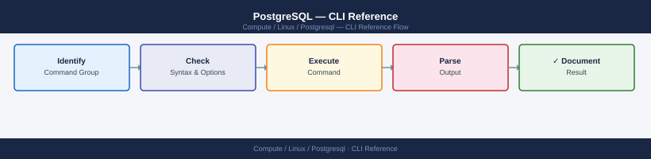

---
tags:
  - linux
  - operations
---
# PostgreSQL — CLI Reference

<div class="kb-summary">
PostgreSQL CLI reference — psql meta-commands, pg_dump/pg_restore, pg_basebackup, pg_upgrade, vacuumdb, and reindexdb quick reference.

*Applies to: RHEL / Ubuntu LTS*
</div>



## Before you begin

- **Access:** root or sudo-capable account on target hosts
- **Timing:** safe to run during business hours unless a step is marked ⚠ (causes interruption)
- **Dependencies:** no active upgrades or migrations on the same infrastructure
- **Logging:** capture command output — paste into the change record on completion

---

## psql

```bash
# Connect
psql -h <host> -U <user> -d <database>
psql -U postgres                           # local socket
psql -U appuser -h 10.0.1.10 -d app_prod
psql -U postgres -c "SELECT version();"    # one-liner
psql -U postgres -Atc "SELECT count(*) FROM pg_stat_activity;"  # -A no align, -t tuples only
```

**Meta-commands inside psql:**

| Command | Action |
|---|---|
| `\l` | List databases |
| `\c <db>` | Connect to database |
| `\dt` | List tables in current schema |
| `\d <table>` | Describe table |
| `\du` | List roles/users |
| `\i <file.sql>` | Execute SQL file |
| `\timing` | Toggle query execution time |
| `\x` | Toggle expanded output |
| `\q` | Quit |

## pg_dump / pg_restore

```bash
# Dump single DB (custom format)
pg_dump -U postgres -Fc app_prod > app_prod_$(date +%F).dump

# Dump all databases
pg_dumpall -U postgres > all-$(date +%F).sql

# Restore custom format (parallel)
pg_restore -U postgres -d app_prod -j 4 app_prod.dump

# Restore with create
pg_restore -U postgres -C -d postgres app_prod.dump
```

## pg_basebackup

```bash
pg_basebackup -h localhost -U replication -D /backup/base -P -Xs -R
# -Xs = include WAL; -R = write standby.signal
```

## vacuumdb / reindexdb

```bash
vacuumdb -U postgres --analyze -d app_prod
vacuumdb -U postgres --full -d app_prod --table orders   # full; locks table
reindexdb -U postgres -d app_prod
```

## pg_upgrade

```bash
pg_upgrade \
  --old-datadir /var/lib/pgsql/15/data \
  --new-datadir /var/lib/pgsql/16/data \
  --old-bindir /usr/pgsql-15/bin \
  --new-bindir /usr/pgsql-16/bin \
  --check   # dry-run; remove --check for actual upgrade
```

---

## Verify

- Confirm the operation completed without errors in the log or management UI
- Verify the expected state change is visible (service running, object created, config applied)
- Document the outcome in the change record

---

## See also

- [Postgresql — Procedures](procedures/)
- [Postgresql — Scripts](scripts/)
- [Postgresql — Health Checks](health-checks/)
