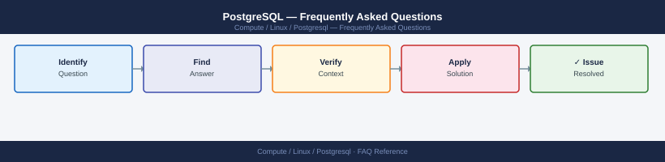

---
tags:
  - postgresql
  - faq
  - operations
---
# PostgreSQL — Frequently Asked Questions

Common questions about PostgreSQL operations, configuration, and troubleshooting. For step-by-step procedures, see the <a href="index.md">Operations</a> section.

## General

**Q: What PostgreSQL version is recommended for new deployments?**
A: PostgreSQL 16 or 17 (latest stable). Avoid versions older than 14 (approaching EOL). Check with `psql --version` or `SELECT version();` from psql.

**Q: How do I check the current PostgreSQL version?**
A: `psql --version`

## Configuration

**Q: What is the default `shared_buffers` size and when should it change?**
A: Default is 128 MB — too small for production. Set to 25% of system RAM: e.g., `shared_buffers = 4GB` in `postgresql.conf`. Also set `effective_cache_size` to 75% of RAM for the query planner.

**Q: How do I enable logical replication in PostgreSQL?**
A: Set `wal_level = logical` in `postgresql.conf` and restart. Create a publication: `CREATE PUBLICATION mypub FOR TABLE orders;`. On the subscriber, create a subscription pointing to the publisher.

## Operations

**Q: How do I upgrade PostgreSQL major versions without extended downtime?**
A: Use `pg_upgrade` for offline upgrade (fastest) or logical replication for near-zero downtime: set up a replica on the new version, replicate, then switch traffic. Test `pg_upgrade --check` first.

**Q: What is the correct procedure to add a streaming replica?**
A: Run `pg_basebackup -h primary -U replicator -D /data/pg16 -Fp -Xs -P`. Configure `recovery.conf` (PG12-) or `standby.signal` (PG12+). Add `primary_conninfo` in `postgresql.conf`. Verify with `pg_stat_replication`.

## Troubleshooting

**Q: PostgreSQL logs show 'FATAL: sorry, too many clients already'. What does it mean?**
A: `max_connections` limit reached (default 100). Increase in `postgresql.conf` (requires restart). Better solution: use PgBouncer connection pooler in transaction mode to reduce actual backend connections.

**Q: Queries are slow after data load — where do I start?**
A: Run `ANALYZE` to update statistics. Check `pg_stat_statements` for slow queries. Use `EXPLAIN ANALYZE` on specific queries. Check for missing indexes with `pg_stat_user_indexes`. Review autovacuum settings.

## Backup and Recovery

**Q: How often should I back up PostgreSQL?**
A: Continuous WAL archiving with `pg_basebackup` weekly base backups. Use `pgBackRest` or `Barman` for enterprise backup management. PITR recovery requires both base backup and WAL archive.

**Q: Can I restore a single table without a full cluster restore?**
A: Yes — `pg_dump -t tablename dbname > table.sql` for export; `psql dbname < table.sql` to restore. For PITR, restore to a separate instance and use `pg_dump` to extract the specific table.

## See Also

- [PostgreSQL Operations](index.md)
- [PostgreSQL Troubleshooting](../../../troubleshooting/index.md)
