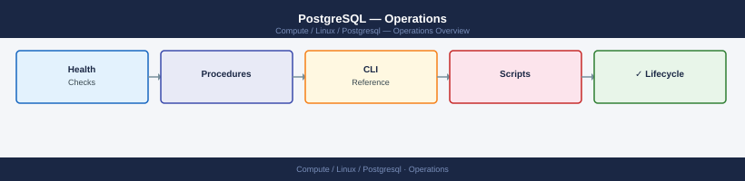

---
tags:
  - linux
  - operations
---
# PostgreSQL — Operations

Health checks, procedures, CLI, backup/restore, upgrades, and scripts.

*Applies to: RHEL / Ubuntu LTS*

  <a class="kb-card" href="health-checks/">Health Checks</a>
  <a class="kb-card" href="procedures/">Procedures</a>
  <a class="kb-card" href="cli-reference/">Cli Reference</a>
  <a class="kb-card" href="backup-restore/">Backup Restore</a>
  <a class="kb-card" href="install-upgrade/">Install Upgrade</a>
  <a class="kb-card" href="scripts/">Scripts</a>
  <a class="kb-card" href="faq/"><strong>FAQ</strong>Frequently asked questions, common issues, and quick answers for day-to-day operations.</a>

