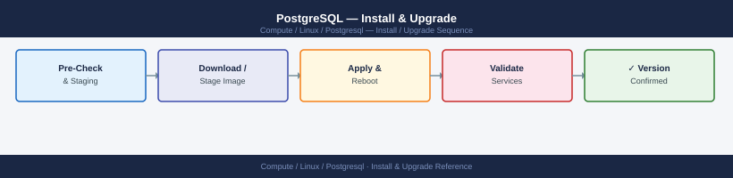

---
tags:
  - linux
  - operations
---
# PostgreSQL — Install & Upgrade

<div class="kb-summary">
PostgreSQL upgrade procedures — minor version (in-place), major version (pg_upgrade), upgrade path, pre-upgrade checks, and post-upgrade validation.

*Applies to: RHEL / Ubuntu LTS*
</div>


## Before you begin

- **Access:** root or sudo-capable account on target hosts
- **Timing:** safe to run during business hours unless a step is marked ⚠ (causes interruption)
- **Dependencies:** no active upgrades or migrations on the same infrastructure
- **Logging:** capture command output — paste into the change record on completion

---

## Version Upgrade Path

Minor versions (15.x → 15.y): in-place, same data directory.
Major versions (15 → 16): requires `pg_upgrade` or logical replication migration.
Always upgrade one major version at a time.

## Minor Version Upgrade (RHEL)

```bash
sudo systemctl stop postgresql-15
sudo dnf upgrade postgresql15-server
sudo systemctl start postgresql-15
psql -U postgres -c "SELECT version();"
```

## Major Version Upgrade with `pg_upgrade`

```bash
# Install new version
sudo dnf install -y postgresql16-server
sudo /usr/pgsql-16/bin/postgresql-16-setup initdb

# Copy config files
sudo cp /var/lib/pgsql/15/data/postgresql.conf /var/lib/pgsql/16/data/
sudo cp /var/lib/pgsql/15/data/pg_hba.conf /var/lib/pgsql/16/data/

# Stop old instance
sudo systemctl stop postgresql-15

# Dry-run check
sudo -u postgres pg_upgrade \
  --old-datadir /var/lib/pgsql/15/data \
  --new-datadir /var/lib/pgsql/16/data \
  --old-bindir /usr/pgsql-15/bin \
  --new-bindir /usr/pgsql-16/bin \
  --check

# Actual upgrade
sudo -u postgres pg_upgrade \
  --old-datadir /var/lib/pgsql/15/data \
  --new-datadir /var/lib/pgsql/16/data \
  --old-bindir /usr/pgsql-15/bin \
  --new-bindir /usr/pgsql-16/bin \
  --jobs 4

sudo systemctl start postgresql-16
```

## Post-Upgrade Steps

```bash
# Update statistics (required after pg_upgrade)
sudo -u postgres /usr/pgsql-16/bin/vacuumdb --all --analyze-in-stages

# Verify all databases accessible
psql -U postgres -l

# Update extensions
psql -U postgres -d app_prod -c "ALTER EXTENSION pg_stat_statements UPDATE;"
```

---

## Verify

- Confirm the operation completed without errors in the log or management UI
- Verify the expected state change is visible (service running, object created, config applied)
- Document the outcome in the change record

---

## See also

- [Postgresql — Procedures](../procedures/)
- [Postgresql — Health Checks](../health-checks/)
- [Postgresql — Deploy](../../deploy/)
