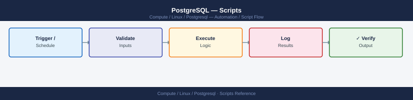

---
tags:
  - linux
  - operations
description: "PostgreSQL automation scripts — base backup, WAL archiving, replication lag monitor, bloat report, long-running transaction alert, and connection trend..."
---
# PostgreSQL — Scripts

<div class="kb-summary">
PostgreSQL automation scripts — base backup, WAL archiving, replication lag monitor, bloat report, long-running transaction alert, and connection trend logging.

*Applies to: RHEL / Ubuntu LTS*
</div>


## Before you begin

- **Access:** root or sudo-capable account on target hosts
- **Timing:** safe to run during business hours unless a step is marked ⚠ (causes interruption)
- **Dependencies:** no active upgrades or migrations on the same infrastructure
- **Logging:** capture command output — paste into the change record on completion

---

## Nightly Base Backup

```bash
#!/bin/bash
BACKUP_DIR="/backup/postgresql/$(date +%F)"
mkdir -p "$BACKUP_DIR"
pg_basebackup -U replication -D "$BACKUP_DIR" -Ft -z -P -Xs
find /backup/postgresql/ -maxdepth 1 -type d -mtime +14 -exec rm -rf {} +
echo "Base backup complete: $BACKUP_DIR"
```


```text title="Expected output"
mkdir: created directory '/backup/postgresql/2024-01-15'
24576/24576 kB (100%), 1/1 tablespace
NOTICE:  pg_basebackup: base backup completed
Base backup complete: /backup/postgresql/2024-01-15
```

!!! warning "Common errors"
    **`pg_basebackup: could not connect to server: FATAL:  role "replication" does not exist`** — Create the replication role with `createuser -U postgres --replication replication` or verify the role exists with `psql -U postgres -c "\du"`.
    **`mkdir: cannot create directory '/backup/postgresql/2024-01-15': Permission denied`** — Ensure the PostgreSQL system user (usually `postgres`) owns the `/backup/postgresql` directory with `sudo chown postgres:postgres /backup/postgresql && sudo chmod 700 /backup/postgresql`.
    **`pg_basebackup: could not create directory "/backup/postgresql/2024-01-15": No space left on device`** — Check available disk space with `df -h /backup` and free up space or expand the partition before retrying the backup.
## Replication Lag Monitor

```bash
#!/bin/bash
LAG=$(psql -U monitor -Atc \
  "SELECT EXTRACT(EPOCH FROM (now() - pg_last_xact_replay_timestamp()))::int;" 2>/dev/null)
if [ -n "$LAG" ] && [ "$LAG" -gt 30 ]; then
  echo "WARN: PG replica lag ${LAG}s on $(hostname)" | \
    mail -s "PostgreSQL Replication Alert" dba@example.com
fi
```


```text title="Expected output"
(no output — command completes silently)
```

!!! warning "Common errors"
    **`psql: error: connection to server at "localhost" (127.0.0.1), port 5432 failed`** — Ensure the PostgreSQL server is running and the monitor user has connection permissions; check `pg_hba.conf` for the monitor user's host-based authentication rules.
    **`mail: command not found`** — Install a mail utility (e.g., `apt-get install mailutils` on Debian/Ubuntu or `yum install mailx` on RHEL) or configure an alternative alerting mechanism.
    **`psql: error: FATAL: role "monitor" does not exist`** — Create the monitor role with `createuser -U postgres monitor` and grant it CONNECT privileges on the replication database.
## Bloat Report

```sql
SELECT relname,
       n_dead_tup,
       n_live_tup,
       ROUND(100.0 * n_dead_tup / NULLIF(n_live_tup + n_dead_tup, 0), 1) AS dead_pct,
       last_autovacuum
FROM pg_stat_user_tables
WHERE n_live_tup > 1000
ORDER BY dead_pct DESC NULLS LAST
LIMIT 20;
```

## Long-Running Transaction Alert

```sql
SELECT pid, usename, state, query_start,
       now() - query_start AS duration,
       left(query, 80) AS query_snippet
FROM pg_stat_activity
WHERE state != 'idle'
  AND now() - query_start > interval '5 minutes'
ORDER BY duration DESC;
```

## Index Usage Report

```sql
SELECT schemaname, tablename, indexname, idx_scan
FROM pg_stat_user_indexes
WHERE idx_scan = 0
  AND indexname NOT LIKE '%_pkey'
ORDER BY schemaname, tablename;
```

## Connection Count Trend

```bash
psql -U monitor -Atc "SELECT now(), count(*) FROM pg_stat_activity;" \
  >> /var/log/pg-connections.csv
```


```text title="Expected output"
2024-01-15 14:32:47.123456+00:00|42
```

!!! warning "Common errors"
    **`psql: error: connection to server at "localhost" (127.0.0.1), port 5432 failed`** — Verify PostgreSQL is running with `systemctl status postgresql` and check that the monitor user has connection permissions in `pg_hba.conf`.
    **`psql: error: FATAL: role "monitor" does not exist`** — Create the monitoring role with `createuser -U postgres monitor` or verify the role name matches your actual PostgreSQL user.
    **`Permission denied`** — Ensure the `/var/log/` directory is writable by the user running the command, or redirect to a writable location like `/tmp/pg-connections.csv`.
---

## Verify

- Confirm the operation completed without errors in the log or management UI
- Verify the expected state change is visible (service running, object created, config applied)
- Document the outcome in the change record

---

## See also

- [Postgresql — Procedures](../procedures/)
- [Postgresql — CLI Reference](../cli-reference/)
- [Postgresql — Health Checks](../health-checks/)
