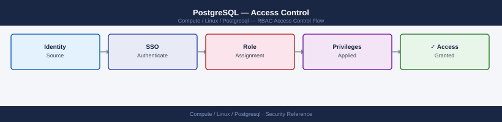

---
tags:
  - linux
  - security
description: "PostgreSQL access control — roles, GRANT/REVOKE, row-level security, schema permissions, pg_hba.conf host rules, and auditing current privileges."
---
# PostgreSQL — Access Control

<div class="kb-summary">
PostgreSQL access control — roles, GRANT/REVOKE, row-level security, schema permissions, pg_hba.conf host rules, and auditing current privileges.

*Applies to: RHEL / Ubuntu LTS*
</div>


## Before you begin

- **Access:** root or sudo-capable account on target hosts
- **Change management:** security changes require CAB approval in most environments
- **Rollback plan:** document current state before any security control change
- **Testing:** validate in a non-production environment first where possible

---

## Role Management

```sql
-- Create role (PostgreSQL uses roles for both users and groups)
CREATE ROLE appuser WITH LOGIN ENCRYPTED PASSWORD 'StrongPass1!';
CREATE ROLE readonly_role NOLOGIN;   -- group role

-- Assign group role to user
GRANT readonly_role TO appuser;

-- Drop
DROP ROLE appuser;
```

## Database and Schema Permissions

```sql
-- Grant connect + usage on schema
GRANT CONNECT ON DATABASE app_prod TO appuser;
GRANT USAGE ON SCHEMA public TO appuser;

-- Read-only on all tables in schema
GRANT SELECT ON ALL TABLES IN SCHEMA public TO appuser;

-- Read-write
GRANT SELECT, INSERT, UPDATE, DELETE ON ALL TABLES IN SCHEMA public TO appuser;

-- Grant on future tables (ALTER DEFAULT PRIVILEGES)
ALTER DEFAULT PRIVILEGES IN SCHEMA public
  GRANT SELECT, INSERT, UPDATE, DELETE ON TABLES TO appuser;
```

## pg_hba.conf — Connection Rules

```text
# TYPE  DATABASE  USER      ADDRESS          METHOD
local   all       postgres                   peer          # OS socket, no password
host    app_prod  appuser   10.0.1.0/24      scram-sha-256 # app subnet
host    all       all       0.0.0.0/0        reject        # deny all others
```

Reload after changes: `SELECT pg_reload_conf();`

## Row-Level Security

```sql
-- Enable RLS on table
ALTER TABLE orders ENABLE ROW LEVEL SECURITY;

-- Policy: users see only their own rows
CREATE POLICY user_policy ON orders
  USING (owner = current_user);
```

## Auditing Current Privileges

```sql
-- All privileges on tables in a schema
SELECT grantee, table_name, privilege_type
FROM information_schema.role_table_grants
WHERE table_schema = 'public'
ORDER BY grantee, table_name;

-- Members of each role
SELECT r.rolname AS role, m.rolname AS member
FROM pg_roles r
JOIN pg_auth_members am ON am.roleid = r.oid
JOIN pg_roles m ON m.oid = am.member
ORDER BY role;
```

---

## See also

- [Postgresql — Authentication](../authentication/)
- [Postgresql — Hardening](../hardening/)
- [Postgresql — Encryption](../encryption/)
