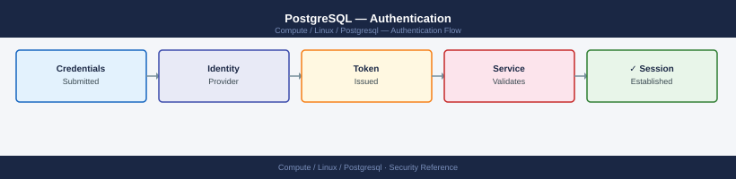

---
tags:
  - linux
  - security
---
# PostgreSQL — Authentication

<div class="kb-summary">
PostgreSQL authentication — pg_hba.conf methods (scram-sha-256, md5, peer, ldap, cert), password management, and SSL client certificate auth.

*Applies to: RHEL / Ubuntu LTS*
</div>



```d2
direction: down

external: External / Untrusted {shape: rectangle}
authentication_methods: "Authentication Methods" {shape: rectangle}
pghbaconf_configuration: "pg_hba.conf Configuration" {shape: rectangle}
password_management: "Password Management" {shape: rectangle}
ssl_client_certificate_auth: "SSL Client Certificate Auth" {shape: rectangle}
ldap_authentication: "LDAP Authentication" {shape: rectangle}
core: "PostgreSQL Core" {shape: hexagon}

external -> authentication_methods: traffic in
authentication_methods -> pghbaconf_configuration
pghbaconf_configuration -> password_management
password_management -> ssl_client_certificate_auth
ssl_client_certificate_auth -> ldap_authentication
ldap_authentication -> core: secured path
```

## Before you begin

- **Access:** root or sudo-capable account on target hosts
- **Change management:** security changes require CAB approval in most environments
- **Rollback plan:** document current state before any security control change
- **Testing:** validate in a non-production environment first where possible

---

## Authentication Methods

| Method | Notes |
|---|---|
| `scram-sha-256` | Modern standard; use this for all remote connections (PostgreSQL 10+) |
| `md5` | Legacy; weaker; avoid on new deployments |
| `peer` | Unix socket only; authenticates by OS username; use for `postgres` superuser |
| `ident` | Like peer but for TCP; requires ident server; rarely used |
| `ldap` | Delegates to LDAP/AD; password checked against directory |
| `cert` | Client presents TLS certificate; `CN` must match role name |
| `trust` | No password — only for local development; never production |
| `reject` | Explicit deny |

## pg_hba.conf Configuration

```text
# /etc/postgresql/16/main/pg_hba.conf

# Local (socket): postgres via peer; all others via scram
local   all   postgres                   peer
local   all   all                        scram-sha-256

# Remote: scram for app subnet; reject everything else
host    app_prod   appuser   10.0.1.0/24   scram-sha-256
host    all        all       0.0.0.0/0     reject
```

After editing: `sudo systemctl reload postgresql-16`
Or from psql: `SELECT pg_reload_conf();`

## Password Management

```sql
-- Set / change password
ALTER USER appuser WITH ENCRYPTED PASSWORD 'NewPass1!';

-- Expire password (force reset on next login)
ALTER USER appuser VALID UNTIL '2026-12-31';

-- Check password expiry
SELECT usename, valuntil FROM pg_user;
```

## SSL Client Certificate Auth

```text
# pg_hba.conf
hostssl  app_prod  certuser  10.0.1.0/24  cert  clientcert=verify-full
```

```bash
# Connect with client cert
psql "host=db.example.com dbname=app_prod user=certuser \
  sslcert=/etc/ssl/client.crt \
  sslkey=/etc/ssl/client.key \
  sslrootcert=/etc/ssl/ca.crt \
  sslmode=verify-full"
```

## LDAP Authentication

```text
# pg_hba.conf
host  all  all  10.0.1.0/24  ldap  ldapserver=ldap.example.com  ldapbasedn="dc=example,dc=com"  ldapsearchattribute=sAMAccountName
```

---

## See also

- [Postgresql — Access Control](access-control/)
- [Postgresql — Hardening](hardening/)
- [Postgresql — Encryption](encryption/)
