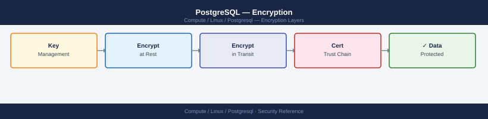

---
tags:
  - linux
  - security
description: "PostgreSQL encryption — SSL/TLS for connections, pgcrypto for column-level encryption, transparent data encryption options, and WAL/backup encryption."
---
# PostgreSQL — Encryption

<div class="kb-summary">
PostgreSQL encryption — SSL/TLS for connections, pgcrypto for column-level encryption, transparent data encryption options, and WAL/backup encryption.

*Applies to: RHEL / Ubuntu LTS*
</div>


## Before you begin

- **Access:** root or sudo-capable account on target hosts
- **Change management:** security changes require CAB approval in most environments
- **Rollback plan:** document current state before any security control change
- **Testing:** validate in a non-production environment first where possible

---

## SSL/TLS for Connections

PostgreSQL uses OpenSSL for SSL. Generated automatically during `initdb` on most distributions.

```ini
# postgresql.conf
ssl = on
ssl_cert_file = 'server.crt'
ssl_key_file = 'server.key'
ssl_ca_file = 'root.crt'
ssl_min_protocol_version = 'TLSv1.2'
```

```bash
# Verify SSL is active
psql -U postgres -c "SHOW ssl;"
# Confirm connection is encrypted
psql -U appuser -h db.example.com -d app_prod -c "SELECT ssl, version, cipher FROM pg_stat_ssl WHERE pid = pg_backend_pid();"
```


```text title="Expected output"
ssl
-----
 on
(1 row)

 ssl | version |           cipher
-----+---------+---------------------------
 t   | TLSv1.3 | ECDHE-RSA-AES256-GCM-SHA384
(1 row)
```

!!! warning "Common errors"
    | Error | Fix |
    |---|---|
    | `psql: error: connection to server at "db.example.com" (10.45.67.89), port 5432 failed: SSL connection error: certificate verify failed` | Ensure the PostgreSQL server certificate is signed by a trusted CA or add `sslmode=require` without verification only for testing (use `sslcert` and `sslkey` parameters for production client certificates). |
    | `psql: error: FATAL: no pg_hba.conf entry for host "10.45.67.89", user "appuser", database "app_prod", SSL off` | Add an SSL-enabled entry to pg_hba.conf (e.g., `hostssl app_prod appuser 10.45.67.89/32 md5`) and reload the PostgreSQL configuration with `SELECT pg_reload_conf();`. |
    | `ERROR: relation "pg_stat_ssl" does not exist` | Verify PostgreSQL version is 10+ (pg_stat_ssl was added in PostgreSQL 10) and that the `ssl` parameter is enabled in postgresql.conf with `ssl = on`. |
## Require SSL for All Connections

```text
# pg_hba.conf — use hostssl instead of host
hostssl  all  all  0.0.0.0/0  scram-sha-256
```

## pgcrypto — Column-Level Encryption

```sql
-- Enable extension
CREATE EXTENSION pgcrypto;

-- Encrypt at insert
INSERT INTO sensitive (data) VALUES (pgp_sym_encrypt('secret', 'key'));

-- Decrypt at query
SELECT pgp_sym_decrypt(data, 'key') FROM sensitive;

-- Hash (one-way, for passwords)
INSERT INTO users (password_hash) VALUES (crypt('userpassword', gen_salt('bf', 12)));
-- Verify
SELECT * FROM users WHERE password_hash = crypt('userpassword', password_hash);
```

## WAL Encryption

PostgreSQL does not have native WAL encryption. Options:
- **pgBackRest**: supports `--cipher-type=aes-256-cbc` for backup and WAL archive encryption
- **OS-level**: encrypt the WAL archive destination (encrypted filesystem or S3 SSE)
- **Transparent Filesystem Encryption**: LUKS on the PostgreSQL data partition

## Transparent Data Encryption

Native TDE is available in PostgreSQL 17+ and commercial forks (Percona, EnterpriseDB). For PostgreSQL 16 and earlier:
- Use OS-level disk encryption (LUKS/BitLocker)
- Store data on encrypted cloud volumes (AWS EBS, Azure Managed Disk)

---

## See also

- [Postgresql — Hardening](../hardening/)
- [Postgresql — Authentication](../authentication/)
- [Postgresql — Access Control](../access-control/)
