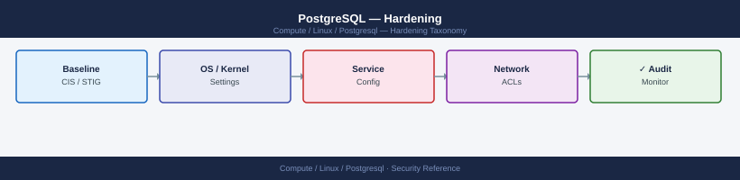

---
tags:
  - linux
  - security
description: "PostgreSQL hardening — disabling superuser remote login, SSL enforcement, restricting pg_hba.conf, file permissions, and CIS benchmark key controls."
---
# PostgreSQL — Hardening

<div class="kb-summary">
PostgreSQL hardening — disabling superuser remote login, SSL enforcement, restricting pg_hba.conf, file permissions, and CIS benchmark key controls.

*Applies to: RHEL / Ubuntu LTS*
</div>


## Before you begin

- **Access:** root or sudo-capable account on target hosts
- **Change management:** security changes require CAB approval in most environments
- **Rollback plan:** document current state before any security control change
- **Testing:** validate in a non-production environment first where possible

---

## Restrict Superuser Access

```sql
-- postgres superuser should only connect via local socket
-- pg_hba.conf:
-- local  all  postgres  peer
-- host   all  postgres  127.0.0.1/32  reject  ← explicitly reject remote postgres login
```

## Configuration Hardening

```ini
# postgresql.conf
listen_addresses = 'specific-ip'    # never '*' without firewall
ssl = on
ssl_min_protocol_version = 'TLSv1.2'
log_connections = on
log_disconnections = on
log_duration = off                   # avoid logging query durations in production (noise)
log_min_duration_statement = 2000    # log slow queries (> 2s) only
log_line_prefix = '%t [%p]: [%l-1] user=%u,db=%d,app=%a,client=%h '
```

## pg_hba.conf Hardening

```text
# Deny all by default; allow only known sources
host    all  all  0.0.0.0/0  reject
hostssl app_prod  appuser  10.0.1.0/24  scram-sha-256
```

## OS-Level Permissions

```bash
# Data directory must be owned by postgres, mode 700
ls -la /var/lib/pgsql/16/data
# drwx------ 19 postgres postgres 4096 ...

# Config files: readable by postgres only
sudo chmod 600 /var/lib/pgsql/16/data/postgresql.conf
sudo chmod 600 /var/lib/pgsql/16/data/pg_hba.conf
```


```text title="Expected output"
total 112
drwx------ 19 postgres postgres  4096 Nov 14 10:23 .
drwxr-xr-x  3 root     root      4096 Nov 14 09:15 ..
-rw-------  1 postgres postgres  1234 Nov 14 10:22 postgresql.conf
-rw-------  1 postgres postgres   892 Nov 14 10:22 pg_hba.conf
drwx------  5 postgres postgres  4096 Nov 14 10:20 base
drwx------  2 postgres postgres  4096 Nov 14 10:20 global
drwx------  2 postgres postgres  4096 Nov 14 10:20 pg_wal
-rw-------  1 postgres postgres    48 Nov 14 10:22 postgresql.auto.conf
-rw-------  1 postgres postgres   256 Nov 14 10:22 pg_ident.conf
```

!!! warning "Common errors"
    | Error | Fix |
    |---|---|
    | `chmod: changing permissions of '/var/lib/pgsql/16/data/postgresql.conf': Operation not permitted` | Run the chmod commands with `sudo` or as the postgres user, and verify the file is not immutable with `lsattr`. |
    | `ls: cannot open directory '/var/lib/pgsql/16/data': Permission denied` | Ensure your user is in the postgres group (`usermod -a -G postgres $USER`) or run the ls command with `sudo`. |
## Disable Unnecessary Features

```sql
-- Check if file_fdw or dblink are installed (potential data exfiltration vectors)
SELECT * FROM pg_extension WHERE extname IN ('file_fdw', 'dblink', 'postgres_fdw');

-- Remove if not needed
DROP EXTENSION IF EXISTS file_fdw;
```

## CIS Benchmark Key Controls

| Control | Verification |
|---|---|
| No remote superuser | `SELECT * FROM pg_hba_file_rules WHERE username='{postgres}' AND type='host'` → 0 rows |
| SSL enforced | `SHOW ssl` → on |
| `log_connections = on` | `SHOW log_connections` → on |
| Strong auth method | All `host` lines in pg_hba.conf use `scram-sha-256` |
| Data dir mode 700 | `stat /var/lib/pgsql/16/data` → permissions 700 |

---

## See also

- [Postgresql — Authentication](../authentication/)
- [Postgresql — Access Control](../access-control/)
- [Postgresql — Encryption](../encryption/)
