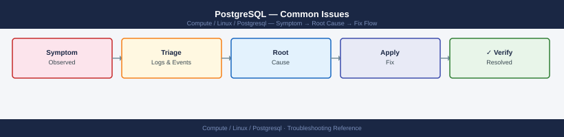
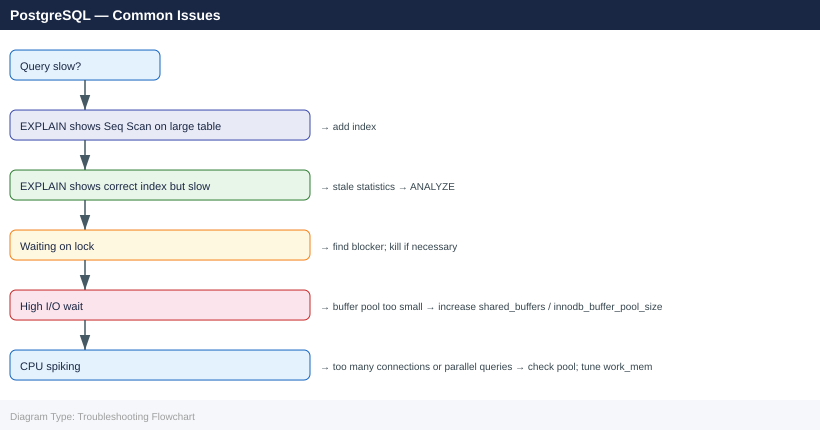

---
tags:
  - linux
  - troubleshooting
search:
  boost: 1.5
---
# PostgreSQL — Common Issues

<div class="kb-summary">
PostgreSQL troubleshooting: replication lag, `deadlock detected`, autovacuum bloat, connection pool exhaustion, checkpoint overload, and corrupt index recovery.

*Applies to: RHEL / Ubuntu LTS*
</div>


```d2
direction: down

symptom: Identify Symptom {shape: diamond}
diagnostic_flow: "Diagnostic Flow" {shape: rectangle}
database_performance_troubleshooting: "Database — Performance Troubleshooting" {shape: rectangle}
verify_resolution: "Verify resolution" {shape: rectangle}
resolution: Resolve or Escalate {shape: oval}

symptom -> diagnostic_flow: investigate
symptom -> database_performance_troubleshooting: investigate
symptom -> verify_resolution: investigate
diagnostic_flow -> resolution
database_performance_troubleshooting -> resolution
verify_resolution -> resolution
```

## Diagnostic Flow

```d2
direction: right

D1: "D1" {shape: rectangle}
R1: "Database — Performance Troubleshooting" {shape: rectangle}
D2: "D2" {shape: rectangle}
R2: "Database — Performance Troubleshooting" {shape: rectangle}
D3: "D3" {shape: rectangle}
R3: "Database — Performance Troubleshooting" {shape: rectangle}
D4: "D4" {shape: rectangle}
R4: "Database — Performance Troubleshooting" {shape: rectangle}
D5: "D5" {shape: rectangle}
R5: "Verify resolution" {shape: rectangle}
R6: "Verify resolution" {shape: rectangle}
S: "What is the symptom?" {shape: rectangle}

D1 -> R1
D2 -> R2
D3 -> R3
D4 -> R4
D5 -> R5
R1 -> R6
```

---

## Before you begin

- **Access:** root or sudo-capable account on target hosts
- **Gather first:** recent error message text, event timestamps, and affected object names
- **Scope:** confirm whether the issue affects a single object, host, cluster, or site
- **Escalation:** open a vendor support ticket before running any destructive step
- **Logging:** document each command and output — required if escalation is needed

---

## Database — Performance Troubleshooting

```bash
# OS resource view
top -b -n 1 | head -20
vmstat 1 5        # check wa (I/O wait) column
iostat -xz 1 5    # %util, await, r/s, w/s on DB disk
free -h           # check swap usage — DB paging = critical
```

```sql
-- Currently executing requests sorted by CPU
SELECT r.session_id, r.status, r.cpu_time, r.total_elapsed_time/1000 AS elapsed_sec,
       r.wait_type, r.blocking_session_id, LEFT(t.text, 100) AS query_text
FROM sys.dm_exec_requests r
CROSS APPLY sys.dm_exec_sql_text(r.sql_handle) t
WHERE r.status != 'background'
ORDER BY r.cpu_time DESC;

-- Top queries by total CPU (Query Store — SQL Server 2016+)
SELECT TOP 20 qt.query_sql_text, rs.avg_cpu_time/1000 AS avg_cpu_ms,
       rs.avg_logical_io_reads, rs.count_executions
FROM sys.query_store_query_text qt
JOIN sys.query_store_query q ON qt.query_text_id = q.query_text_id
JOIN sys.query_store_plan p ON q.query_id = p.query_id
JOIN sys.query_store_runtime_stats rs ON p.plan_id = rs.plan_id
ORDER BY rs.avg_cpu_time DESC;

-- Missing index recommendations
SELECT mig.equality_columns, mig.inequality_columns, mig.included_columns,
       mid.statement AS table_name, migs.avg_user_impact
FROM sys.dm_db_missing_index_details mid
JOIN sys.dm_db_missing_index_groups mig ON mid.index_handle = mig.index_handle
JOIN sys.dm_db_missing_index_group_stats migs ON mig.index_group_handle = migs.group_handle
ORDER BY migs.avg_user_impact DESC;

-- Blocking chains
SELECT blocking_session_id, session_id, wait_type, wait_time/1000 AS wait_sec
FROM sys.dm_exec_requests WHERE blocking_session_id != 0;
```
```sql
-- PostgreSQL: cache hit ratio (target > 99%)
SELECT sum(heap_blks_hit) / NULLIF(sum(heap_blks_hit) + sum(heap_blks_read), 0) * 100 AS cache_hit_pct
FROM pg_statio_user_tables;

-- MySQL: InnoDB buffer pool hit ratio
SHOW STATUS LIKE 'Innodb_buffer_pool_read%';
-- Formula: (read_requests - disk_reads) / read_requests * 100

-- SQL Server: page life expectancy (target > 300s per 4GB RAM)
SELECT object_name, counter_name, cntr_value
FROM sys.dm_os_performance_counters
WHERE counter_name = 'Page life expectancy';
```
```bash
# Too many connections exhausting max_connections (PostgreSQL)
psql -c "SELECT count(*), state FROM pg_stat_activity GROUP BY state;"
psql -c "SHOW max_connections;"

# MySQL threads_connected approaching max_connections
mysql -e "SHOW STATUS LIKE 'Threads_connected';"
mysql -e "SHOW VARIABLES LIKE 'max_connections';"
```


---

## Verify resolution

- Confirm the original symptom no longer occurs
- Check logs for any residual errors related to the issue
- Monitor for 10–15 minutes to confirm the fix is stable

---

## See also

- [Postgresql — Diagnostics](../diagnostics/)
- [Postgresql — Escalation](../escalation/)
- [Postgresql — Health Checks](../../operations/health-checks/)
