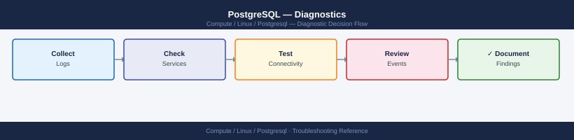

---
tags:
  - linux
  - troubleshooting
search:
  boost: 1.5
---
# PostgreSQL — Diagnostics

<div class="kb-summary">
PostgreSQL diagnostic commands: read the error log, query pg_stat_activity for blocking sessions, identify slow queries with pg_stat_statements, check WAL replication lag, diagnose autovacuum bloat, and collect a diagnostic snapshot for escalation.

*Applies to: PostgreSQL 14–17 on RHEL / Ubuntu LTS*
</div>


```d2
direction: right

B: "B" {shape: rectangle}
C: "Check pg_stat_activity\nWhere state != idle" {shape: rectangle}
D: "Check pg_stat_statements\nTop queries by total_exec_time" {shape: rectangle}
E: "Check pg_stat_replication\nlag_bytes on primary" {shape: rectangle}
F: "Check pg_stat_user_tables\nn_dead_tup per table" {shape: rectangle}
G: "Check error log\ntail /var/log/postgresql/..." {shape: rectangle}
H: "H" {shape: rectangle}
I: "pg_blocking_pids pid\nFind blocking session" {shape: rectangle}
J: "pg_cancel_backend or\npg_terminate_backend" {shape: rectangle}
K: "EXPLAIN query\nCheck index usage" {shape: rectangle}
L: "L" {shape: rectangle}
M: "Check network\nand WAL send rate" {shape: rectangle}
N: "Monitor; may be acceptable" {shape: rectangle}
O: "VACUUM ANALYZE table\nMonitor n_dead_tup" {shape: rectangle}
P: "Check for OOM or\ndisk full in log" {shape: rectangle}
Q: "Collect pg_dump diag\nfor escalation" {shape: rectangle}
A: "PostgreSQL Issue" {shape: rectangle}

B -> C
B -> D
B -> E
B -> F
B -> G
H -> I
H -> D
I -> J
D -> K
L -> M
L -> N
F -> O
G -> P
J -> Q
K -> Q
M -> Q
O -> Q
P -> Q
```

```d2
direction: down

symptom: Identify Symptom {shape: diamond}
step_1_check_the_error_log: "Step 1 — Check the error log" {shape: rectangle}
step_2_check_active_sessions_and_blo: "Step 2 — Check active sessions and blocking" {shape: rectangle}
step_3_find_and_resolve_lock_content: "Step 3 — Find and resolve lock contention" {shape: rectangle}
step_4_identify_slow_queries: "Step 4 — Identify slow queries" {shape: rectangle}
step_5_check_autovacuum_and_table_bl: "Step 5 — Check autovacuum and table bloat" {shape: rectangle}
step_6_check_wal_replication_and_lag: "Step 6 — Check WAL replication and lag" {shape: rectangle}
resolution: Resolve or Escalate {shape: oval}

symptom -> step_1_check_the_error_log: investigate
symptom -> step_2_check_active_sessions_and_blo: investigate
symptom -> step_3_find_and_resolve_lock_content: investigate
symptom -> step_4_identify_slow_queries: investigate
symptom -> step_5_check_autovacuum_and_table_bl: investigate
symptom -> step_6_check_wal_replication_and_lag: investigate
step_1_check_the_error_log -> resolution
step_2_check_active_sessions_and_blo -> resolution
step_3_find_and_resolve_lock_content -> resolution
step_4_identify_slow_queries -> resolution
step_5_check_autovacuum_and_table_bl -> resolution
step_6_check_wal_replication_and_lag -> resolution
```

## Before you begin

- **Access:** `postgres` superuser or a role with `pg_monitor` privileges for diagnostic queries; root/sudo on the OS for log access
- **Gather first:** the exact error message, affected database name, approximate time of the issue, and whether it affects one query, one user, or all connections
- **Scope:** confirm whether the issue is a single slow query, a blocked transaction, a replication lag event, or a service crash
- **Extensions:** `pg_stat_statements` must be enabled in `postgresql.conf` (`shared_preload_libraries = 'pg_stat_statements'`) for slow query data — verify before relying on it

---

## Step 1 — Check the error log

```bash
# Ubuntu (default log location)
sudo tail -100 /var/log/postgresql/postgresql-16-main.log

# RHEL (logs in data directory)
sudo tail -100 /var/lib/pgsql/16/data/log/postgresql-*.log

# systemd journal (works on both distros)
sudo journalctl -u postgresql-16 --since "1 hour ago" | tail -100

# Filter for errors only
sudo grep -E "FATAL|ERROR|PANIC" /var/log/postgresql/postgresql-16-main.log | tail -50

# Common error patterns:
#   FATAL: max_connections exceeded — too many clients
#   FATAL: password authentication failed — credential or pg_hba.conf issue
#   PANIC: could not write to file — disk full or permissions
#   LOG: autovacuum: found X pages with Y dead row versions — normal autovacuum
```


```text title="Expected output"
2024-01-15 14:32:18.547 UTC [8234] LOG:  database system was shut down at 2024-01-15 14:31:45 UTC
2024-01-15 14:32:18.612 UTC [8234] LOG:  MultiXact member wraparound protections are now enabled
2024-01-15 14:32:18.621 UTC [8234] LOG:  database system is ready to accept connections
2024-01-15 14:32:19.043 UTC [8241] LOG:  autovacuum launcher started
2024-01-15 14:45:22.156 UTC [8567] ERROR:  relation "users_table" does not exist at character 15
2024-01-15 14:45:22.156 UTC [8567] STATEMENT:  SELECT * FROM users_table WHERE id = 42;
2024-01-15 15:02:11.834 UTC [8891] LOG:  autovacuum: found 2847 pages with 15623 dead row versions in relation "public.transactions"
2024-01-15 15:02:12.102 UTC [8891] LOG:  vacuuming "public.transactions" finished in 268.45 ms (pages: 0 removed, 2847 remain, 0 skipped due to pins, 0 skipped frozen)
2024-01-15 15:18:45.923 UTC [9102] FATAL:  max_connections (100) exceeded
2024-01-15 15:18:45.923 UTC [9102] HINT:  Try increasing the server's max_connections parameter.
```

!!! warning "Common errors"
    **`FATAL:  max_connections (100) exceeded`** — Increase `max_connections` in postgresql.conf and reload the server with `sudo systemctl reload postgresql-16`.
    **`ERROR:  relation "users_table" does not exist`** — Verify the table name is correct and exists in the current schema with `\dt` in psql, or check if you need to specify the schema name explicitly.
    **`FATAL:  password authentication failed for user "postgres"`** — Verify credentials in pg_hba.conf are correct and the user exists; check with `sudo -u postgres psql -c "\du"` to list users.
---

## Step 2 — Check active sessions and blocking

```sql
-- All non-idle sessions with duration
SELECT pid, usename, datname, state, wait_event_type, wait_event,
       now() - query_start AS duration,
       left(query, 120) AS query
FROM pg_stat_activity
WHERE state != 'idle'
ORDER BY duration DESC NULLS LAST;

-- Sessions in "idle in transaction" (holding locks without active query)
SELECT pid, usename, state, now() - state_change AS idle_duration,
       left(query, 80) AS last_query
FROM pg_stat_activity
WHERE state = 'idle in transaction'
ORDER BY idle_duration DESC;
-- "idle in transaction" for > 30 seconds = common lock holder; consider terminating
```

---

## Step 3 — Find and resolve lock contention

```sql
-- Who is blocking whom
SELECT blocked.pid   AS blocked_pid,
       blocked.usename AS blocked_user,
       blocking.pid  AS blocking_pid,
       blocking.usename AS blocking_user,
       left(blocked.query, 80)  AS blocked_query,
       left(blocking.query, 80) AS blocking_query,
       now() - blocked.query_start AS blocked_duration
FROM pg_stat_activity blocked
JOIN pg_stat_activity blocking
  ON blocking.pid = ANY(pg_blocking_pids(blocked.pid))
WHERE cardinality(pg_blocking_pids(blocked.pid)) > 0;

-- Identify the root blocker (chain of blocking)
SELECT pg_blocking_pids(<blocked_pid>);
-- Returns array of PIDs; recurse up the chain to find the root

-- Cancel the blocking query (sends SIGINT — graceful; waits for safe point)
SELECT pg_cancel_backend(<blocking_pid>);

-- Terminate the blocking connection (sends SIGTERM — forces disconnect)
SELECT pg_terminate_backend(<blocking_pid>);
-- Use terminate only if cancel does not resolve within 30 seconds
```

---

## Step 4 — Identify slow queries

```sql
-- Top 10 queries by total execution time (requires pg_stat_statements)
SELECT left(query, 100) AS query,
       calls,
       total_exec_time / 1000   AS total_sec,
       mean_exec_time  / 1000   AS mean_sec,
       rows
FROM pg_stat_statements
ORDER BY total_exec_time DESC
LIMIT 10;

-- Reset stats after a fix to measure improvement
SELECT pg_stat_statements_reset();

-- Get query plan for a slow query
EXPLAIN (ANALYZE, BUFFERS, FORMAT TEXT)
  SELECT * FROM my_table WHERE some_column = 'value';
-- Look for: Seq Scan on large tables (should be Index Scan), high Rows Removed by Filter
-- High "Buffers: hit=X read=Y" with large Y = heavy I/O

-- Enable slow query log temporarily without restart
SET log_min_duration_statement = 1000;  -- log queries > 1 second in current session
-- Or globally (requires reload, not restart):
-- ALTER SYSTEM SET log_min_duration_statement = 1000;
-- SELECT pg_reload_conf();
```

---

## Step 5 — Check autovacuum and table bloat

```sql
-- Tables with the most dead tuples (candidates for bloat)
SELECT schemaname, relname, last_autovacuum, last_autoanalyze, n_dead_tup,
       n_live_tup,
       round(100.0 * n_dead_tup / NULLIF(n_live_tup + n_dead_tup, 0), 1) AS dead_pct
FROM pg_stat_user_tables
WHERE n_dead_tup > 10000
ORDER BY n_dead_tup DESC
LIMIT 20;
-- dead_pct > 20% = table needs VACUUM; autovacuum may not be keeping up

-- Force vacuum on a specific table (non-blocking VACUUM; FULL is disruptive)
VACUUM ANALYZE <schema>.<tablename>;

-- Check autovacuum activity in real time
SELECT datname, pid, backend_start, now() - backend_start AS runtime,
       left(query, 100) AS query
FROM pg_stat_activity
WHERE query ILIKE '%autovacuum%'
ORDER BY backend_start;
```

---

## Step 6 — Check WAL replication and lag

```sql
-- On the PRIMARY: check replica lag
SELECT client_addr,
       state,
       sent_lsn,
       write_lsn,
       flush_lsn,
       replay_lsn,
       (sent_lsn - replay_lsn) AS lag_bytes
FROM pg_stat_replication;
-- lag_bytes > 100 MB = replica is falling behind; investigate network or replica load

-- On the STANDBY: check lag in seconds
SELECT now() - pg_last_xact_replay_timestamp() AS replay_lag;
-- Expected: < 30 seconds for async streaming; 0 for synchronous replication

-- Confirm this host is a standby
SELECT pg_is_in_recovery() AS is_standby;
```

---

## Step 7 — Collect diagnostic snapshot for escalation

```bash
# All-in-one diagnostic snapshot (run as postgres user or with psql -U postgres)
{
  echo "=== PostgreSQL version ==="
  psql -U postgres -c "SELECT version();"
  echo "=== Active sessions ==="
  psql -U postgres -c "SELECT pid, usename, state, now()-query_start AS dur, left(query,80) FROM pg_stat_activity WHERE state != 'idle' ORDER BY dur DESC NULLS LAST;"
  echo "=== Blocking ==="
  psql -U postgres -c "SELECT blocked.pid, blocking.pid AS blocker, left(blocked.query,60) FROM pg_stat_activity blocked JOIN pg_stat_activity blocking ON blocking.pid = ANY(pg_blocking_pids(blocked.pid)) WHERE cardinality(pg_blocking_pids(blocked.pid))>0;"
  echo "=== Top slow queries ==="
  psql -U postgres -c "SELECT calls, total_exec_time/1000 AS total_sec, left(query,80) FROM pg_stat_statements ORDER BY total_exec_time DESC LIMIT 10;"
  echo "=== Replication ==="
  psql -U postgres -c "SELECT client_addr, state, (sent_lsn-replay_lsn) AS lag_bytes FROM pg_stat_replication;"
  echo "=== Dead tuple tables ==="
  psql -U postgres -c "SELECT relname, n_dead_tup FROM pg_stat_user_tables ORDER BY n_dead_tup DESC LIMIT 10;"
  echo "=== Error log (last 100 lines) ==="
  sudo tail -100 /var/log/postgresql/postgresql-*.log 2>/dev/null || \
    sudo tail -100 /var/lib/pgsql/*/data/log/postgresql-*.log
} > /tmp/pg-diag-$(date +%F-%H%M).txt
```


```text title="Expected output"
=== PostgreSQL version ===
                                                 version
────────────────────────────────────────────────────────────────────────────────
 PostgreSQL 14.8 (Debian 14.8-1.pgdg110+1) on x86_64-pc-linux-gnu, compiled by g
cc (Debian 11.2.0-19) 11.2.0, 64-bit
(1 row)

=== Active sessions ===
  pid  | usename  |  state  |     dur      |                    left
───────┼──────────┼─────────┼──────────────┼──────────────────────────────────
 28451 | appuser  | active  | 00:02:14.532 | SELECT * FROM orders WHERE status=
 28462 | analytics| active  | 00:01:47.291 | INSERT INTO audit_log (event_id,
 28501 | postgres | active  | 00:00:03.105 | SELECT pid, usename, state, now()
(3 rows)

=== Blocking ===
 pid  | blocker | left
──────┬─────────┼──────────────────────────────────────────────────────────
 28451 |   28462 | UPDATE inventory SET qty=qty-1 WHERE sku='ABC123'
(1 row)

=== Top slow queries ===
 calls | total_sec |                            left
───────┼───────────┼──────────────────────────────────────────────────────────
  1247 |  847.3421 | SELECT o.id, o.total FROM orders o JOIN customers c ON
   892 |  623.1847 | INSERT INTO transaction_log (user_id, action, timestamp)
   156 |  412.5634 | SELECT COUNT(*) FROM large_fact_table WHERE date_part('ye
(3 rows)

=== Replication ===
 client_addr  |   state   | lag_bytes
──────────────┼───────────┼───────────
 192.168.1.42 | streaming | 0
 192.168.1.43 | streaming | 8192
(2 rows)

=== Dead tuple tables ===
      relname      | n_dead_tup
────────────────────┼────────────
 transaction_log    |      89342
 audit_events       |      45621
 session_cache      |      12847
(3 rows)

=== Error log (last 100 lines) ===
2024-01-15 14:23:47.123 UTC [28451] LOG:  duration: 134.521 ms  statement: SELECT * FROM orders WHERE status='pending'
2024-01-15 14:24:12.456 UTC [28462] WARNING:  deadlock detected
2024-01-15 14:24:15.789 UTC [28501] LOG:  autovacuum launcher started
Diagnostic snapshot saved to: /tmp/pg-diag-2024-01-15-1425.txt
```

!!! warning "Common errors"
    **`psql: error: connection to server on socket "/var/run/postgresql/.s.PGSQL.5432" failed: FATAL: Ident authentication failed for user
---

## Log locations

| Source | Path / Command | What to look for |
|---|---|---|
| Error log (Ubuntu) | `/var/log/postgresql/postgresql-16-main.log` | FATAL, PANIC, crash recovery |
| Error log (RHEL) | `/var/lib/pgsql/16/data/log/postgresql-*.log` | Same |
| Slow query log | Configured via `log_min_duration_statement` | Queries exceeding threshold |
| systemd journal | `journalctl -u postgresql-16 --since "1h ago"` | Service start/stop events |
| pg_stat_activity | SQL view — live | Sessions, blocking, wait events |
| pg_stat_statements | SQL view — cumulative | Top queries by total execution time |

---

## See also

- [PostgreSQL — Common Issues](../common-issues/)
- [PostgreSQL — Escalation](../escalation/)
- [PostgreSQL — Health Checks](../../operations/health-checks/)

## Verify resolution

- `pg_stat_activity` shows no sessions in `idle in transaction` for more than 30 seconds
- `pg_stat_replication` shows lag_bytes below 100 MB (or 0 for sync replication)
- The original slow query now runs within expected time; `EXPLAIN ANALYZE` shows Index Scan instead of Seq Scan
- `n_dead_tup` in `pg_stat_user_tables` is decreasing after `VACUUM ANALYZE`
- No new FATAL or PANIC entries in the error log in the last 15 minutes
