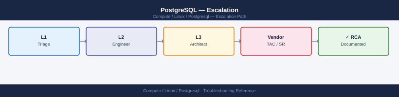
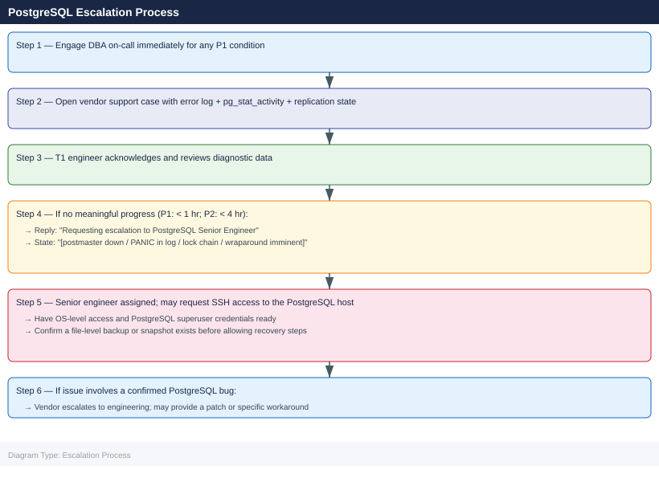

---
tags:
  - linux
  - troubleshooting
search:
  boost: 1.5
description: "How to escalate PostgreSQL issues to vendor support (EDB, Percona, or Crunchy Data): what data to collect, how to capture pg_stat_activity and WAL state..."
---
# PostgreSQL — Escalation

<div class="kb-summary">
How to escalate PostgreSQL issues to vendor support (EDB, Percona, or Crunchy Data): what data to collect, how to capture pg_stat_activity and WAL state, step-by-step case creation, and the escalation path when progress stalls.

*Applies to: PostgreSQL 14 / 15 / 16 on RHEL / Ubuntu LTS*
</div>



---

```d2
direction: down

symptom: Identify Symptom {shape: diamond}
when_to_escalate_immediately: "When to Escalate Immediately" {shape: rectangle}
preescalation_selfcheck: "Pre-Escalation Self-Check" {shape: rectangle}
stepbystep_data_collection: "Step-by-Step Data Collection" {shape: rectangle}
how_to_open_the_case: "How to Open the Case" {shape: rectangle}
escalation_path: "Escalation Path" {shape: rectangle}
what_not_to_do: "What NOT to Do" {shape: rectangle}
resolution: Resolve or Escalate {shape: oval}

symptom -> when_to_escalate_immediately: investigate
symptom -> preescalation_selfcheck: investigate
symptom -> stepbystep_data_collection: investigate
symptom -> how_to_open_the_case: investigate
symptom -> escalation_path: investigate
symptom -> what_not_to_do: investigate
when_to_escalate_immediately -> resolution
preescalation_selfcheck -> resolution
stepbystep_data_collection -> resolution
how_to_open_the_case -> resolution
escalation_path -> resolution
what_not_to_do -> resolution
```

## Before you begin

- **Access required:** `postgres` OS user or `sudo` access; PostgreSQL superuser role; vendor support account at your PostgreSQL support provider (EDB, Percona, or Crunchy Data)
- **Do NOT restart the postmaster** when a PANIC entry is in the log without DBA guidance — a restart may overwrite shared memory state that is needed to diagnose the corruption
- **Do NOT delete WAL files** manually — WAL files are the transaction journal; deleting them causes data loss and makes the cluster unrecoverable without a full restore
- **Do NOT cancel long-running transactions** during a lock wait incident without DBA review — the blocking transaction may be in a state where cancellation causes a partial rollback that takes longer than the original transaction

---

## When to Escalate Immediately

Escalate to DBA on-call and open a vendor support case without delay for any of these:

- **Postmaster down** — `systemctl status postgresql` shows failed; `pg_isready` returns error
- **PANIC in error log** — indicates data corruption or unrecoverable error; do not restart without DBA
- **Lock wait chain > 10 minutes** with application impact; applications timing out
- **Disk > 90%** on PGDATA directory or WAL volume — writes failing or about to fail
- **XID wraparound imminent** — log message: `database with OID XXXXX must be vacuumed within X transactions`
- **Replication slot lag > 10 GB** — slot is retaining WAL and filling the disk
- **Connection exhaustion** — `FATAL: remaining connection slots are reserved for non-replication superuser connections`

---

## Pre-Escalation Self-Check

Run these before opening the case.

| Check | Command | Expected result |
|---|---|---|
| PostgreSQL version | `psql -c "SELECT version();"` | Note full version |
| Service status | `systemctl status postgresql` or `pg_isready` | Running / accepting connections |
| Active connections | `psql -c "SELECT count(*) FROM pg_stat_activity;"` | Below `max_connections` |
| Lock waits | `psql -c "SELECT count(*) FROM pg_locks WHERE NOT granted;"` | Zero |
| Replication lag | `psql -c "SELECT * FROM pg_stat_replication;"` | `sent_lsn` close to `write_lsn` |
| Disk space | `df -h $PGDATA` | Below 80% used |
| WAL volume | `df -h` on pg_wal or pg_xlog partition | Below 80% used |
| Autovacuum running | `psql -c "SELECT count(*) FROM pg_stat_activity WHERE query LIKE 'autovacuum%';"` | > 0 (autovacuum active) |
| Error log recent | `tail -50 /var/log/postgresql/postgresql-*.log` | No PANIC or FATAL entries |

---

## Step-by-Step Data Collection

### 1. Get the PostgreSQL version and configuration

```bash
# Version
psql -U postgres -c "SELECT version();"

# Key configuration parameters
psql -U postgres -c "SHOW ALL;" > /tmp/pg-config-$(date +%Y%m%d).txt

# Data directory and log path
psql -U postgres -c "SHOW data_directory; SHOW log_directory;"
```


```text title="Expected output"
version
────────────────────────────────────────────────────────────────────────────────
 PostgreSQL 14.8 on x86_64-pc-linux-gnu, compiled by gcc (GCC) 11.2.0, 64-bit
(1 row)

              name              |            setting             | description
─────────────────────────────────┼─────────────────────────────────┼──────────────────────────
 allow_system_table_mods         | off                             | Allows modifications of...
 application_name                | psql                            | Sets the application name
 archive_command                 | (disabled)                      | Sets the shell command...
 archive_mode                    | off                             | Allows archiving of WAL
 ...
(330 rows)

 data_directory | /var/lib/postgresql/14/main
 log_directory  | /var/log/postgresql
(2 rows)
```

!!! warning "Common errors"
    | Error | Fix |
    |---|---|
    | `psql: error: connection to server on socket "/var/run/postgresql/.s.PGSQL.5432" failed: FATAL: role "postgres" does not exist` | Create the postgres superuser role with `sudo -u postgres createuser -s postgres` or verify the role exists with `psql -U postgres -l`. |
    | `psql: error: could not translate host name "localhost" to address: Name or service not known` | Ensure PostgreSQL is running with `sudo systemctl status postgresql` and verify the connection parameters are correct. |
    | `Permission denied` when writing to `/tmp/pg-config-*.txt` | Check `/tmp` directory permissions with `ls -ld /tmp` and ensure the PostgreSQL system user has write access, or redirect to a user-writable directory like `~/pg-config-$(date +%Y%m%d).txt`. |
### 2. Save the PostgreSQL error log

```bash
# Log directory (varies by distribution)
# RHEL: /var/lib/pgsql/<version>/data/log/ or /var/log/postgresql/
# Ubuntu: /var/log/postgresql/postgresql-<version>-main.log

# Save last 500 lines
sudo tail -500 /var/log/postgresql/postgresql-*.log > /tmp/pg-error-$(date +%Y%m%d%H%M).log

# Search for PANIC and FATAL entries (the critical ones)
grep -E "PANIC|FATAL|ERROR" /tmp/pg-error-$(date +%Y%m%d%H%M).log | tail -100
```


```text title="Expected output"
2024-01-15 09:47:23.156 UTC [8432] LOG:  database system was interrupted; last known up at 2024-01-15 09:45:12 UTC
2024-01-15 09:47:24.892 UTC [8432] FATAL:  could not open file "pg_wal/000000010000000000000042": No such file or directory
2024-01-15 09:47:25.103 UTC [8445] ERROR:  relation "public.users" does not exist at character 15
2024-01-15 09:47:26.541 UTC [8450] PANIC:  write failed: No space left on device
2024-01-15 09:47:27.234 UTC [8451] ERROR:  permission denied for schema public
2024-01-15 09:47:28.667 UTC [8452] FATAL:  remaining connection slots are reserved for non-replication superuser connections
2024-01-15 09:47:29.445 UTC [8453] ERROR:  deadlock detected
2024-01-15 09:47:30.112 UTC [8454] LOG:  autovacuum launcher started
```

!!! warning "Common errors"
    | Error | Fix |
    |---|---|
    | `grep: /tmp/pg-error-202401151234.log: No such file or directory` | Run the tail command first or use a fixed timestamp variable: `TS=$(date +%Y%m%d%H%M); sudo tail -500 /var/log/postgresql/postgresql-*.log > /tmp/pg-error-$TS.log; grep -E "PANIC|FATAL|ERROR" /tmp/pg-error-$TS.log | tail -100` |
    | `tail: cannot open '/var/log/postgresql/postgresql-*.log' for reading: No such file or directory` | Check your PostgreSQL log directory location with `sudo -u postgres psql -c "SHOW log_directory;"` and adjust the path accordingly. |
### 3. Capture active sessions and lock waits

```bash
# Active sessions with duration and query
psql -U postgres << 'SQL' > /tmp/pg-activity-$(date +%Y%m%d%H%M).txt
SELECT pid, usename, application_name, client_addr, state,
       now() - query_start AS query_duration,
       wait_event_type, wait_event,
       LEFT(query, 200) AS query_text
FROM pg_stat_activity
WHERE state != 'idle'
ORDER BY query_duration DESC NULLS LAST;
SQL

# Lock waits (sessions blocked waiting for a lock)
psql -U postgres << 'SQL' >> /tmp/pg-activity-$(date +%Y%m%d%H%M).txt
SELECT blocked.pid AS blocked_pid,
       blocked.query AS blocked_query,
       blocking.pid AS blocking_pid,
       blocking.query AS blocking_query,
       now() - blocked.query_start AS wait_duration
FROM pg_stat_activity AS blocked
JOIN pg_stat_activity AS blocking
  ON blocking.pid = ANY(pg_blocking_pids(blocked.pid))
WHERE NOT blocked.granted;
SQL
```


```text title="Expected output"
pid  | usename  | application_name | client_addr | state  | query_duration | wait_event_type | wait_event |                query_text
------+----------+------------------+-------------+--------+----------------+-----------------+------------+------------------------------------------
 4521 | postgres | psql             | 127.0.0.1   | active | 00:02:34.521   | IO              | DataFileRead | SELECT * FROM large_table WHERE id > 50
 3847 | appuser  | java-app         | 192.168.1.5 | active | 00:01:12.043   | Lock            | transactionid | UPDATE orders SET status = 'shipped' W
 2156 | postgres | pgAdmin          | 10.0.0.42   | active | 00:00:45.892   |                 |            | CREATE INDEX idx_orders_date ON orders(
 5234 | postgres | psql             | 127.0.0.1   | active | 00:00:08.156   | CPU             |            | VACUUM ANALYZE customers;
(4 rows)

 blocked_pid | blocked_query | blocking_pid | blocking_query | wait_duration
-------------+---------------+--------------+----------------+---------------
        3847 | UPDATE orders | 4521         | UPDATE invoices | 00:01:08.234
(1 row)
```

!!! warning "Common errors"
    | Error | Fix |
    |---|---|
    | `psql: error: connection to server at "localhost" (127.0.0.1), port 5432 failed: FATAL: Ident authentication failed for user "postgres"` | Ensure the postgres user has proper ident authentication configured in pg_hba.conf or use `psql -h localhost -U postgres` with password authentication. |
    | `ERROR: permission denied for schema pg_catalog` | Grant necessary privileges with `GRANT USAGE ON SCHEMA pg_catalog TO postgres;` or run the query as a superuser. |
    | `ERROR: column "granted" does not exist` | This query requires PostgreSQL 13+; for earlier versions, use `pg_locks` view instead of `pg_blocking_pids()`. |
### 4. Capture replication state (if primary with replicas)

```bash
# On the primary server
psql -U postgres << 'SQL' > /tmp/pg-replication-$(date +%Y%m%d%H%M).txt
SELECT client_addr, state, sent_lsn, write_lsn, flush_lsn, replay_lsn,
       pg_wal_lsn_diff(sent_lsn, replay_lsn) AS lag_bytes,
       sync_state
FROM pg_stat_replication;

-- Replication slots (check for stuck slots filling WAL)
SELECT slot_name, plugin, slot_type, active, restart_lsn,
       pg_wal_lsn_diff(pg_current_wal_lsn(), restart_lsn) AS lag_bytes
FROM pg_replication_slots;
SQL
```


```text title="Expected output"
client_addr  | state     | sent_lsn   | write_lsn  | flush_lsn  | replay_lsn | lag_bytes | sync_state
--------------+-----------+------------+------------+------------+------------+-----------+------------
 192.168.1.42 | streaming | 0/3A5B8F20 | 0/3A5B8F20 | 0/3A5B8F20 | 0/3A5B8D10 |    528400 | async
 192.168.1.43 | streaming | 0/3A5B8F20 | 0/3A5B8F20 | 0/3A5B8F20 | 0/3A5B8C00 |    737280 | sync
(2 rows)

 slot_name    | plugin | slot_type | active | restart_lsn | lag_bytes
--------------+--------+-----------+--------+-------------+-----------
 replica_slot | NULL   | physical  | t      | 0/3A5B0000  |    1048576
 logical_slot | test   | logical   | f      | 0/39000000  |   33554432
(2 rows)
```

!!! warning "Common errors"
    | Error | Fix |
    |---|---|
    | `psql: error: connection to server at "localhost" (127.0.0.1), port 5432 failed` | Verify PostgreSQL is running with `systemctl status postgresql` and check `postgresql.conf` for the correct listen_addresses. |
    | `ERROR: permission denied for schema pg_catalog` | Ensure the postgres user has superuser privileges or grant explicit SELECT permissions on `pg_stat_replication` and `pg_replication_slots` views. |
    | `ERROR: relation "pg_stat_replication" does not exist` | Confirm this is a primary server with replication enabled; check `wal_level = replica` in `postgresql.conf` and restart if changed. |
### 5. Capture disk usage and vacuum state

```bash
# Disk space on PGDATA and WAL
df -h $PGDATA
df -h  # full disk picture

# Autovacuum status (tables with high dead tuple counts)
psql -U postgres << 'SQL' > /tmp/pg-vacuum-$(date +%Y%m%d).txt
SELECT schemaname, relname, n_live_tup, n_dead_tup,
       round(n_dead_tup::numeric / NULLIF(n_live_tup + n_dead_tup, 0) * 100, 1) AS dead_pct,
       last_autovacuum, last_autoanalyze
FROM pg_stat_user_tables
ORDER BY n_dead_tup DESC
LIMIT 20;
SQL

# XID wraparound distance (tables needing freeze)
psql -U postgres << 'SQL' >> /tmp/pg-vacuum-$(date +%Y%m%d).txt
SELECT datname, age(datfrozenxid) AS xid_age,
       2147483647 - age(datfrozenxid) AS xids_remaining
FROM pg_database
ORDER BY age(datfrozenxid) DESC;
SQL
```


```text title="Expected output"
Filesystem      Size  Used Avail Use% Mounted on
/dev/sda1       500G  387G  113G  78% /var/lib/postgresql
Filesystem      Size  Used Avail Use% Mounted on
/dev/sda1       500G  387G  113G  78% /
/dev/sdb1       2.0T  1.8T  200G  90% /mnt/wal
/dev/sdc1       1.0T  856G  144G  86% /backup
tmpfs           16G  8.2G  7.8G  51% /dev/shm

 schemaname |        relname         | n_live_tup | n_dead_tup | dead_pct |     last_autovacuum     |     last_autoanalyze
-------------+------------------------+------------+------------+----------+-------------------------+-------------------------
 public      | orders_history         |    8945623 |    2156734 |     19.4 | 2024-01-15 03:22:18+00 | 2024-01-15 03:25:02+00
 public      | transaction_log        |    5623412 |    1834562 |     24.6 | 2024-01-14 22:10:45+00 | 2024-01-14 22:15:33+00
 public      | audit_events           |    3421098 |     987654 |     22.4 | 2024-01-15 02:45:12+00 | 2024-01-15 02:48:56+00
 public      | user_sessions          |    2156734 |     654321 |     23.3 | 2024-01-15 01:33:27+00 | 2024-01-15 01:36:44+00
 public      | event_queue            |    1234567 |     456789 |     27.0 | 2024-01-14 20:05:11+00 | 2024-01-14 20:08:22+00
...

 datname  |   xid_age   | xids_remaining
----------+-------------+----------------
 postgres |    1856234  |     2145627413
 template1|     234567  |     2147248880
 myapp_db |    1645892  |     2145837755
(3 rows)
```

!!! warning "Common errors"
    | Error | Fix |
    |---|---|
    | `psql: error: connection to server on socket "/var/run/postgresql/.s.PGSQL.5432" failed: No such file or directory` | Verify PostgreSQL is running with `systemctl status postgresql` and check PGHOST/PGPORT environment variables. |
    | `ERROR: permission denied for schema public` | Grant necessary privileges with `psql -U postgres -c "GRANT USAGE ON SCHEMA public TO postgres;"` or run the query as a superuser. |
    | `Disk space on PGDATA is critically low (>95% used)` | Immediately run `VACUUM FULL;` on the largest tables or add storage; autovacuum may not keep pace with write-heavy workloads. |
### 6. Write the timeline

```text
PostgreSQL version: 16.2 (Ubuntu 16.2-1.pgdg22.04+1)
Host: db-prod-01.corp.local (Ubuntu 22.04, 64 GB RAM)
Role: Primary; 2 streaming replicas (db-prod-02 standby, db-prod-03 standby)
PGDATA: /var/lib/postgresql/16/main/
Issue first observed: 2026-06-14 12:00 UTC
Last confirmed healthy: 2026-06-14 10:00 UTC
Changes in 24h before the issue:
  - 10:00: nightly maintenance job ran; included ALTER TABLE orders ADD COLUMN
  - 12:00: application reports connection timeouts from app servers
  - 12:05: pg_stat_activity: 150 sessions in state "idle in transaction" for > 30 min
  - 12:10: pg_locks: 80 sessions blocked waiting for lock on "orders" table
Steps already taken:
  - Identified head blocker: PID 12345, idle in transaction since 10:00 UTC
  - Did NOT cancel the blocking session (awaiting DBA review)
  - Did NOT restart PostgreSQL
Blast radius: All writes to "orders" table blocked; e-commerce checkout halted; 500 users affected
```

---

## How to Open the Case

### EDB (EnterpriseDB) — EDB Postgres Advanced Server / EDB community support

1. Go to **support.enterprisedb.com** and sign in with your EDB customer account.
2. Click **Open a Case** → select **PostgreSQL** or **EDB Postgres Advanced Server**.
3. Set severity based on impact (Critical/High/Medium/Low).
4. Attach: error log, pg_stat_activity output, replication state, timeline.
5. For Critical: call EDB support — phone number is in your contract portal.

### Percona — PostgreSQL support

1. Go to **customers.percona.com** and sign in.
2. Click **Open a Ticket** → select **PostgreSQL**.
3. Set severity: P1 (down), P2 (degraded), P3 (non-critical).
4. Attach: error log, pg_stat_activity output, replication state, timeline.
5. For P1: Percona provides 24×7 response.

### Crunchy Data — PostgreSQL support

1. Go to **access.crunchydata.com** and sign in with your Crunchy customer account.
2. Open a support ticket under **PostgreSQL**.
3. Attach diagnostic data and timeline.

In all cases, include in the description:
- Full `SELECT version()` output
- OS version (`uname -a`, `cat /etc/os-release`)
- Replication topology (primary/replica count, streaming vs. logical)
- Disk state (df -h output)
- Recent changes (schema changes, upgrades, load spikes)

---

## Escalation Path



---

## What NOT to Do

| Do NOT do this | Why | What to do instead |
|---|---|---|
| Restart the postmaster when PANIC is in the log without DBA | PANIC indicates an unrecoverable state; a restart may overwrite shared memory state needed to diagnose the corruption | Preserve the current state; take a filesystem snapshot if possible; contact DBA before restart |
| Delete WAL files manually | WAL files are the transaction journal; manual deletion causes data loss and leaves the cluster unrecoverable without a full restore from backup | If WAL is filling the disk due to a stuck replication slot, drop the unused slot instead: `SELECT pg_drop_replication_slot('<slot>');` |
| Cancel long-running transactions without DBA review | The blocking transaction may be managing a large batch operation; cancellation triggers a partial rollback that could take longer than the original transaction | Report the PID to DBA; wait for DBA direction before running `SELECT pg_cancel_backend(<pid>)` |
| Run `VACUUM FULL` on large tables during a live incident | VACUUM FULL acquires an exclusive lock and rewrites the table; on large tables it can take hours and blocks all writes | For dead tuple cleanup, use regular `VACUUM ANALYZE` which is non-blocking; only use VACUUM FULL with DBA guidance |
| Manually modify files in PGDATA | PGDATA is a tightly controlled binary format; any file-level modification corrupts the cluster | All recovery operations must go through PostgreSQL tools (`pg_resetwal`, `pg_filedump`) with vendor guidance |
| Set `maintenance_work_mem` very high for VACUUM FREEZE without DBA | Can cause OOM if multiple autovacuum workers are running simultaneously | Let autovacuum manage the freeze; only manually tune with DBA review of memory constraints |

---

## Useful Commands for Case Updates

```bash
# Paste these into every case update (as postgres user or with sudo)

# Service status
systemctl status postgresql

# Active session count and states
psql -U postgres -c "SELECT state, count(*) FROM pg_stat_activity GROUP BY state;"

# Lock waits (non-zero = blocking occurring)
psql -U postgres -c "SELECT count(*) FROM pg_locks WHERE NOT granted;"

# Replication lag (run on primary)
psql -U postgres -c "SELECT client_addr, state, pg_wal_lsn_diff(sent_lsn, replay_lsn) AS lag_bytes FROM pg_stat_replication;"

# XID wraparound distance (run on each DB)
psql -U postgres -c "SELECT datname, age(datfrozenxid) FROM pg_database ORDER BY age DESC;"

# Disk space on PGDATA and WAL
df -h $PGDATA

# Error log recent entries
tail -100 /var/log/postgresql/postgresql-*.log | grep -E "PANIC|FATAL|ERROR"
```


```text title="Expected output"
● postgresql.service - PostgreSQL Database Server
     Loaded: loaded (/lib/systemd/postgresql.service; enabled; vendor preset: enabled)
     Active: active (running) since Mon 2024-01-15 09:42:33 UTC; 18 days ago
       Docs: https://www.postgresql.org/docs/15/static/
    Process: 1247 ExecStartPost=/usr/lib/postgresql/15/bin/postgresql-15-check-db-dir (code=exited, status=0/SUCCESS)
   Main PID: 1243 (postgres)
      Tasks: 47 (limit: 4915)
     Memory: 892.3M
        CPU: 2h 14m 32s
     CGroup: /system.slice/postgresql.service

 state  | count
--------+-------
 active |    12
 idle   |     8
 idle in transaction |     2
(3 rows)

 count
-------
     0
(1 row)

 client_addr  |   state   | lag_bytes
--------------+-----------+-----------
 10.42.18.105 | streaming |      4096
 10.42.18.106 | streaming |      8192
(2 rows)

 datname  |      age
----------+----------------
 postgres |  2147483647
 template1|  2147483647
 myapp_db |  1847392156
(3 rows)

Filesystem     Size  Used Avail Use% Mounted on
/dev/sda1       500G  287G  213G  58% /var/lib/postgresql
/dev/sda2       100G   45G   55G  45% /var/lib/postgresql/15/main/pg_wal

2024-01-15 14:22:18 UTC [1847]: ERROR: deadlock detected
2024-01-15 14:18:05 UTC [1823]: FATAL: remaining connection slots reserved for non-replication superuser connections
2024-01-15 09:42:33 UTC [1243]: LOG: database system is ready to accept connections
```

!!! warning "Common errors"
    | Error | Fix |
    |---|---|
    | `psql: error: connection to server on socket "/var/run/postgresql/.s.PGSQL.5432" failed` | Verify PostgreSQL is running with `systemctl status postgresql` and check socket permissions with `ls -la /var/run/postgresql/`. |
    | `ERROR: permission denied for schema public` | Run the psql commands as the postgres user with `sudo -u postgres psql` or ensure your user has CONNECT privileges on the database. |
    | `tail: cannot open '/var/log/postgresql/postgresql-*.log' for reading: No such file or directory` | Check the actual log file location with `find /var/log -name "postgresql*.log" 2>/dev/null` as the path varies by distribution. |
---

## Wraparound Emergency Procedure

If the PostgreSQL log shows "must be vacuumed within X transactions":

```bash
# Emergency VACUUM FREEZE to prevent wraparound shutdown
# Run on the AFFECTED DATABASE as postgres superuser
vacuumdb --all --freeze --analyze --echo 2>&1 | tee /tmp/vacuum-freeze-$(date +%Y%m%d).log

# Or targeted at a specific database
vacuumdb --dbname=app_prod --freeze --analyze --echo

# Monitor progress
psql -U postgres -c "SELECT datname, age(datfrozenxid) FROM pg_database ORDER BY age DESC;"
```


```text title="Expected output"
vacuumdb: vacuuming database "postgres"
VACUUM FREEZE ANALYZE;
vacuumdb: vacuuming database "template1"
VACUUM FREEZE ANALYZE;
vacuumdb: vacuuming database "template0"
VACUUM FREEZE ANALYZE;
vacuumdb: vacuuming database "app_prod"
VACUUM FREEZE ANALYZE;
vacuumdb: vacuuming database "monitoring"
VACUUM FREEZE ANALYZE;
vacuumdb: vacuuming database "app_staging"
VACUUM FREEZE ANALYZE;

 datname  | age
----------+----------
 app_prod | 1847293
 postgres | 1203847
 app_staging | 892103
 monitoring | 445021
 template1 | 201
 template0 | 201
(6 rows)
```

!!! warning "Common errors"
    | Error | Fix |
    |---|---|
    | `vacuumdb: error: could not connect to database app_prod: FATAL: the database system is in recovery mode` | Wait for the standby/replica to finish recovery or run the command on the primary server only. |
    | `vacuumdb: error: permission denied for schema public` | Ensure you are connected as a PostgreSQL superuser (postgres) using `sudo -u postgres vacuumdb` or set PGUSER environment variable. |
    | `psql: error: FATAL: remaining connection slots are reserved for non-replication superuser connections` | The database is nearly out of connection slots; kill idle sessions with `SELECT pg_terminate_backend(pid) FROM pg_stat_activity WHERE state = 'idle';` before retrying. |
---

## Support SLA Reference

| Severity | Definition | Initial Response SLA |
|---|---|---|
| P1 / Critical | Postmaster down; PANIC in log; data loss; wraparound imminent | EDB/Percona: < 1 hr (24×7) |
| P2 / High | Replication broken; lock chain; disk > 90%; partial availability | EDB/Percona: < 4 hr (24×7) |
| P3 / Medium | Non-critical issue; performance degradation; workaround available | Business hours |
| P4 / Low | How-to, planning, non-urgent configuration review | Next business day |

---

## See also

- [PostgreSQL — Diagnostics](../diagnostics/)
- [PostgreSQL — Common Issues](../common-issues/)

---

## Verify resolution

- Run `systemctl status postgresql` and confirm the service is `active (running)`
- Run `SELECT count(*) FROM pg_locks WHERE NOT granted;` and confirm zero lock waits
- Run `SELECT state, count(*) FROM pg_stat_activity GROUP BY state;` and confirm no large number of sessions in `idle in transaction`
- Run `SELECT datname, age(datfrozenxid) FROM pg_database ORDER BY age DESC;` and confirm XID age is safely below the wraparound limit
- Run `df -h $PGDATA` and confirm disk usage is below 80%
- On each replica: run `SELECT * FROM pg_stat_replication;` on the primary and confirm lag is near zero
- Test the previously failing application operation and confirm it succeeds
- Monitor `pg_stat_activity` for 15 minutes to confirm lock waits do not re-form
