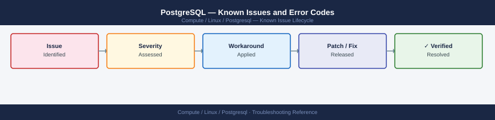

---
tags:
  - troubleshooting
  - postgresql
  - linux
  - known-issues
description: "Catalog of known PostgreSQL bugs, error codes, and workarounds covering connectivity, replication, vacuum, and Patroni HA."
---
# PostgreSQL — Known Issues and Error Codes

<div class="kb-summary">
Catalog of known PostgreSQL bugs, error codes, and workarounds covering connectivity, replication, vacuum, and Patroni HA.

*Applies to: PostgreSQL 15.x / 16.x*
</div>



```d2
direction: down

symptom: Identify Symptom {shape: diamond}
connectivity: "Connectivity" {shape: rectangle}
replication: "Replication" {shape: rectangle}
vacuum_bloat: "Vacuum / Bloat" {shape: rectangle}
patroni_ha: "Patroni HA" {shape: rectangle}
resolution: Resolve or Escalate {shape: oval}

symptom -> connectivity: investigate
symptom -> replication: investigate
symptom -> vacuum_bloat: investigate
symptom -> patroni_ha: investigate
connectivity -> resolution
replication -> resolution
vacuum_bloat -> resolution
patroni_ha -> resolution
```

## Before you begin

- PostgreSQL logs: `/var/log/postgresql/postgresql-*.log` or via `journalctl -u postgresql`.
- `pg_activity` or `SELECT * FROM pg_stat_activity` for active query monitoring.
- Autovacuum issues are the most common silent performance degrader — check `pg_stat_user_tables`.

## Connectivity

| Error Code | Description | Cause | Fix |
|---|---|---|---|
| `FATAL: password authentication failed` | Wrong password or `pg_hba.conf` rejects method | Verify `pg_hba.conf` allows connection method (md5/scram); check password | N/A |
| `FATAL: no pg_hba.conf entry for host` | Client IP not in `pg_hba.conf` | Add client IP/subnet to `pg_hba.conf`; `pg_reload_conf()` | N/A |
| `could not connect to server: Connection refused` | PostgreSQL not listening on TCP | Check `listen_addresses` in `postgresql.conf`; restart if changed | N/A |

## Replication

| Error / Symptom | Affected Versions | Cause | Workaround / Fix | Fixed In |
|---|---|---|---|---|
| Streaming replica lag growing | PostgreSQL 15/16 | WAN bandwidth or primary write rate too high | Increase `wal_keep_size`; consider `pg_logical` for more efficient replication | N/A |
| `replication slot inactive` consuming WAL | PostgreSQL 15/16 | Replica connected to slot dropped; slot not cleaned up | Drop unused slot: `SELECT pg_drop_replication_slot('slot_name')` | N/A |

## Vacuum / Bloat

| Error / Symptom | Affected Versions | Cause | Workaround / Fix | Fixed In |
|---|---|---|---|---|
| Table bloat growing rapidly | All | Autovacuum not keeping up with DELETE/UPDATE rate | Run manual `VACUUM ANALYZE <table>`; increase `autovacuum_vacuum_cost_delay` | N/A |
| `Transaction ID wraparound` warning | All | Autovacuum not processing table within 2B transactions | Run emergency `VACUUM FREEZE <table>` immediately | N/A |

## Patroni HA

| Error / Symptom | Affected Versions | Cause | Workaround / Fix | Fixed In |
|---|---|---|---|---|
| Patroni cluster `No Leader` after split-brain | Patroni 3.x | etcd quorum lost; all nodes in follower state | Restore etcd quorum; or use `patronictl failover --force <cluster> <node>` | N/A |
| HAProxy not routing to primary | Patroni 3.x | HAProxy health check not detecting new primary after failover | Restart HAProxy; verify Patroni REST API (port 8008) responds with primary status | N/A |

## See also

- [PostgreSQL — Common Issues](../common-issues/)
- [Linux — Known Issues](../../troubleshooting/known-issues.md)
