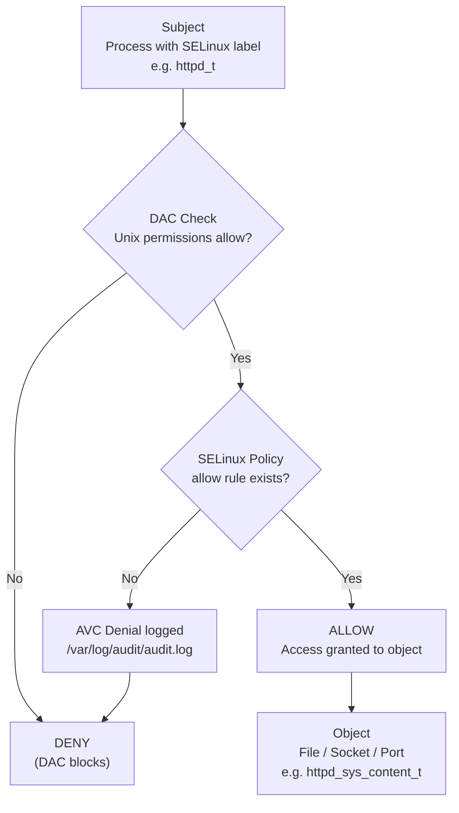
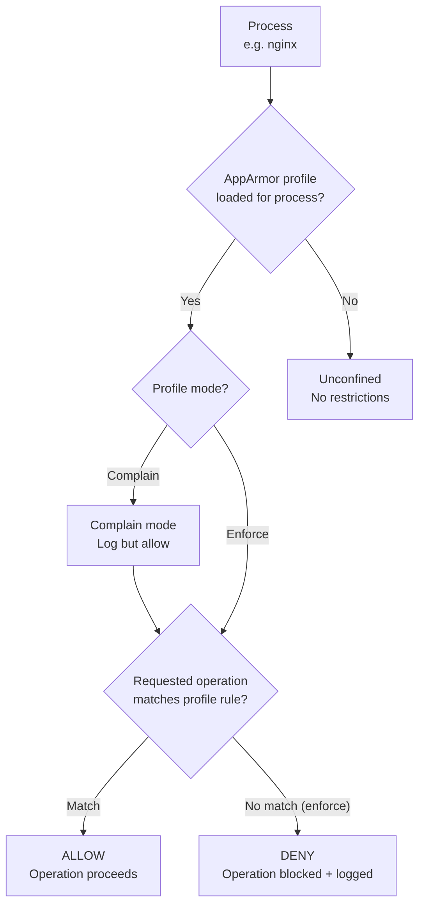

# Linux — Access Control

DAC (chmod/ACL), MAC (SELinux/AppArmor), sudoers policy, and login access restrictions.

## Discretionary Access Control (DAC)

### Traditional Unix Permissions

```bash
# View permissions
ls -l /path/to/file

# Set owner and group
chown jsmith:developers /opt/app/config.cfg

# Set permissions — owner rw, group r, others none
chmod 640 /opt/app/config.cfg

# Set permissions recursively (files and directories)
find /opt/app -type f -exec chmod 640 {} \;
find /opt/app -type d -exec chmod 750 {} \;

# Sticky bit on shared directories — only owner can delete their files
chmod 1777 /tmp
chmod 1775 /opt/shared

# SGID on a directory — new files inherit group
chmod 2775 /opt/projects
```

### POSIX ACLs

Use ACLs when you need per-user permissions beyond the three owner/group/other slots.

```bash
# Install acl tools (usually pre-installed)
# RHEL: dnf install -y acl
# Ubuntu: apt install -y acl

# View ACLs
getfacl /opt/app/data/

# Grant a specific user read+write on a file
setfacl -m u:jsmith:rw /opt/app/data/report.csv

# Grant a group read access
setfacl -m g:analysts:r /opt/app/data/

# Set default ACL — all new files in directory inherit these entries
setfacl -d -m g:developers:rwx /opt/projects/
setfacl -d -m o::--- /opt/projects/

# Remove a specific ACL entry
setfacl -x u:jsmith /opt/app/data/report.csv

# Remove all ACL entries (revert to standard permissions)
setfacl -b /opt/app/data/report.csv

# Copy ACLs from one file to another
getfacl /opt/app/data/report.csv | setfacl --set-file=- /opt/app/data/report2.csv
```

### Sensitive File Permissions Baseline

| File | Owner | Permissions | Notes |
|---|---|---|---|
| `/etc/passwd` | root:root | 644 | World-readable, no passwords |
| `/etc/shadow` | root:root | 000 | Readable only by root |
| `/etc/gshadow` | root:root | 000 | Group password hashes |
| `/etc/sudoers` | root:root | 440 | Only via `visudo` |
| `/etc/ssh/sshd_config` | root:root | 600 | SSH daemon config |
| `/root` | root:root | 700 | Root home directory |
| `/etc/cron.d/` | root:root | 700 | Cron job directory |
| `/var/log/audit/` | root:root | 700 | Audit log directory |

```bash
# Verify critical file permissions
stat -c "%a %U %G %n" /etc/passwd /etc/shadow /etc/sudoers /etc/ssh/sshd_config
```

## Mandatory Access Control — SELinux (RHEL)

SELinux enforces mandatory policies on top of DAC. Even root is constrained by SELinux policy.

### SELinux MAC Decision Flow



### SELinux Modes

```bash
# Check current mode
getenforce        # Enforcing / Permissive / Disabled
sestatus          # Detailed status including policy type

# Temporarily set to permissive (survives until reboot)
setenforce 0

# Permanently set mode in /etc/selinux/config
# SELINUX=enforcing   (enforcing | permissive | disabled)
# Requires reboot to take effect when changing disabled <-> enforcing
```

### Context Management

```bash
# View file context
ls -Z /var/www/html/

# View process context
ps -eZ | grep httpd

# View user context
id -Z

# Change file context
chcon -t httpd_sys_content_t /opt/webapp/public/
# Restore to policy default
restorecon -Rv /opt/webapp/public/

# Make a context change permanent (survives restorecon)
semanage fcontext -a -t httpd_sys_content_t "/opt/webapp/public(/.*)?"
restorecon -Rv /opt/webapp/public/
```

### Boolean Switches

```bash
# List all booleans
getsebool -a

# Common web server booleans
getsebool httpd_can_network_connect
setsebool -P httpd_can_network_connect on   # -P = persistent

# Allow services to use NFS home directories
setsebool -P use_nfs_home_dirs on

# Allow SSSD to use LDAP
setsebool -P sssd_use_ldap on
```

### Troubleshooting Denials

```bash
# View recent AVC denials
ausearch -m avc --start recent | audit2why

# Generate a permissive policy module from denials (for testing)
ausearch -m avc --start recent | audit2allow -M mypolicy
semodule -i mypolicy.pp

# Check SELinux denials in journal
journalctl | grep "SELinux is preventing"

# sealert (setroubleshoot-server package) — human-readable denial explanations
sealert -a /var/log/audit/audit.log
```

## Mandatory Access Control — AppArmor (Ubuntu/Debian)

### AppArmor MAC Decision Flow



```bash
# Check status
aa-status

# List loaded profiles and their modes
aa-status 2>/dev/null | grep -E "enforce|complain"

# Set a profile to enforce mode
aa-enforce /etc/apparmor.d/usr.sbin.nginx

# Set a profile to complain (audit only, no blocking)
aa-complain /etc/apparmor.d/usr.sbin.nginx

# Reload a profile after editing
apparmor_parser -r /etc/apparmor.d/usr.sbin.nginx

# View denials
journalctl | grep "apparmor" | grep "DENIED" | tail -20
dmesg | grep "apparmor=\"DENIED\""
```

### AppArmor Profile Structure

```bash
# /etc/apparmor.d/usr.local.bin.myapp
/usr/local/bin/myapp {
  # Allow read on config directory
  /etc/myapp/** r,
  # Allow read/write on data directory
  /var/lib/myapp/** rw,
  # Allow write on log file
  /var/log/myapp.log w,
  # Allow network (TCP)
  network tcp,
  # Deny everything else implicitly
}
```

## sudo Access Control

See also: [Authentication — sudo configuration](../authentication/index.md#sudo-configuration)

### Principle of Least Privilege in Sudoers

```bash
visudo   # Always use visudo — validates syntax on save
```

```bash
# Separate duty: backup operator — only rsync and tar
%backupops  ALL=(root) /usr/bin/rsync, /usr/bin/tar

# Developers — restart application services only
%developers  ALL=(root) /usr/bin/systemctl restart app-*, /usr/bin/systemctl status app-*

# Network team — only network-related commands
%netops  ALL=(root) /usr/sbin/ip, /usr/sbin/ss, /usr/sbin/tcpdump

# Deny a specific command even within a permitted group
jsmith  ALL=(ALL) ALL, !/bin/su, !/usr/bin/passwd root
```

```bash
# Audit who has sudo access
grep -E "^[^#]" /etc/sudoers /etc/sudoers.d/* | grep -v "^Defaults"

# Check a specific user's sudo permissions
sudo -l -U jsmith
```

## /etc/security/access.conf

Restricts which users or groups can log in from which origins. Processed by `pam_access.so`.

```bash
# /etc/security/access.conf format:
# permission : users/groups : origins
# + = allow, - = deny

# Allow root only from console and specific management host
+ : root : LOCAL 10.10.10.5
- : root : ALL

# Allow domain admin group from anywhere on the corporate network
+ : @linuxadmins : 10.0.0.0/8 .example.local
+ : @linuxadmins : LOCAL

# Allow all users from internal networks
+ : ALL : 10.0.0.0/8 192.168.0.0/16

# Deny all others
- : ALL : ALL
```

```bash
# /etc/pam.d/system-auth — enable pam_access
account     required      pam_access.so
```

## File Attributes (chattr)

Immutable flag prevents modification even by root — useful for protecting log files or configuration.

```bash
# Make a file immutable
chattr +i /etc/resolv.conf

# Remove immutable flag
chattr -i /etc/resolv.conf

# Make a file append-only (useful for log files)
chattr +a /var/log/secure

# View attributes
lsattr /etc/resolv.conf
lsattr /var/log/
```

## Capabilities

Capabilities allow processes to have specific elevated privileges without full root.

```bash
# View capabilities on a binary
getcap /usr/bin/ping
getcap /usr/sbin/tcpdump

# Grant a capability (instead of setuid root)
setcap cap_net_raw+ep /usr/sbin/tcpdump

# Remove all capabilities
setcap -r /usr/sbin/tcpdump

# View all binaries with capabilities
find / -xdev -type f -exec getcap {} \; 2>/dev/null

# View capabilities of a running process
cat /proc/<pid>/status | grep Cap
capsh --decode=<hex-value>
```

## Access Control Audit

```bash
# Find world-writable files outside /tmp (should be none)
find / -xdev -type f -perm -0002 -not -path "/tmp/*" -not -path "/proc/*" 2>/dev/null

# Find setuid binaries
find / -xdev -type f -perm -4000 2>/dev/null

# Find setgid binaries
find / -xdev -type f -perm -2000 2>/dev/null

# Find files with no owner (orphaned)
find / -xdev -nouser -o -nogroup 2>/dev/null

# Check /etc/passwd for accounts with UID 0 (should only be root)
awk -F: '$3 == 0 { print $1 }' /etc/passwd

# Check for accounts with empty passwords
awk -F: '$2 == "" { print $1 }' /etc/shadow
```

## Quick Reference

| Control type | Mechanism | Scope |
|---|---|---|
| Traditional permissions | `chmod`, `chown` | Owner / Group / Other |
| Extended permissions | `setfacl` / `getfacl` | Per-user / per-group |
| Mandatory policy (RHEL) | SELinux (`setenforce`, `chcon`) | All processes and files |
| Mandatory policy (Ubuntu) | AppArmor (`aa-enforce`) | Per-application profiles |
| Privileged command access | `sudoers`, `/etc/sudoers.d/` | Per-user / per-group |
| Login origin restriction | `/etc/security/access.conf` | User + source IP/host |
| File immutability | `chattr +i` | Specific files |
| Process privileges | `setcap` / `getcap` | Specific binaries |
