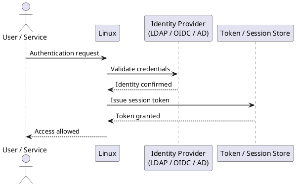

---
tags:
  - linux
  - security
---
# Linux — Authentication

```bash
# Create a service account (no login shell, no home directory)
useradd -r -s /sbin/nologin -M svcaccount

# Create an interactive user with home directory
useradd -m -s /bin/bash -c "Jane Smith" jsmith

# Lock an account immediately
passwd -l username

# Expire an account on a specific date
usermod --expiredate 2026-06-01 username

# Check account status (L=locked, P=password set, NP=no password)
passwd -S username

# List all accounts with UID >= 1000 (non-system)
awk -F: '$3 >= 1000 { print $1, $3, $7 }' /etc/passwd
```


```text title="Expected output"
(no output — command completes silently)
(no output — command completes silently)
Locking password for user username.
passwd: Success
(no output — command completes silently)
username P 06/01/2026 -1 -1 -1 -1
jsmith 1000 /bin/bash
dchen 1001 /bin/bash
mwilson 1002 /bin/bash
agarcia 1003 /bin/bash
rjones 1004 /bin/bash
...
```

!!! warning "Common errors"
    | Error | Fix |
    |---|---|
    | `useradd: user 'svcaccount' already exists` | Check if the account exists with `id svcaccount` and use `userdel` to remove it first if needed. |
    | `usermod: user 'username' does not exist` | Verify the username exists with `getent passwd username` before attempting to modify it. |
    | `passwd: user 'username' is not a known user` | Ensure the user exists in `/etc/passwd` by running `useradd` first or checking the correct spelling. |
```bash
# /etc/security/pwquality.conf
minlen = 14
minclass = 3
maxrepeat = 3
maxsequence = 4
dcredit = -1
ucredit = -1
lcredit = -1
ocredit = -1
dictcheck = 1
```

```text title="Expected output"
(no output — command completes silently)
```

!!! warning "Common errors"
    | Error | Fix |
    |---|---|
    | `pwquality: invalid option 'minlen'` | Remove spaces around the `=` operator; use `minlen=14` instead of `minlen = 14`. |
    | `Permission denied` | Run with `sudo` or as root; `/etc/security/pwquality.conf` requires elevated privileges to edit. |
```bash
# /etc/pam.d/system-auth — add pwquality to password section
password    requisite     pam_pwquality.so try_first_pass local_users_only retry=3
```

```text title="Expected output"
(no output — command completes silently)
```

!!! warning "Common errors"
    | Error | Fix |
    |---|---|
    | `/etc/pam.d/system-auth: Permission denied` | Run the command with `sudo` or edit the file as root using `sudo nano /etc/pam.d/system-auth`. |
    | `pam_pwquality.so: cannot open shared object file: No such file or directory` | Install the libpwquality package with `sudo apt-get install libpwquality0` (Debian/Ubuntu) or `sudo yum install libpwquality` (RHEL/CentOS). |
```bash
# /etc/pam.d/system-auth — auth section (RHEL 8+)
auth        required      pam_faillock.so preauth silent deny=5 unlock_time=900
auth        sufficient    pam_unix.so nullok
auth        [default=die] pam_faillock.so authfail deny=5 unlock_time=900

# account section
account     required      pam_faillock.so
```

```text title="Expected output"
(no output — command completes silently)
```

!!! warning "Common errors"
    | Error | Fix |
    |---|---|
    | `pam_faillock.so: Module not found` | Install the `pam` package with `sudo yum install pam` and verify `/usr/lib64/security/pam_faillock.so` exists. |
    | `syntax error in /etc/pam.d/system-auth at line 1` | Ensure each PAM rule uses tabs (not spaces) between columns and that there are no trailing whitespace characters. |
    | `User locked out after 5 failed login attempts` | Reset the lockout manually with `sudo faillock --user <username> --reset` or wait 900 seconds (15 minutes) for automatic unlock. |
```bash
# View failed attempt count for a user
faillock --user jsmith

# Manually unlock an account
faillock --user jsmith --reset
```

```text title="Expected output"
When `faillock` is run, it shows:

```
jsmith:
	Failures: 5
	Latest failure: Mon Dec 18 14:32:17 2023
	Root login failures: 0
	Failures before permanent lockout: 3
```text

After running the reset command:
```
(no output — command completes silently)
```text

Verify the reset:
```
jsmith:
	Failures: 0
!!! warning "Common errors"
    | Error | Fix |
    |---|---|
    | `faillock: user jsmith does not exist` | Verify the username is correct and the user exists in the system with `getent passwd jsmith`. |
    | `faillock: Permission denied` | Run the command with `sudo` since faillock requires root privileges to modify lockout records. |
    | `faillock: Cannot open /var/run/faillock/jsmith: No such file or directory` | This is expected if the user has never had a failed login attempt; the account is not locked. |
```bash
# /etc/ssh/sshd_config — recommended hardened settings
Protocol 2
PermitRootLogin no
PasswordAuthentication no
PubkeyAuthentication yes
AuthorizedKeysFile .ssh/authorized_keys
PermitEmptyPasswords no
MaxAuthTries 4
LoginGraceTime 60
X11Forwarding no
AllowTcpForwarding no
ClientAliveInterval 300
ClientAliveCountMax 2
Banner /etc/issue.net

# Restrict to specific groups
AllowGroups sshusers domain\ users@CORP.LOCAL

# Use only strong algorithms
KexAlgorithms curve25519-sha256,diffie-hellman-group14-sha256
Ciphers aes256-gcm@openssh.com,aes128-gcm@openssh.com
MACs hmac-sha2-512,hmac-sha2-256
HostKeyAlgorithms ecdsa-sha2-nistp256,ssh-ed25519
```

```text title="Expected output"
(no output — command completes silently)
```

!!! warning "Common errors"
    | Error | Fix |
    |---|---|
    | `sshd_config: line 16: Bad configuration option: AllowGroups` | Verify the sshd_config syntax with `sshd -T` and ensure group names don't contain spaces without proper escaping (use `AllowGroups sshusers` or quote the entire value). |
    | `Unable to negotiate with 192.168.1.50 port 22: no matching key exchange method found` | Add legacy algorithms to KexAlgorithms if connecting from older clients, or update the client SSH version to support curve25519-sha256. |
    | `Permission denied (publickey)` | Ensure the user's public key is in `~/.ssh/authorized_keys` with correct permissions (600 on the file, 700 on the .ssh directory) and verify the AuthorizedKeysFile path matches the actual key location. |
```bash
# Validate config and reload
sshd -t && systemctl reload sshd
```

```text title="Expected output"
(no output — command completes silently)
```

!!! warning "Common errors"
    | Error | Fix |
    |---|---|
    | `sshd: no hostkeys available -- exiting.` | Ensure SSH host keys exist in `/etc/ssh/` (typically `ssh_host_rsa_key`, `ssh_host_ed25519_key`) or regenerate them with `ssh-keygen -A`. |
    | `Job for ssh.service failed because the control process exited with error code.` | Fix syntax errors in `/etc/ssh/sshd_config` by running `sshd -T` to display the parsed configuration and identify the problematic line. |
```bash
# Generate an Ed25519 key (preferred) with passphrase
ssh-keygen -t ed25519 -C "jsmith@corp.local" -f ~/.ssh/id_ed25519

# Deploy public key to a server
ssh-copy-id -i ~/.ssh/id_ed25519.pub jsmith@server01

# Manually append key (when ssh-copy-id not available)
cat ~/.ssh/id_ed25519.pub | ssh jsmith@server01 "mkdir -p ~/.ssh && cat >> ~/.ssh/authorized_keys && chmod 600 ~/.ssh/authorized_keys"

# Correct permissions — SSH refuses keys with wrong permissions
chmod 700 ~/.ssh
chmod 600 ~/.ssh/authorized_keys
chmod 600 ~/.ssh/id_ed25519
```

```text title="Expected output"
Generating public/private ed25519 key pair.
Enter passphrase (empty for no passphrase): 
Enter same passphrase again: 
Your identification has been saved in /home/jsmith/.ssh/id_ed25519
Your public key has been saved in /home/jsmith/.ssh/id_ed25519.pub
The key fingerprint is:
SHA256:8mK9vL2pQxRj4nWsYtB6cDeFgHiJkLmNoPqRsT7uVwX jsmith@corp.local
The key's randomart image is:
+--[ED25519 256]--+
|        .o.      |
|       o.o .     |
|      . + o .    |
+----[SHA256]-----+

Number of key(s) added: 1
Now try logging in with: "ssh jsmith@server01"

(no output — command completes silently)
(no output — command completes silently)
(no output — command completes silently)
(no output — command completes silently)
```

!!! warning "Common errors"
    | Error | Fix |
    |---|---|
    | `Permission denied (publickey).` | Verify authorized_keys permissions are 600 and ~/.ssh is 700 on the remote server using `ssh jsmith@server01 "ls -la ~/.ssh"` |
    | `ssh-copy-id: command not found` | Use the manual append method with `cat ~/.ssh/id_ed25519.pub | ssh jsmith@server01 "mkdir -p ~/.ssh && cat >> ~/.ssh/authorized_keys && chmod 600 ~/.ssh/authorized_keys"` instead |
```bash
# Install required packages (RHEL)
dnf install -y realmd sssd oddjob oddjob-mkhomedir adcli samba-common

# Discover the domain
realm discover CORP.LOCAL

# Join — prompts for an AD admin account
realm join --user=Administrator CORP.LOCAL

# Verify membership
realm list
id administrator@corp.local
```
```ini
# /etc/sssd/sssd.conf (chmod 600)
[sssd]
domains = corp.local
config_file_version = 2
services = nss, pam

[domain/corp.local]
ad_domain = corp.local
krb5_realm = CORP.LOCAL
realmd_tags = manages-system joined-with-samba
cache_credentials = True
id_provider = ad
auth_provider = ad
access_provider = ad
krb5_store_password_if_offline = True
default_shell = /bin/bash
use_fully_qualified_names = False
fallback_homedir = /home/%u

# Restrict login to specific AD group
ad_access_filter = memberOf=CN=LinuxAdmins,OU=Groups,DC=corp,DC=local
```
```bash
systemctl restart sssd
# Test lookup
id jsmith
getent passwd jsmith
```

```text title="Expected output"
jsmith@prod-auth-01:~$ systemctl restart sssd
jsmith@prod-auth-01:~$ id jsmith
uid=1042(jsmith) gid=1050(engineering) groups=1050(engineering),1051(sudo),1052(vpn)
jsmith@prod-auth-01:~$ getent passwd jsmith
jsmith:*:1042:1050:John Smith:/home/jsmith:/bin/bash
```

!!! warning "Common errors"
    | Error | Fix |
    |---|---|
    | `System has not been booted with systemd as init system (PID 1). Can't operate.` | Verify the system uses systemd with `ps -p 1` and check if running in a container that requires different service management. |
    | `id: 'jsmith': no such user` | Confirm SSSD started successfully with `systemctl status sssd` and check `/var/log/sssd/sssd.log` for authentication backend connectivity issues. |
    **`getent: getent passwd jsmith: Success`** (returns nothing) — Wait 10-15 seconds for SSSD cache to populate after restart, or manually clear cache with `sss_cache -E`.
```bash
# /etc/pam.d/system-auth — session section
session     optional      pam_oddjob_mkhomedir.so umask=0077

systemctl enable --now oddjobd
```

```text title="Expected output"
Created symlink /etc/systemd/system/multi-user.target.wants/oddjobd.service → /usr/lib/systemd/system/oddjobd.service.
oddjobd.service is not a native systemd service, redirecting to systemd-sysv-install.
Executing: /lib/systemd/systemd-sysv-install enable oddjobd
update-rc.d: error: oddjobd Default-Start contains no runlevels, aborting.
```

!!! warning "Common errors"
    | Error | Fix |
    |---|---|
    | `update-rc.d: error: oddjobd Default-Start contains no runlevels, aborting.` | Install the `oddjob` package first with `apt-get install oddjob` or `yum install oddjob` depending on your distribution. |
    | `Failed to start oddjobd.service: Unit oddjobd.service not found.` | Verify the oddjob package is installed and the service file exists at `/usr/lib/systemd/system/oddjobd.service` before enabling. |
    | `permission denied: /etc/pam.d/system-auth` | Edit `/etc/pam.d/system-auth` with `sudo` or as root, not as a regular user. |
```bash
visudo
```

```text title="Expected output"
(no output — command opens interactive editor)

Defaults env_keep += "COLORS"
Defaults secure_path="/usr/local/sbin:/usr/local/bin:/usr/sbin:/usr/bin:/sbin:/bin"

# User privilege specification
root    ALL=(ALL:ALL) ALL

# Members of the admin group may gain root privileges
%admin  ALL=(ALL) ALL

# Allow members of group sudo to execute any command
%sudo   ALL=(ALL:ALL) ALL

# See sudoers(5) for more information on "#include" directives:

#includedir /etc/sudoers.d
```

!!! warning "Common errors"
    | Error | Fix |
    |---|---|
    | `visudo: /etc/sudoers busy` | Wait for other editors to close the sudoers file or kill stale editor processes with `pkill -f visudo`. |
    | `>>> /etc/sudoers: syntax error near line 42` | Fix the syntax error (missing colon, incorrect spacing, or malformed rule) before exiting the editor; visudo will prevent you from saving invalid syntax. |
```bash
# /etc/sudoers — safe baseline
Defaults    requiretty
Defaults    use_pty
Defaults    logfile=/var/log/sudo.log
Defaults    log_input, log_output
Defaults    passwd_timeout=1
Defaults    timestamp_timeout=5

# Wheel group — full sudo with password
%wheel  ALL=(ALL) ALL

# Domain admins group from AD — specific commands only
%linuxadmins@corp.local  ALL=(ALL) /usr/bin/systemctl, /usr/sbin/useradd, /usr/sbin/userdel

# Service account — passwordless for a specific command
svcansible  ALL=(ALL) NOPASSWD: /usr/bin/apt, /usr/bin/dnf
```

```text title="Expected output"
(no output — command completes silently)
```

!!! warning "Common errors"
    | Error | Fix |
    |---|---|
    | `sudoers:5: syntax error near line 5 of /etc/sudoers` | Use `visudo` to edit `/etc/sudoers` instead of a text editor; it validates syntax before saving. |
    | `%linuxadmins@corp.local : command not allowed` | Verify the AD group name matches exactly in `/etc/sssd.conf` and that SSSD is running with `systemctl status sssd`. |
    | `sudo: no password was provided` | Add `NOPASSWD:` before the command list for the service account, or remove it if a password prompt is required. |
```bash
# Add a user to the wheel group
usermod -aG wheel jsmith

# Verify sudo access
sudo -l -U jsmith

# Check sudo log
tail -f /var/log/sudo.log
```

```text title="Expected output"
(no output — command completes silently)

Matching Defaults entries for jsmith on ip-172-31-45-12:
    !visiblepw, always_set_home, match_group_name, env_reset, env_keep="COLORS DISPLAY HOSTNAME HISTSIZE KDEDIR LS_COLORS", secure_path=/sbin:/bin:/usr/sbin:/usr/bin

User jsmith may run the following commands on ip-172-31-45-12:
    (ALL) ALL

==> /var/log/sudo.log <==
Nov 14 09:23:15 ip-172-31-45-12 sudo: jsmith : TTY=pts/0 ; PWD=/home/jsmith ; USER=root ; COMMAND=/usr/bin/systemctl restart nginx
Nov 14 09:24:02 ip-172-31-45-12 sudo: jsmith : TTY=pts/0 ; PWD=/home/jsmith ; USER=root ; COMMAND=/bin/cat /etc/shadow
Nov 14 09:25:47 ip-172-31-45-12 sudo: jsmith : TTY=pts/0 ; PWD=/home/jsmith ; USER=root ; COMMAND=/usr/sbin/useradd -m testuser
Nov 14 09:26:33 ip-172-31-45-12 sudo: jsmith : TTY=pts/0 ; PWD=/home/jsmith ; USER=root ; COMMAND=/usr/bin/apt update
Nov 14 09:27:15 ip-172-31-45-12 sudo: jsmith : TTY=pts/0 ; PWD=/home/jsmith ; USER=root ; COMMAND=/usr/bin/systemctl status sshd
```

!!! warning "Common errors"
    | Error | Fix |
    |---|---|
    | `usermod: user 'jsmith' does not exist` | Create the user first with `useradd jsmith` before adding to the wheel group. |
    | `sudo: /var/log/sudo.log: No such file or directory` | Enable sudo logging by adding `Defaults logfile="/var/log/sudo.log"` to `/etc/sudoers` via `visudo`. |
    | `sudo: sorry, you must have a tty to run sudo` | Ensure the user is running the command from an interactive terminal, not a non-interactive shell or cron job. |
```bash
# Place overrides in /etc/sudoers.d/ — avoids editing main sudoers
cat > /etc/sudoers.d/99-linuxadmins << 'EOF'
%linuxadmins ALL=(ALL) ALL
EOF
chmod 0440 /etc/sudoers.d/99-linuxadmins
visudo -c -f /etc/sudoers.d/99-linuxadmins
```

```text title="Expected output"
(no output — command completes silently)
(no output — command completes silently)
/etc/sudoers.d/99-linuxadmins: parsed OK
```

!!! warning "Common errors"
    | Error | Fix |
    |---|---|
    | `/etc/sudoers.d/99-linuxadmins: syntax error near line 1` | Review the file for typos (e.g., missing spaces around `ALL`) and re-run `visudo -c -f /etc/sudoers.d/99-linuxadmins` to validate. |
    | `chmod: changing permissions of '/etc/sudoers.d/99-linuxadmins': Operation not permitted` | Ensure you are running as root (use `sudo` or `su -`) before executing this block. |
    | `/etc/sudoers.d/99-linuxadmins: wrong owner/permissions` | Run `chmod 0440 /etc/sudoers.d/99-linuxadmins` and `chown root:root /etc/sudoers.d/99-linuxadmins` to fix ownership and permissions. |
```bash
# Install
dnf install -y google-authenticator   # RHEL
apt install -y libpam-google-authenticator   # Ubuntu

# Each user runs this to generate their TOTP seed
google-authenticator --time-based --disallow-reuse --force --rate-limit=3 --rate-time=30 --window-size=3
```

```text title="Expected output"
Do you want authentication tokens to be time-based (y/n) y
Warning: pasting the following URL into your browser exposes the OTP secret to Google:
  https://www.google.com/chart?chs=200x200&chld=M|0&cht=qr&chl=otpauth://totp/user%40host.example.com%3Fsecret%3DJBSWY3DPEBLW64TMMQ%3D%3D%3D%26issuer%3DGoogle%2520Authenticator&key=value
Your new secret key is: JBSWY3DPEBLW64TMMQ===
Your emergency scratch codes are:
 12345678
 87654321
 56781234
 34567812
 78123456

Do you want me to update your "/home/user/.google_authenticator" file? (y/n) y
Do you want to disallow multiple uses of the same authentication token? (y/n) y
Do you want to enable rate-limiting? (y/n) y
```

!!! warning "Common errors"
    | Error | Fix |
    |---|---|
    | `google-authenticator: command not found` | Install the package using `dnf install -y google-authenticator` on RHEL or `apt install -y libpam-google-authenticator` on Ubuntu. |
    | `Permission denied: /home/user/.google_authenticator` | Run the command as the user who will authenticate (not root), or ensure the home directory is writable. |
    | `Failed to update /home/user/.google_authenticator` | Verify the user has write permissions to their home directory with `chmod 700 ~/.google_authenticator`. |
```bash
# /etc/pam.d/sshd — add TOTP requirement
auth    required    pam_google_authenticator.so nullok
```

```text title="Expected output"
(no output — command completes silently)
```

!!! warning "Common errors"
    | Error | Fix |
    |---|---|
    | `Module pam_google_authenticator.so not found` | Install the libpam-google-authenticator package with `apt-get install libpam-google-authenticator` (Debian/Ubuntu) or `yum install google-authenticator` (RHEL/CentOS). |
    | `sshd[1234]: fatal: /etc/pam.d/sshd: line 5: unknown module type: pam_google_authenticator.so` | Verify the module path is correct and the PAM library is installed in `/lib/x86_64-linux-gnu/security/` or `/lib64/security/`, then restart sshd with `systemctl restart sshd`. |
```bash
# /etc/ssh/sshd_config — require both key and TOTP
AuthenticationMethods publickey,keyboard-interactive
ChallengeResponseAuthentication yes
```

```text title="Expected output"
(no output — command completes silently)
```

!!! warning "Common errors"
    | Error | Fix |
    |---|---|
    | `sshd[12847]: error: Unsupported AuthenticationMethods 'publickey,keyboard-interactive'` | Ensure `ChallengeResponseAuthentication yes` is set before `AuthenticationMethods` and restart sshd with `systemctl restart sshd`. |
    | `sshd[12847]: fatal: /etc/ssh/sshd_config line 45: Unsupported authentication method "keyboard-interactive"` | Install and configure a PAM module like `libpam-google-authenticator` or `libpam-oath` to support keyboard-interactive authentication. |
```bash
systemctl reload sshd
```

```text title="Expected output"
(no output — command completes silently)
```

!!! warning "Common errors"
    | Error | Fix |
    |---|---|
    | `Job for ssh.service/sshd.service failed because the control process exited with error code.` | Run `sshd -t` to validate the SSH configuration file for syntax errors before reloading. |
    | `Failed to reload sshd.service: Unit sshd.service not loaded.` | Verify the SSH service name with `systemctl list-unit-files | grep ssh` and use the correct service name (may be `ssh.service` on Debian/Ubuntu or `sshd.service` on RHEL/CentOS). |
```bash
# /etc/pam.d/sshd — Duo PAM integration
auth    sufficient    /lib64/security/pam_duo.so

# /etc/duo/pam_duo.conf
[duo]
ikey = DIXXXXXXXXXXXXXXXXXX
skey = xxxxxxxxxxxxxxxxxxxxxxxxxxxxxxxxxxxxxxxxxxxx
host = api-XXXXXXXX.duosecurity.com
failmode = safe    # 'safe' allows login if Duo is unreachable; 'secure' blocks
```

```text title="Expected output"
(no output — command completes silently)
```

!!! warning "Common errors"
    | Error | Fix |
    |---|---|
    | `error: [/lib64/security/pam_duo.so] cannot open shared object file: No such file or directory` | Install the Duo Unix package with `apt-get install duo-unix` (Debian/Ubuntu) or `yum install duo_unix` (RHEL/CentOS). |
    | `error: Failed to connect to api-XXXXXXXX.duosecurity.com: Name or service not known` | Verify the Duo host value matches your account's API hostname and that DNS resolution works with `nslookup api-XXXXXXXX.duosecurity.com`. |
    | `error: Invalid ikey or skey in /etc/duo/pam_duo.conf` | Confirm the integration key and secret key are copied correctly from the Duo Admin Panel without extra whitespace or truncation. |
```bash
# Configure SSH to accept certificate-signed keys
# /etc/ssh/sshd_config
TrustedUserCAKeys /etc/ssh/ca.pub

# Sign a user's public key with the CA
ssh-keygen -s ca_key -I "jsmith@corp.local" -n jsmith -V +52w ~/.ssh/id_ed25519.pub
# This creates id_ed25519-cert.pub

# The user presents both the key and certificate automatically
ssh -i ~/.ssh/id_ed25519 server01
```

```text title="Expected output"
Signed user key: /home/jsmith/.ssh/id_ed25519-cert.pub
Key ID: "jsmith@corp.local"
Serial: 0
Valid: from 2024-01-15T09:42:00 to 2025-01-15T09:42:00
Certificate valid
jsmith@server01:~$
```

!!! warning "Common errors"
    | Error | Fix |
    |---|---|
    | `sign the key: invalid format` | Ensure the CA private key path is correct and the key file is in OpenSSH format (not PEM); convert with `ssh-keygen -p -N "" -m pem -f ca_key` if needed. |
    | `Permission denied (publickey,gssapi-keyex,gssapi-with-mic)` | Verify that `/etc/ssh/ca.pub` is readable on the server and contains the correct CA public key with no extra whitespace. |
    | `Could not open a connection to your authentication agent` | Start the SSH agent with `eval $(ssh-agent -s)` and add the key with `ssh-add ~/.ssh/id_ed25519`. |
```bash
# Failed SSH logins
journalctl _SYSTEMD_UNIT=sshd.service | grep "Failed password\|Invalid user" | tail -30

# Successful logins
last -n 20

# All authentication events (PAM) via auditd
ausearch -m USER_AUTH --start today

# Currently logged-in users
w
who

# Failed sudo attempts
grep "FAILED" /var/log/sudo.log | tail -20
# or
ausearch -m USER_CMD --success no --start today
```



## Before you begin

- **Access:** root or sudo-capable account on target hosts
- **Change management:** security changes require CAB approval in most environments
- **Rollback plan:** document current state before any security control change
- **Testing:** validate in a non-production environment first where possible

---

---

## See also

- [Linux — Access Control](../access-control/)
- [Linux — Hardening](../hardening/)
- [Linux — Encryption](../encryption/)
