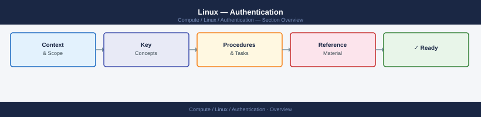

---
tags:
  - linux
  - security
---
# Linux — Authentication



```bash
# Create a service account (no login shell, no home directory)
useradd -r -s /sbin/nologin -M svcaccount

# Create an interactive user with home directory
useradd -m -s /bin/bash -c "Jane Smith" jsmith

# Lock an account immediately
passwd -l username

# Expire an account on a specific date
usermod --expiredate 2026-06-01 username

# Check account status (L=locked, P=password set, NP=no password)
passwd -S username

# List all accounts with UID >= 1000 (non-system)
awk -F: '$3 >= 1000 { print $1, $3, $7 }' /etc/passwd
```

```bash
# /etc/security/pwquality.conf
minlen = 14
minclass = 3
maxrepeat = 3
maxsequence = 4
dcredit = -1
ucredit = -1
lcredit = -1
ocredit = -1
dictcheck = 1
```
```bash
# /etc/pam.d/system-auth — add pwquality to password section
password    requisite     pam_pwquality.so try_first_pass local_users_only retry=3
```
```bash
# /etc/pam.d/system-auth — auth section (RHEL 8+)
auth        required      pam_faillock.so preauth silent deny=5 unlock_time=900
auth        sufficient    pam_unix.so nullok
auth        [default=die] pam_faillock.so authfail deny=5 unlock_time=900

# account section
account     required      pam_faillock.so
```
```bash
# View failed attempt count for a user
faillock --user jsmith

# Manually unlock an account
faillock --user jsmith --reset
```
```bash
# /etc/ssh/sshd_config — recommended hardened settings
Protocol 2
PermitRootLogin no
PasswordAuthentication no
PubkeyAuthentication yes
AuthorizedKeysFile .ssh/authorized_keys
PermitEmptyPasswords no
MaxAuthTries 4
LoginGraceTime 60
X11Forwarding no
AllowTcpForwarding no
ClientAliveInterval 300
ClientAliveCountMax 2
Banner /etc/issue.net

# Restrict to specific groups
AllowGroups sshusers domain\ users@CORP.LOCAL

# Use only strong algorithms
KexAlgorithms curve25519-sha256,diffie-hellman-group14-sha256
Ciphers aes256-gcm@openssh.com,aes128-gcm@openssh.com
MACs hmac-sha2-512,hmac-sha2-256
HostKeyAlgorithms ecdsa-sha2-nistp256,ssh-ed25519
```
```bash
# Validate config and reload
sshd -t && systemctl reload sshd
```
```bash
# Generate an Ed25519 key (preferred) with passphrase
ssh-keygen -t ed25519 -C "jsmith@corp.local" -f ~/.ssh/id_ed25519

# Deploy public key to a server
ssh-copy-id -i ~/.ssh/id_ed25519.pub jsmith@server01

# Manually append key (when ssh-copy-id not available)
cat ~/.ssh/id_ed25519.pub | ssh jsmith@server01 "mkdir -p ~/.ssh && cat >> ~/.ssh/authorized_keys && chmod 600 ~/.ssh/authorized_keys"

# Correct permissions — SSH refuses keys with wrong permissions
chmod 700 ~/.ssh
chmod 600 ~/.ssh/authorized_keys
chmod 600 ~/.ssh/id_ed25519
```
```bash
# Install required packages (RHEL)
dnf install -y realmd sssd oddjob oddjob-mkhomedir adcli samba-common

# Discover the domain
realm discover CORP.LOCAL

# Join — prompts for an AD admin account
realm join --user=Administrator CORP.LOCAL

# Verify membership
realm list
id administrator@corp.local
```
```ini
# /etc/sssd/sssd.conf (chmod 600)
[sssd]
domains = corp.local
config_file_version = 2
services = nss, pam

[domain/corp.local]
ad_domain = corp.local
krb5_realm = CORP.LOCAL
realmd_tags = manages-system joined-with-samba
cache_credentials = True
id_provider = ad
auth_provider = ad
access_provider = ad
krb5_store_password_if_offline = True
default_shell = /bin/bash
use_fully_qualified_names = False
fallback_homedir = /home/%u

# Restrict login to specific AD group
ad_access_filter = memberOf=CN=LinuxAdmins,OU=Groups,DC=corp,DC=local
```
```bash
systemctl restart sssd
# Test lookup
id jsmith
getent passwd jsmith
```
```bash
# /etc/pam.d/system-auth — session section
session     optional      pam_oddjob_mkhomedir.so umask=0077

systemctl enable --now oddjobd
```
```bash
visudo
```
```bash
# /etc/sudoers — safe baseline
Defaults    requiretty
Defaults    use_pty
Defaults    logfile=/var/log/sudo.log
Defaults    log_input, log_output
Defaults    passwd_timeout=1
Defaults    timestamp_timeout=5

# Wheel group — full sudo with password
%wheel  ALL=(ALL) ALL

# Domain admins group from AD — specific commands only
%linuxadmins@corp.local  ALL=(ALL) /usr/bin/systemctl, /usr/sbin/useradd, /usr/sbin/userdel

# Service account — passwordless for a specific command
svcansible  ALL=(ALL) NOPASSWD: /usr/bin/apt, /usr/bin/dnf
```
```bash
# Add a user to the wheel group
usermod -aG wheel jsmith

# Verify sudo access
sudo -l -U jsmith

# Check sudo log
tail -f /var/log/sudo.log
```
```bash
# Place overrides in /etc/sudoers.d/ — avoids editing main sudoers
cat > /etc/sudoers.d/99-linuxadmins << 'EOF'
%linuxadmins ALL=(ALL) ALL
EOF
chmod 0440 /etc/sudoers.d/99-linuxadmins
visudo -c -f /etc/sudoers.d/99-linuxadmins
```
```bash
# Install
dnf install -y google-authenticator   # RHEL
apt install -y libpam-google-authenticator   # Ubuntu

# Each user runs this to generate their TOTP seed
google-authenticator --time-based --disallow-reuse --force --rate-limit=3 --rate-time=30 --window-size=3
```
```bash
# /etc/pam.d/sshd — add TOTP requirement
auth    required    pam_google_authenticator.so nullok
```
```bash
# /etc/ssh/sshd_config — require both key and TOTP
AuthenticationMethods publickey,keyboard-interactive
ChallengeResponseAuthentication yes
```
```bash
systemctl reload sshd
```
```bash
# /etc/pam.d/sshd — Duo PAM integration
auth    sufficient    /lib64/security/pam_duo.so

# /etc/duo/pam_duo.conf
[duo]
ikey = DIXXXXXXXXXXXXXXXXXX
skey = xxxxxxxxxxxxxxxxxxxxxxxxxxxxxxxxxxxxxxxxxxxx
host = api-XXXXXXXX.duosecurity.com
failmode = safe    # 'safe' allows login if Duo is unreachable; 'secure' blocks
```
```bash
# Configure SSH to accept certificate-signed keys
# /etc/ssh/sshd_config
TrustedUserCAKeys /etc/ssh/ca.pub

# Sign a user's public key with the CA
ssh-keygen -s ca_key -I "jsmith@corp.local" -n jsmith -V +52w ~/.ssh/id_ed25519.pub
# This creates id_ed25519-cert.pub

# The user presents both the key and certificate automatically
ssh -i ~/.ssh/id_ed25519 server01
```
```bash
# Failed SSH logins
journalctl _SYSTEMD_UNIT=sshd.service | grep "Failed password\|Invalid user" | tail -30

# Successful logins
last -n 20

# All authentication events (PAM) via auditd
ausearch -m USER_AUTH --start today

# Currently logged-in users
w
who

# Failed sudo attempts
grep "FAILED" /var/log/sudo.log | tail -20
# or
ausearch -m USER_CMD --success no --start today
```

## Before you begin

- **Access:** root or sudo-capable account on target hosts
- **Change management:** security changes require CAB approval in most environments
- **Rollback plan:** document current state before any security control change
- **Testing:** validate in a non-production environment first where possible

---

---

## See also

- [Linux — Access Control](../access-control/)
- [Linux — Hardening](../hardening/)
- [Linux — Encryption](../encryption/)
