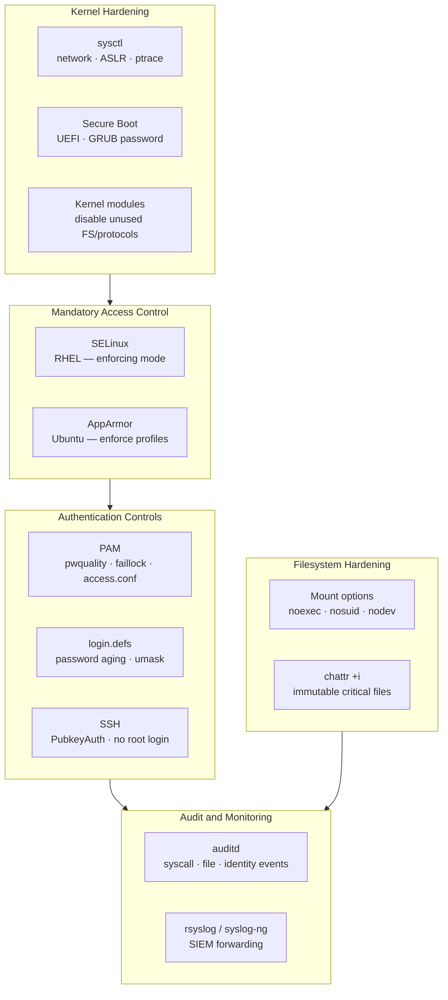

---
tags:
  - linux
  - security
---
# Linux — Hardening


<div class="kb-summary">
CIS benchmark controls, kernel hardening via sysctl, auditd configuration, login.defs, and PAM password policy.

*Applies to: RHEL / Ubuntu LTS*
</div>

## Before you begin

- **Access:** root or sudo-capable account on target hosts
- **Change management:** security changes require CAB approval in most environments
- **Rollback plan:** document current state before any security control change
- **Testing:** validate in a non-production environment first where possible

---

## Linux Hardening Layers


```text
┌────────────────────────────────────── Linux — System Hardening ───────────────────────────────────────┐
│                                                                                                       │
│  CIS benchmark-aligned Linux hardening: kernel, network, packages, and auditing.                      │
│                                                                                                       │
│   ┌──────────────────────────────────────────────┐  ┌─────────────────────────────────────────────┐   │
│   │               Kernel Hardening               │  │              Network Hardening              │   │
│   │           sysctl: disable IPv6 fwd           │  │             firewalld / nftables            │   │
│   │           kernel.dmesg_restrict=1            │  │           deny all inbound default          │   │
│   │              fs.suid_dumpable=0              │  │              TCP SYN cookies on             │   │
│   │             kernel.yama.ptrace=1             │  │              RP filter enabled              │   │
│   │             randomize_va_space=2             │  │           No ICMP redirect accept           │   │
│   └──────────────────────────────────────────────┘  └─────────────────────────────────────────────┘   │
│                                                                                                       │
│   ┌──────────────────────────────────────────────┐  ┌─────────────────────────────────────────────┐   │
│   │              Package & Service               │  │              Audit & Monitoring             │   │
│   │            Remove unused packages            │  │            auditd: syscall rules            │   │
│   │           Disable unused services            │  │            AIDE: integrity checks           │   │
│   │          Auto-patch: dnf-automatic           │  │             logwatch / journald             │   │
│   │            RPM GPG verify always             │  │               oscap: CIS scan               │   │
│   │           noexec on /tmp /var/tmp            │  │            fail2ban: brute force            │   │
│   └──────────────────────────────────────────────┘  └─────────────────────────────────────────────┘   │
│                                                                                                       │
│  Physical Infrastructure (the hardware everything above runs on):                                     │
│  x86-64 servers · hardware firewall · TPM 2.0 · NIC with port security · physical locks               │
│                                                                                                       │
│  Key terms:                                                                                           │
│                                                                                                       │
│  CIS Benchmark= Consensus security configuration standard for OS and apps                             │
│  ASLR        = Address Space Layout Randomization; randomize_va_space=2                               │
│  sysctl      = Kernel runtime parameters in /proc/sys; persisted via sysctl.conf                      │
│  AIDE        = Advanced Intrusion Detection Environment; compares file hashes                         │
│  auditd      = Records security-relevant syscalls; stores in /var/log/audit/                          │
│  oscap       = OpenSCAP tool; applies and reports on SCAP/CIS benchmarks                              │
│  noexec      = Mount option preventing execution of binaries from that filesystem                     │
│  nftables    = Modern Linux firewall framework replacing iptables                                     │
│  fail2ban    = Bans IPs after repeated failed auth attempts via iptables/nftables                     │
│  ptrace      = Kernel syscall for process tracing; restrict to prevent privilege esc                  │
│  RP filter   = Reverse path filter; drops packets with spoofed source addresses                       │
│  SYN cookie  = Defense against SYN flood DoS by encoding state in SYN-ACK                             │
│                                                                                                       │
└───────────────────────────────────────────────────────────────────────────────────────────────────────┘
```

## Kernel Hardening — sysctl

Apply via `/etc/sysctl.d/99-hardening.conf`. Load with `sysctl --system`.

```text
# /etc/sysctl.d/99-hardening.conf

# ── Network hardening ────────────────────────────────────────────────────────

# Disable IP forwarding (unless this is a router)
net.ipv4.ip_forward = 0
net.ipv6.conf.all.forwarding = 0

# Disable IPv6 if not used
net.ipv6.conf.all.disable_ipv6 = 1
net.ipv6.conf.default.disable_ipv6 = 1

# Prevent source routing
net.ipv4.conf.all.accept_source_route = 0
net.ipv4.conf.default.accept_source_route = 0
net.ipv6.conf.all.accept_source_route = 0

# Prevent ICMP redirects (MITM vector)
net.ipv4.conf.all.accept_redirects = 0
net.ipv4.conf.default.accept_redirects = 0
net.ipv4.conf.all.send_redirects = 0
net.ipv6.conf.all.accept_redirects = 0

# Enable reverse path filtering (anti-spoofing)
net.ipv4.conf.all.rp_filter = 1
net.ipv4.conf.default.rp_filter = 1

# Log suspicious packets
net.ipv4.conf.all.log_martians = 1
net.ipv4.conf.default.log_martians = 1

# Ignore ICMP broadcast (Smurf attack prevention)
net.ipv4.icmp_echo_ignore_broadcasts = 1

# Ignore bogus ICMP error responses
net.ipv4.icmp_ignore_bogus_error_responses = 1

# SYN cookies — protect against SYN flood
net.ipv4.tcp_syncookies = 1

# TCP timestamps — disable to reduce fingerprinting
net.ipv4.tcp_timestamps = 0

# ── Kernel hardening ─────────────────────────────────────────────────────────

# Restrict dmesg to root only
kernel.dmesg_restrict = 1

# Restrict kernel pointer exposure
kernel.kptr_restrict = 2

# Disable core dumps for setuid programs
fs.suid_dumpable = 0

# Restrict ptrace — 1 = only parent can ptrace child; 3 = disabled entirely
kernel.yama.ptrace_scope = 1

# Disable magic SysRq key
kernel.sysrq = 0

# Randomise virtual address space (ASLR) — 2 = full randomisation
kernel.randomize_va_space = 2

# Restrict access to kernel address space
kernel.perf_event_paranoid = 3
```

```bash
# Apply without rebooting
sysctl --system

# Verify a specific parameter
sysctl net.ipv4.ip_forward
sysctl kernel.randomize_va_space
```

## auditd — System Call and File Auditing

auditd records privileged operations, file access, and authentication events. Logs go to `/var/log/audit/audit.log`.

### Install and Enable

```bash
dnf install -y audit auditd
systemctl enable --now auditd
```

### Audit Rules — /etc/audit/rules.d/

Place rules in `/etc/audit/rules.d/99-hardening.rules`. Loaded by `augenrules --load`.

```text
# /etc/audit/rules.d/99-hardening.rules

# Delete all existing rules first
-D

# Set buffer size — increase on busy systems
-b 8192

# Failure mode: 1 = print warning; 2 = panic (use 2 on high-security systems)
-f 1

# ── Identity and authentication ───────────────────────────────────────────────
-w /etc/passwd -p wa -k identity
-w /etc/shadow -p wa -k identity
-w /etc/group -p wa -k identity
-w /etc/gshadow -p wa -k identity
-w /etc/sudoers -p wa -k sudoers
-w /etc/sudoers.d/ -p wa -k sudoers
-w /etc/security/access.conf -p wa -k login_access

# ── Authentication events ─────────────────────────────────────────────────────
-w /var/log/lastlog -p wa -k logins
-w /var/run/faillock/ -p wa -k logins

# ── SSH configuration changes ─────────────────────────────────────────────────
-w /etc/ssh/sshd_config -p wa -k sshd_config

# ── Privileged command execution ──────────────────────────────────────────────
-a always,exit -F arch=b64 -S execve -F euid=0 -k privileged_exec
-w /usr/bin/sudo -p x -k sudo_exec
-w /usr/bin/su -p x -k su_exec

# ── Network configuration ─────────────────────────────────────────────────────
-a always,exit -F arch=b64 -S sethostname -S setdomainname -k hostname_change
-w /etc/hosts -p wa -k network_config
-w /etc/sysconfig/network -p wa -k network_config

# ── Module loading ────────────────────────────────────────────────────────────
-w /sbin/insmod -p x -k modules
-w /sbin/rmmod -p x -k modules
-w /sbin/modprobe -p x -k modules
-a always,exit -F arch=b64 -S init_module -S delete_module -k modules

# ── Cron ──────────────────────────────────────────────────────────────────────
-w /etc/cron.allow -p wa -k cron
-w /etc/cron.deny -p wa -k cron
-w /etc/cron.d/ -p wa -k cron
-w /etc/cron.daily/ -p wa -k cron
-w /var/spool/cron/ -p wa -k cron

# ── Time ─────────────────────────────────────────────────────────────────────
-a always,exit -F arch=b64 -S adjtimex -S settimeofday -S clock_settime -k time_change

# ── Make rules immutable — requires reboot to change (comment out during setup)
-e 2
```

```bash
# Load rules
augenrules --load

# Verify loaded rules
auditctl -l

# Check auditd status
systemctl status auditd
auditctl -s
```

### Querying Audit Logs

```bash
# Authentication failures today
ausearch -m USER_AUTH --success no --start today

# Changes to /etc/sudoers
ausearch -f /etc/sudoers --start today

# Commands run as root
ausearch -m EXECVE -ua 0 --start today

# Events by key name
ausearch -k identity --start today

# Human-readable report
aureport --summary
aureport --login --failed --start today
aureport --auth --start today
```

## Login Policy — /etc/login.defs

```bash
# /etc/login.defs — password aging and account policy

PASS_MAX_DAYS   90        # Maximum days before password must be changed
PASS_MIN_DAYS   1         # Minimum days between password changes
PASS_WARN_AGE   14        # Days to warn before expiry
PASS_MIN_LEN    14        # Minimum password length (if not using pam_pwquality)

LOGIN_RETRIES   5         # Failed login attempts before lockout
LOGIN_TIMEOUT   60        # Seconds before login times out

UMASK           027       # Default umask — files created as 640, dirs as 750
USERGROUPS_ENAB yes       # Remove private group when user is deleted
CREATE_HOME     yes

# Encrypt passwords with yescrypt (RHEL 9 default) or SHA-512
ENCRYPT_METHOD  SHA512
SHA_CRYPT_MIN_ROUNDS 5000
SHA_CRYPT_MAX_ROUNDS 100000
```

## PAM Password Policy

```text
# /etc/pam.d/system-auth — full hardened stack

# ── auth ─────────────────────────────────────────────────────────────────────
auth        required      pam_env.so
auth        required      pam_faillock.so preauth silent deny=5 unlock_time=900
auth        sufficient    pam_unix.so nullok
auth        sufficient    pam_sss.so forward_pass
auth        [default=die] pam_faillock.so authfail deny=5 unlock_time=900
auth        requisite     pam_succeed_if.so uid >= 1000 quiet_success
auth        required      pam_deny.so

# ── account ──────────────────────────────────────────────────────────────────
account     required      pam_unix.so
account     sufficient    pam_localuser.so
account     sufficient    pam_succeed_if.so uid < 1000 quiet
account     [default=bad success=ok user_unknown=ignore] pam_sss.so
account     required      pam_permit.so
account     required      pam_faillock.so
account     required      pam_access.so

# ── password ─────────────────────────────────────────────────────────────────
password    requisite     pam_pwquality.so try_first_pass local_users_only \
                          retry=3 minlen=14 minclass=3 maxrepeat=3 dictcheck=1
password    sufficient    pam_unix.so sha512 shadow nullok use_authtok remember=24
password    sufficient    pam_sss.so use_authtok
password    required      pam_deny.so

# ── session ──────────────────────────────────────────────────────────────────
session     optional      pam_keyinit.so revoke
session     required      pam_limits.so
session     optional      pam_oddjob_mkhomedir.so umask=0077
session     [success=1 default=ignore] pam_succeed_if.so service in crond quiet use_uid
session     required      pam_unix.so
session     optional      pam_sss.so
```

## File System Hardening

### /etc/fstab Mount Options

```bash
# /etc/fstab — secure mount options for sensitive filesystems
/dev/mapper/data  /var/tmp   xfs  defaults,nodev,nosuid,noexec  0 0
/dev/mapper/data  /tmp       xfs  defaults,nodev,nosuid,noexec  0 0
/dev/mapper/home  /home      xfs  defaults,nodev,nosuid         0 0
tmpfs             /dev/shm   tmpfs defaults,nodev,nosuid,noexec  0 0
```

```bash
# Verify mount options
mount | grep -E "/tmp|/home|/var/tmp|/dev/shm"

# Remount with new options without rebooting
mount -o remount,noexec,nosuid,nodev /tmp
```

### Disable Unused Filesystems

```bash
# /etc/modprobe.d/hardening.conf — prevent loading unused filesystem modules
install cramfs /bin/true
install freevxfs /bin/true
install jffs2 /bin/true
install hfs /bin/true
install hfsplus /bin/true
install squashfs /bin/true
install udf /bin/true
install usb-storage /bin/true    # If USB storage is not required
```

## Secure Boot and Kernel

```bash
# Verify GRUB password is set (RHEL)
grep "^password" /etc/grub.d/40_custom /boot/grub2/grub.cfg 2>/dev/null

# Set GRUB2 superuser password
grub2-setpassword

# Check if Secure Boot is enabled
mokutil --sb-state
# or
dmesg | grep -i "secure boot"

# Verify no unsigned kernel modules
modinfo <module-name> | grep signer
```

## Cron and Scheduled Tasks

```bash
# Restrict cron access to root and wheel
echo root > /etc/cron.allow
chmod 600 /etc/cron.allow

# Restrict at access
echo root > /etc/at.allow
chmod 600 /etc/at.allow

# Secure cron directories — owner root, no world access
chmod 700 /etc/cron.d /etc/cron.daily /etc/cron.weekly /etc/cron.monthly
chmod 600 /etc/crontab
```

## CIS Control Reference

| CIS Control | Configuration | Command to Verify |
|---|---|---|
| 1.1.x — tmp filesystem | noexec,nosuid,nodev | `mount | grep /tmp` |
| 1.4.1 — GRUB password | Set superuser | `grep password /boot/grub2/grub.cfg` |
| 1.6.1 — SELinux enabled | SELINUX=enforcing | `getenforce` |
| 3.1.1 — IP forwarding off | `net.ipv4.ip_forward=0` | `sysctl net.ipv4.ip_forward` |
| 3.2.1 — Source routing off | `accept_source_route=0` | `sysctl net.ipv4.conf.all.accept_source_route` |
| 3.2.2 — ICMP redirects off | `accept_redirects=0` | `sysctl net.ipv4.conf.all.accept_redirects` |
| 3.3.1 — TCP SYN cookies | `tcp_syncookies=1` | `sysctl net.ipv4.tcp_syncookies` |
| 4.1.x — auditd enabled | `systemctl enable auditd` | `systemctl is-active auditd` |
| 5.2.x — SSH hardening | PermitRootLogin no | `sshd -T | grep permitrootlogin` |
| 5.3.x — PAM faillock | deny=5, unlock_time=900 | `faillock --user root` |
| 5.4.1 — Password aging | PASS_MAX_DAYS 90 | `chage -l root` |
| 5.6 — sudo logging | `Defaults logfile=` | `grep logfile /etc/sudoers` |
| 6.1.2 — shadow perms | 000 root:root | `stat /etc/shadow` |

## Firewall Baseline

```bash
# RHEL — firewalld baseline
firewall-cmd --set-default-zone=drop
firewall-cmd --permanent --zone=drop --add-service=ssh
firewall-cmd --permanent --zone=drop --add-service=https
firewall-cmd --reload
firewall-cmd --list-all

# Ubuntu — UFW baseline
ufw default deny incoming
ufw default allow outgoing
ufw allow ssh
ufw enable
ufw status verbose
```

## Post-Hardening Verification

```bash
# Run lynis after hardening to compare baseline
lynis audit system --quick 2>/dev/null | tail -20

# Quick CIS checks
sysctl net.ipv4.ip_forward net.ipv4.tcp_syncookies kernel.randomize_va_space
getenforce
systemctl is-active auditd firewalld
sshd -T | grep -E "permitrootlogin|passwordauthentication|x11forwarding"
stat /etc/shadow /etc/gshadow | grep "Access:"
```

---

## See also

- [Linux — Authentication](../authentication/)
- [Linux — Access Control](../access-control/)
- [Linux — Encryption](../encryption/)
