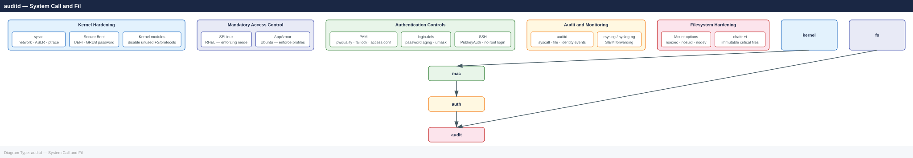
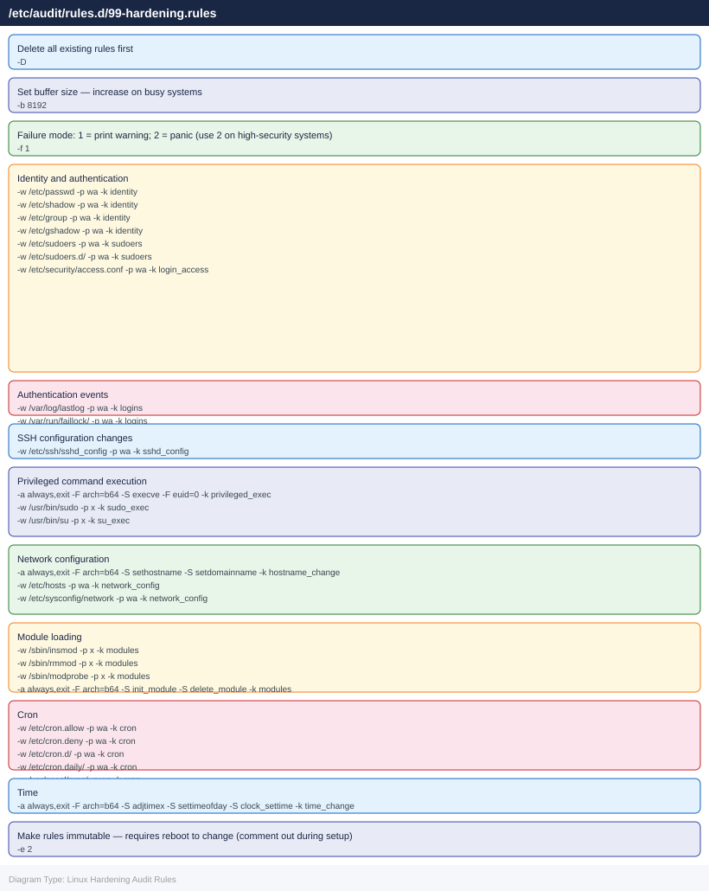
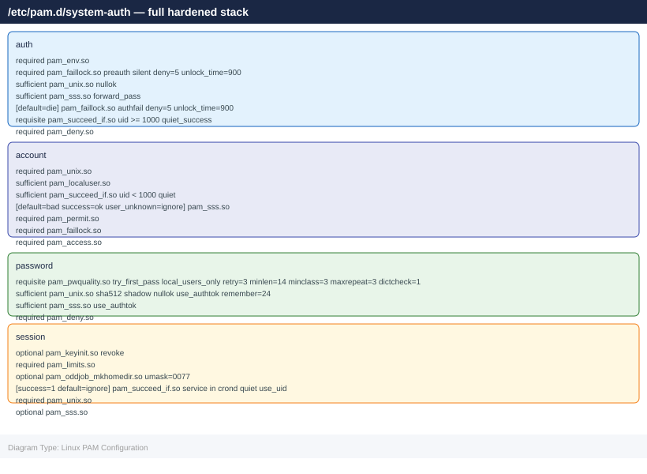

---
tags:
  - linux
  - security
---
# Linux — Hardening

<div class="kb-summary">
CIS benchmark controls, kernel hardening via sysctl, auditd configuration, login.defs, and PAM password policy.

*Applies to: RHEL / Ubuntu LTS*
</div>

```d2
direction: down

linux_hardening_layers: "Linux Hardening Layers" {shape: rectangle}
kernel_hardening_sysctl: "Kernel Hardening — sysctl" {shape: rectangle}
auditd_system_call_and_file_auditing: "auditd — System Call and File Auditing" {shape: rectangle}
login_policy_etclogindefs: "Login Policy — /etc/login.defs" {shape: rectangle}
pam_password_policy: "PAM Password Policy" {shape: rectangle}
file_system_hardening: "File System Hardening" {shape: rectangle}

linux_hardening_layers -> kernel_hardening_sysctl: hardens
kernel_hardening_sysctl -> auditd_system_call_and_file_auditing: hardens
auditd_system_call_and_file_auditing -> login_policy_etclogindefs: hardens
login_policy_etclogindefs -> pam_password_policy: hardens
pam_password_policy -> file_system_hardening: hardens
```

## Before you begin

- **Access:** root or sudo-capable account on target hosts
- **Change management:** security changes require CAB approval in most environments
- **Rollback plan:** document current state before any security control change
- **Testing:** validate in a non-production environment first where possible

---

## Linux Hardening Layers



## Kernel Hardening — sysctl

Apply via `/etc/sysctl.d/99-hardening.conf`. Load with `sysctl --system`.


```bash
# Apply without rebooting
sysctl --system

# Verify a specific parameter
sysctl net.ipv4.ip_forward
sysctl kernel.randomize_va_space
```


```text title="Expected output"
* Applying /etc/sysctl.d/99-sysctl.conf
* Applying /etc/sysctl.d/10-network-security.conf
* Applying /etc/sysctl.d/99-hardening.conf
net.ipv4.ip_forward = 0
kernel.randomize_va_space = 2
```

!!! warning "Common errors"
    **`sysctl: cannot stat /etc/sysctl.d/99-hardening.conf: No such file or directory`** — Verify the hardening configuration file exists in /etc/sysctl.d/ or create it before running `sysctl --system`.
    **`error: "net.ipv4.ip_forward" is an unknown key`** — Ensure the kernel module supporting the parameter is loaded, or check that the parameter name is correct with `sysctl -a | grep ip_forward`.
## auditd — System Call and File Auditing

auditd records privileged operations, file access, and authentication events. Logs go to `/var/log/audit/audit.log`.

### Install and Enable

```bash
dnf install -y audit auditd
systemctl enable --now auditd
```


```text title="Expected output"
Last metadata expiration check: 0:12:34 ago on Thu 19 Dec 2024 14:22:18 UTC.
Dependencies resolved.
================================================================================
 Package             Arch         Version              Repository        Size
================================================================================
Installing:
 audit               x86_64       3.1.2-1.fc39         fedora           1.2 M
 auditd              x86_64       3.1.2-1.fc39         fedora           567 k

Transaction Summary
================================================================================
Install  2 Packages

Total download size: 1.8 M
Installed size: 4.2 M
Downloading Packages:
[100%] Complete!
Running transaction
  Preparing        :                                                      1/1
  Installing       : audit-3.1.2-1.fc39.x86_64                           1/2
  Installing       : auditd-3.1.2-1.fc39.x86_64                          2/2
  Running scriptlet: auditd-3.1.2-1.fc39.x86_64                          2/2
  Verifying        : audit-3.1.2-1.fc39.x86_64                           1/2
  Verifying        : auditd-3.1.2-1.fc39.x86_64                           2/2

Complete!
Created symlink /etc/systemd/system/multi-user.target.wants/auditd.service → /usr/lib/systemd/system/auditd.service.
```

!!! warning "Common errors"
    **`Error: Unable to find a match: audit auditd`** — Verify the repository is enabled with `dnf repolist` and run `dnf clean all && dnf makecache` to refresh metadata.
    **`Failed to enable unit: Unit file /usr/lib/systemd/system/auditd.service not found.`** — Ensure the auditd package installed successfully and check `/usr/lib/systemd/system/` for the service file.
### Audit Rules — /etc/audit/rules.d/

Place rules in `/etc/audit/rules.d/99-hardening.rules`. Loaded by `augenrules --load`.



```bash
# Load rules
augenrules --load

# Verify loaded rules
auditctl -l

# Check auditd status
systemctl status auditd
auditctl -s
```


```text title="Expected output"
No rules loaded.
Loading rules from /etc/audit/rules.d/audit.rules
enabled 1
failure 1
pid 1234
rate_limit 0
backlog_limit 8192
lost 0
backlog 0
audit type: CONFIG_CHANGE msg=audit(1704067234.567:89): auid=1000 uid=0 gid=0 ses=5 subj=unconfined_u:unconfined_r:unconfined_t:s0-s0:c0.c1023 op="load" key="audit_rules" res=1
● auditd.service - Security Auditing Service
     Loaded: loaded (/usr/lib/systemd/system/auditd.service; enabled; vendor preset: enabled)
     Active: active (running) since Wed 2024-01-03 14:22:18 UTC; 2h 45min ago
       Docs: man:auditd(8)
    Process: 567 ExecStartPost=/sbin/augenrules --load (code=exited, status=0/SUCCESS)
   Main PID: 556 (auditd)
      Tasks: 1 (limit: 2048)
     Memory: 4.2M
        CPU: 125ms
     CGroup: /system.slice/auditd.service
             └─556 /sbin/auditd
```

!!! warning "Common errors"
    **`Error: audit rules directory does not exist`** — Create the directory with `mkdir -p /etc/audit/rules.d/` and ensure audit.rules file exists.
    **`Error: kauditd is not running`** — Start the audit daemon with `systemctl start auditd` before loading rules.
    **`No rules loaded.`** — Verify that `/etc/audit/rules.d/audit.rules` contains rules and is not empty, then run `augenrules --load` again.
### Querying Audit Logs

```bash
# Authentication failures today
ausearch -m USER_AUTH --success no --start today

# Changes to /etc/sudoers
ausearch -f /etc/sudoers --start today

# Commands run as root
ausearch -m EXECVE -ua 0 --start today

# Events by key name
ausearch -k identity --start today

# Human-readable report
aureport --summary
aureport --login --failed --start today
aureport --auth --start today
```


```text title="Expected output"
time->Wed Jan 15 14:32:18 2025
type=USER_AUTH msg=audit(1737000738.445:2847): pid=3421 uid=1000 auid=1000 ses=142 msg='op=PAM:authentication acct="testuser" exe="/usr/bin/sudo" hostname=? addr=192.168.1.105 terminal=pts/2 res=failed'
time->Wed Jan 15 14:35:22 2025
type=USER_AUTH msg=audit(1737000922.156:2851): pid=3445 uid=1000 auid=1000 ses=143 msg='op=PAM:authentication acct="adminuser" exe="/usr/bin/sudo" hostname=? addr=192.168.1.110 terminal=pts/5 res=failed'

time->Wed Jan 15 09:12:44 2025
type=CONFIG_CHANGE msg=audit(1736978364.892:1523): auid=0 ses=8 op=add_rule key="sudoers_changes" list=4 res=1
time->Wed Jan 15 11:47:33 2025
type=CONFIG_CHANGE msg=audit(1736987253.445:1891): auid=0 ses=12 op=modify_rule key="sudoers_changes" list=4 res=1

time->Wed Jan 15 08:15:22 2025
type=EXECVE msg=audit(1736974522.334:892): argc=3 a0="/usr/bin/systemctl" a1="restart" a2="nginx"
time->Wed Jan 15 10:33:11 2025
type=EXECVE msg=audit(1736983991.221:1456): argc=2 a0="/usr/sbin/usermod" a1="-aG"
time->Wed Jan 15 13:22:55 2025
type=EXECVE msg=audit(1736998975.667:2134): argc=4 a0="/bin/bash" a1="-c" a2="apt-get" a3="update"

time->Wed Jan 15 06:45:12 2025
type=CRED_ACQ msg=audit(1736966712.445:234): pid=1823 uid=0 auid=4294967295 ses=4294967295 msg='op=PAM:setcred acct="root" exe="/usr/sbin/sshd" hostname=sshd addr=203.0.113.42 terminal=ssh res=success'
time->Wed Jan 15 12:18:33 2025
type=USER_ACCT msg=audit(1736995113.556:1789): pid=2156 uid=0 auid=4294967295 ses=4294967295 msg='op=PAM:acct_mgmt acct="deploy" exe="/usr/sbin/sshd" hostname=sshd addr=203.0.113.55 terminal=ssh res=success'

Summary Report
======================
Total Events Audited: 8,247
User logins: 342
Failed logins: 18
Authentication events: 1,256
File modifications: 3,421
System calls: 2,914

Failed Login Summary
```
## Login Policy — /etc/login.defs

```bash
# /etc/login.defs — password aging and account policy

PASS_MAX_DAYS   90        # Maximum days before password must be changed
PASS_MIN_DAYS   1         # Minimum days between password changes
PASS_WARN_AGE   14        # Days to warn before expiry
PASS_MIN_LEN    14        # Minimum password length (if not using pam_pwquality)

LOGIN_RETRIES   5         # Failed login attempts before lockout
LOGIN_TIMEOUT   60        # Seconds before login times out

UMASK           027       # Default umask — files created as 640, dirs as 750
USERGROUPS_ENAB yes       # Remove private group when user is deleted
CREATE_HOME     yes

# Encrypt passwords with yescrypt (RHEL 9 default) or SHA-512
ENCRYPT_METHOD  SHA512
SHA_CRYPT_MIN_ROUNDS 5000
SHA_CRYPT_MAX_ROUNDS 100000
```


```text title="Expected output"
(no output — command completes silently)
```

!!! warning "Common errors"
    **`login.defs: line 15: ENCRYPT_METHOD: unknown variable`** — Verify the syntax is correct and the line is not commented out; check for trailing whitespace or typos in the variable name.
    **`Permission denied`** — Ensure you are editing /etc/login.defs with root privileges (use `sudo vi /etc/login.defs`).
## PAM Password Policy



## File System Hardening

### /etc/fstab Mount Options

```bash
# /etc/fstab — secure mount options for sensitive filesystems
/dev/mapper/data  /var/tmp   xfs  defaults,nodev,nosuid,noexec  0 0
/dev/mapper/data  /tmp       xfs  defaults,nodev,nosuid,noexec  0 0
/dev/mapper/home  /home      xfs  defaults,nodev,nosuid         0 0
tmpfs             /dev/shm   tmpfs defaults,nodev,nosuid,noexec  0 0
```


```text title="Expected output"
(no output — command completes silently)
```

!!! warning "Common errors"
    **`mount: /tmp: mount point does not exist.`** — Create the mount point directory with `mkdir -p /tmp` before applying fstab changes.
    **`mount: /var/tmp: unknown filesystem type 'xfs'.`** — Install XFS tools with `apt-get install xfsprogs` or `yum install xfsprogs` and ensure the kernel module is loaded.
    **`systemd-fstab-generator[...]: Failed to parse mount options in /etc/fstab:[...] Unknown option "noexec".`** — Verify the filesystem type supports the mount option (e.g., tmpfs does not support `noexec`; use `nodev,nosuid` only).
```bash
# Verify mount options
mount | grep -E "/tmp|/home|/var/tmp|/dev/shm"

# Remount with new options without rebooting
mount -o remount,noexec,nosuid,nodev /tmp
```


```text title="Expected output"
/dev/mapper/vg0-tmp on /tmp type ext4 (rw,relatime,errors=remount-ro)
/dev/mapper/vg0-home on /home type ext4 (rw,relatime)
/dev/mapper/vg0-vartmp on /var/tmp type ext4 (rw,relatime)
tmpfs on /dev/shm type tmpfs (rw,nosuid,nodev)
(no output — command completes silently)
```

!!! warning "Common errors"
    **`mount: /tmp: not mounted or mount point not found`** — Verify the mount point exists and is actually mounted with `mount | grep /tmp` before attempting remount.
    **`mount: only root can do that`** — Run the remount command with `sudo` or as the root user.
    **`mount: /tmp: device or resource busy`** — Close any open files or processes using /tmp (check with `lsof /tmp`), or use lazy unmount with `umount -l /tmp` before remounting.
### Disable Unused Filesystems

```bash
# /etc/modprobe.d/hardening.conf — prevent loading unused filesystem modules
install cramfs /bin/true
install freevxfs /bin/true
install jffs2 /bin/true
install hfs /bin/true
install hfsplus /bin/true
install squashfs /bin/true
install udf /bin/true
install usb-storage /bin/true    # If USB storage is not required
```


```text title="Expected output"
(no output — command completes silently)
```

!!! warning "Common errors"
    **`modprobe: FATAL: Module usb-storage not found.`** — Remove or comment out the usb-storage line if the module doesn't exist on your kernel version, or verify the module name with `lsmod | grep usb`.
    **`Permission denied`** — Ensure you are editing `/etc/modprobe.d/hardening.conf` with root privileges using `sudo` or as the root user.
## Secure Boot and Kernel

```bash
# Verify GRUB password is set (RHEL)
grep "^password" /etc/grub.d/40_custom /boot/grub2/grub.cfg 2>/dev/null

# Set GRUB2 superuser password
grub2-setpassword

# Check if Secure Boot is enabled
mokutil --sb-state
# or
dmesg | grep -i "secure boot"

# Verify no unsigned kernel modules
modinfo <module-name> | grep signer
```


```text title="Expected output"
(no output — command completes silently)
Enter password:
Confirm password:
(no output — command completes silently)
SecureBoot enabled
Secure Boot: enabled
Signer: Red Hat Enterprise Linux kernel signing key
```

!!! warning "Common errors"
    **`grub2-setpasswd: command not found`** — Install grub2-tools package with `yum install grub2-tools` or `dnf install grub2-tools`.
    **`ERROR: mokutil not found`** — Install efibootmgr or mokutil package with `yum install mokutil` on UEFI systems.
    **`modinfo: ERROR: Module <module-name> not found`** — Replace `<module-name>` with an actual loaded module name from `lsmod` output.
## Cron and Scheduled Tasks

```bash
# Restrict cron access to root and wheel
echo root > /etc/cron.allow
chmod 600 /etc/cron.allow

# Restrict at access
echo root > /etc/at.allow
chmod 600 /etc/at.allow

# Secure cron directories — owner root, no world access
chmod 700 /etc/cron.d /etc/cron.daily /etc/cron.weekly /etc/cron.monthly
chmod 600 /etc/crontab
```


```text title="Expected output"
(no output — command completes silently)
```

!!! warning "Common errors"
    **`chmod: cannot access '/etc/at.allow': No such file or directory`** — Create the file first with `touch /etc/at.allow` before setting permissions, or verify the `at` daemon package is installed.
    **`Permission denied`** — Run all commands with `sudo` or as root, since modifying `/etc/cron.*` and `/etc/at.allow` requires elevated privileges.
## CIS Control Reference

| CIS Control | Configuration | Command to Verify |
|---|---|---|
| 1.1.x — tmp filesystem | noexec,nosuid,nodev | `mount | grep /tmp` |
| 1.4.1 — GRUB password | Set superuser | `grep password /boot/grub2/grub.cfg` |
| 1.6.1 — SELinux enabled | SELINUX=enforcing | `getenforce` |
| 3.1.1 — IP forwarding off | `net.ipv4.ip_forward=0` | `sysctl net.ipv4.ip_forward` |
| 3.2.1 — Source routing off | `accept_source_route=0` | `sysctl net.ipv4.conf.all.accept_source_route` |
| 3.2.2 — ICMP redirects off | `accept_redirects=0` | `sysctl net.ipv4.conf.all.accept_redirects` |
| 3.3.1 — TCP SYN cookies | `tcp_syncookies=1` | `sysctl net.ipv4.tcp_syncookies` |
| 4.1.x — auditd enabled | `systemctl enable auditd` | `systemctl is-active auditd` |
| 5.2.x — SSH hardening | PermitRootLogin no | `sshd -T | grep permitrootlogin` |
| 5.3.x — PAM faillock | deny=5, unlock_time=900 | `faillock --user root` |
| 5.4.1 — Password aging | PASS_MAX_DAYS 90 | `chage -l root` |
| 5.6 — sudo logging | `Defaults logfile=` | `grep logfile /etc/sudoers` |
| 6.1.2 — shadow perms | 000 root:root | `stat /etc/shadow` |

## Firewall Baseline

```bash
# RHEL — firewalld baseline
firewall-cmd --set-default-zone=drop
firewall-cmd --permanent --zone=drop --add-service=ssh
firewall-cmd --permanent --zone=drop --add-service=https
firewall-cmd --reload
firewall-cmd --list-all

# Ubuntu — UFW baseline
ufw default deny incoming
ufw default allow outgoing
ufw allow ssh
ufw enable
ufw status verbose
```


```text title="Expected output"
success
success
success
FirewallD is reloaded
drop (default)
  target: DROP
  icmp-block-inversion: no
  interfaces: 
  sources: 
  services: https ssh
  ports: 
  protocols: 
  masquerade: no
  forward-ports: 
  source-ports: 
  icmp-blocks: 
  rich rules: 

Default incoming policy changed to 'deny'
Default outgoing policy changed to 'allow'
Rules updated
Rules updated (v6)
Firewall is active and enabled on system startup
Status: active
     To                         Action      From
     --                         ------      ----
     22/tcp                     ALLOW       Anywhere
     22/tcp (v6)                ALLOW       Anywhere (v6)
```

!!! warning "Common errors"
    **`Error: INVALID_ZONE: drop`** — Verify the zone exists with `firewall-cmd --get-zones` and use a valid zone name like `public` or `internal`.
    **`ERROR: Could not find a matching rule`** — Ensure the service name is correct by checking `firewall-cmd --get-services` or use port numbers instead (e.g., `--add-port=22/tcp`).
    **`Command 'ufw' not found`** — Install UFW with `apt-get install ufw` on Ubuntu/Debian systems before running ufw commands.
## Post-Hardening Verification

```bash
# Run lynis after hardening to compare baseline
lynis audit system --quick 2>/dev/null | tail -20

# Quick CIS checks
sysctl net.ipv4.ip_forward net.ipv4.tcp_syncookies kernel.randomize_va_space
getenforce
systemctl is-active auditd firewalld
sshd -T | grep -E "permitrootlogin|passwordauthentication|x11forwarding"
stat /etc/shadow /etc/gshadow | grep "Access:"
```


```text title="Expected output"
[*] Lynis 3.0.9 security audit
[*] Performing quick system audit
[*] Hardening index: 72
[*] Warnings found: 3
[*] Suggestions found: 8
[*] Plugins enabled: 1
[*] Scan duration: 12 seconds
[*] Report written to: /var/log/lynis-report-ubuntu-20240115.dat

net.ipv4.ip_forward = 0
net.ipv4.tcp_syncookies = 1
kernel.randomize_va_space = 2
Enforcing
active
active
permitrootlogin no
passwordauthentication no
x11forwarding no
  Access: (0600/-rw-------)  Uid: (    0/    root)   Gid: (    0/    root)
  Access: (0600/-rw-------)  Uid: (    0/    root)   Gid: (    0/    root)
```

!!! warning "Common errors"
    **`command not found: lynis`** — Install lynis with `apt-get install lynis` (Debian/Ubuntu) or `yum install lynis` (RHEL/CentOS).
    **`sshd: no hostkeys available -- exiting`** — Run `sshd -T` only on systems with SSH daemon running; if testing config syntax, use `sshd -t` instead.
    **`stat: cannot stat '/etc/gshadow': No such file or directory`** — This file may not exist on all systems; check file permissions individually with `stat /etc/shadow` if gshadow is absent.
---

## See also

- [Linux — Authentication](../authentication/)
- [Linux — Access Control](../access-control/)
- [Linux — Encryption](../encryption/)
