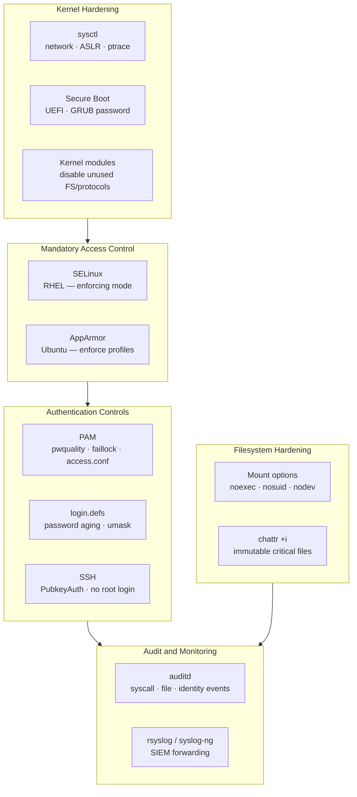

---
tags:
  - linux
  - security
---
# Linux — Hardening

<div class="kb-summary">
CIS benchmark controls, kernel hardening via sysctl, auditd configuration, login.defs, and PAM password policy.

*Applies to: RHEL / Ubuntu LTS*
</div>

```d2
direction: down

linux_hardening_layers: "Linux Hardening Layers" {shape: rectangle}
kernel_hardening_sysctl: "Kernel Hardening — sysctl" {shape: rectangle}
auditd_system_call_and_file_auditing: "auditd — System Call and File Auditing" {shape: rectangle}
login_policy_etclogindefs: "Login Policy — /etc/login.defs" {shape: rectangle}
pam_password_policy: "PAM Password Policy" {shape: rectangle}
file_system_hardening: "File System Hardening" {shape: rectangle}

linux_hardening_layers -> kernel_hardening_sysctl: hardens
kernel_hardening_sysctl -> auditd_system_call_and_file_auditing: hardens
auditd_system_call_and_file_auditing -> login_policy_etclogindefs: hardens
login_policy_etclogindefs -> pam_password_policy: hardens
pam_password_policy -> file_system_hardening: hardens
```

## Before you begin

- **Access:** root or sudo-capable account on target hosts
- **Change management:** security changes require CAB approval in most environments
- **Rollback plan:** document current state before any security control change
- **Testing:** validate in a non-production environment first where possible

---

## Linux Hardening Layers



## Kernel Hardening — sysctl

Apply via `/etc/sysctl.d/99-hardening.conf`. Load with `sysctl --system`.


```bash
# Apply without rebooting
sysctl --system

# Verify a specific parameter
sysctl net.ipv4.ip_forward
sysctl kernel.randomize_va_space
```

## auditd — System Call and File Auditing

auditd records privileged operations, file access, and authentication events. Logs go to `/var/log/audit/audit.log`.

### Install and Enable

```bash
dnf install -y audit auditd
systemctl enable --now auditd
```

### Audit Rules — /etc/audit/rules.d/

Place rules in `/etc/audit/rules.d/99-hardening.rules`. Loaded by `augenrules --load`.


```bash
# Load rules
augenrules --load

# Verify loaded rules
auditctl -l

# Check auditd status
systemctl status auditd
auditctl -s
```

### Querying Audit Logs

```bash
# Authentication failures today
ausearch -m USER_AUTH --success no --start today

# Changes to /etc/sudoers
ausearch -f /etc/sudoers --start today

# Commands run as root
ausearch -m EXECVE -ua 0 --start today

# Events by key name
ausearch -k identity --start today

# Human-readable report
aureport --summary
aureport --login --failed --start today
aureport --auth --start today
```

## Login Policy — /etc/login.defs

```bash
# /etc/login.defs — password aging and account policy

PASS_MAX_DAYS   90        # Maximum days before password must be changed
PASS_MIN_DAYS   1         # Minimum days between password changes
PASS_WARN_AGE   14        # Days to warn before expiry
PASS_MIN_LEN    14        # Minimum password length (if not using pam_pwquality)

LOGIN_RETRIES   5         # Failed login attempts before lockout
LOGIN_TIMEOUT   60        # Seconds before login times out

UMASK           027       # Default umask — files created as 640, dirs as 750
USERGROUPS_ENAB yes       # Remove private group when user is deleted
CREATE_HOME     yes

# Encrypt passwords with yescrypt (RHEL 9 default) or SHA-512
ENCRYPT_METHOD  SHA512
SHA_CRYPT_MIN_ROUNDS 5000
SHA_CRYPT_MAX_ROUNDS 100000
```

## PAM Password Policy


## File System Hardening

### /etc/fstab Mount Options

```bash
# /etc/fstab — secure mount options for sensitive filesystems
/dev/mapper/data  /var/tmp   xfs  defaults,nodev,nosuid,noexec  0 0
/dev/mapper/data  /tmp       xfs  defaults,nodev,nosuid,noexec  0 0
/dev/mapper/home  /home      xfs  defaults,nodev,nosuid         0 0
tmpfs             /dev/shm   tmpfs defaults,nodev,nosuid,noexec  0 0
```

```bash
# Verify mount options
mount | grep -E "/tmp|/home|/var/tmp|/dev/shm"

# Remount with new options without rebooting
mount -o remount,noexec,nosuid,nodev /tmp
```

### Disable Unused Filesystems

```bash
# /etc/modprobe.d/hardening.conf — prevent loading unused filesystem modules
install cramfs /bin/true
install freevxfs /bin/true
install jffs2 /bin/true
install hfs /bin/true
install hfsplus /bin/true
install squashfs /bin/true
install udf /bin/true
install usb-storage /bin/true    # If USB storage is not required
```

## Secure Boot and Kernel

```bash
# Verify GRUB password is set (RHEL)
grep "^password" /etc/grub.d/40_custom /boot/grub2/grub.cfg 2>/dev/null

# Set GRUB2 superuser password
grub2-setpassword

# Check if Secure Boot is enabled
mokutil --sb-state
# or
dmesg | grep -i "secure boot"

# Verify no unsigned kernel modules
modinfo <module-name> | grep signer
```

## Cron and Scheduled Tasks

```bash
# Restrict cron access to root and wheel
echo root > /etc/cron.allow
chmod 600 /etc/cron.allow

# Restrict at access
echo root > /etc/at.allow
chmod 600 /etc/at.allow

# Secure cron directories — owner root, no world access
chmod 700 /etc/cron.d /etc/cron.daily /etc/cron.weekly /etc/cron.monthly
chmod 600 /etc/crontab
```

## CIS Control Reference

| CIS Control | Configuration | Command to Verify |
|---|---|---|
| 1.1.x — tmp filesystem | noexec,nosuid,nodev | `mount | grep /tmp` |
| 1.4.1 — GRUB password | Set superuser | `grep password /boot/grub2/grub.cfg` |
| 1.6.1 — SELinux enabled | SELINUX=enforcing | `getenforce` |
| 3.1.1 — IP forwarding off | `net.ipv4.ip_forward=0` | `sysctl net.ipv4.ip_forward` |
| 3.2.1 — Source routing off | `accept_source_route=0` | `sysctl net.ipv4.conf.all.accept_source_route` |
| 3.2.2 — ICMP redirects off | `accept_redirects=0` | `sysctl net.ipv4.conf.all.accept_redirects` |
| 3.3.1 — TCP SYN cookies | `tcp_syncookies=1` | `sysctl net.ipv4.tcp_syncookies` |
| 4.1.x — auditd enabled | `systemctl enable auditd` | `systemctl is-active auditd` |
| 5.2.x — SSH hardening | PermitRootLogin no | `sshd -T | grep permitrootlogin` |
| 5.3.x — PAM faillock | deny=5, unlock_time=900 | `faillock --user root` |
| 5.4.1 — Password aging | PASS_MAX_DAYS 90 | `chage -l root` |
| 5.6 — sudo logging | `Defaults logfile=` | `grep logfile /etc/sudoers` |
| 6.1.2 — shadow perms | 000 root:root | `stat /etc/shadow` |

## Firewall Baseline

```bash
# RHEL — firewalld baseline
firewall-cmd --set-default-zone=drop
firewall-cmd --permanent --zone=drop --add-service=ssh
firewall-cmd --permanent --zone=drop --add-service=https
firewall-cmd --reload
firewall-cmd --list-all

# Ubuntu — UFW baseline
ufw default deny incoming
ufw default allow outgoing
ufw allow ssh
ufw enable
ufw status verbose
```

## Post-Hardening Verification

```bash
# Run lynis after hardening to compare baseline
lynis audit system --quick 2>/dev/null | tail -20

# Quick CIS checks
sysctl net.ipv4.ip_forward net.ipv4.tcp_syncookies kernel.randomize_va_space
getenforce
systemctl is-active auditd firewalld
sshd -T | grep -E "permitrootlogin|passwordauthentication|x11forwarding"
stat /etc/shadow /etc/gshadow | grep "Access:"
```

---

## See also

- [Linux — Authentication](../authentication/)
- [Linux — Access Control](../access-control/)
- [Linux — Encryption](../encryption/)
