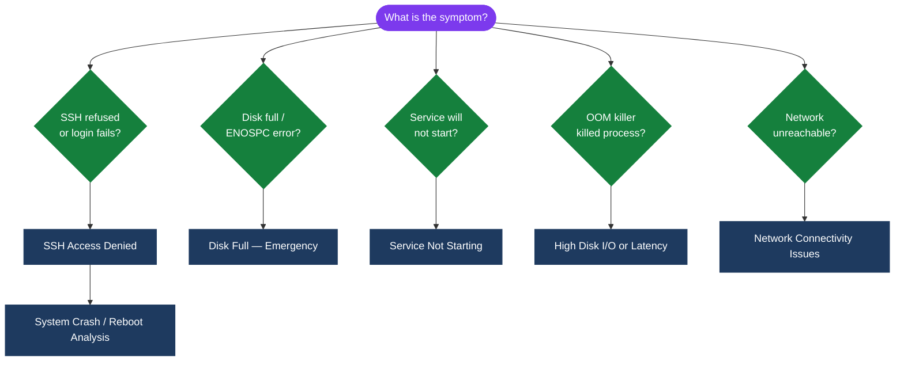
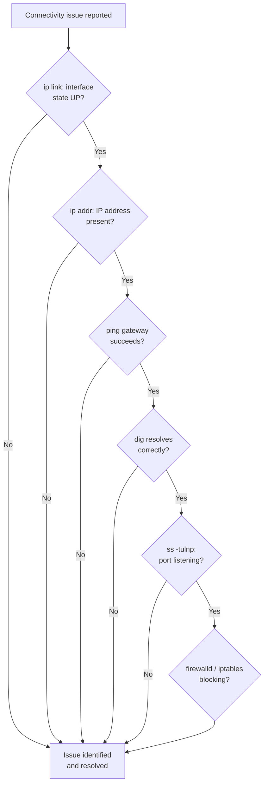
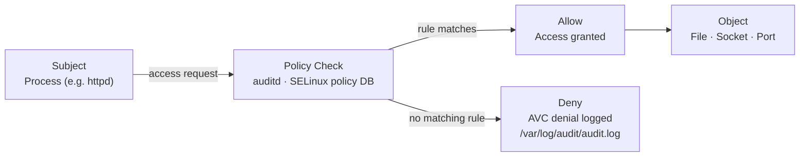

---
tags:
  - linux
  - troubleshooting
search:
  boost: 2
---
# Linux — Common Issues

<div class="kb-summary">
Quick reference for common problems and resolutions. Structured approach to diagnosing common Linux server issues.

*Applies to: RHEL / Ubuntu LTS*
</div>

Quick reference for common problems and resolutions.

Structured approach to diagnosing common Linux server issues.

```d2
direction: down

symptom: Identify Symptom {shape: diamond}
diagnostic_flow: "Diagnostic Flow" {shape: rectangle}
network_connectivity_triage: "Network Connectivity Triage" {shape: rectangle}
high_disk_io_or_latency: "High Disk I/O or Latency" {shape: rectangle}
network_connectivity_issues: "Network Connectivity Issues" {shape: rectangle}
service_not_starting: "Service Not Starting" {shape: rectangle}
ssh_access_denied: "SSH Access Denied" {shape: rectangle}
resolution: Resolve or Escalate {shape: oval}

symptom -> diagnostic_flow: investigate
symptom -> network_connectivity_triage: investigate
symptom -> high_disk_io_or_latency: investigate
symptom -> network_connectivity_issues: investigate
symptom -> service_not_starting: investigate
symptom -> ssh_access_denied: investigate
diagnostic_flow -> resolution
network_connectivity_triage -> resolution
high_disk_io_or_latency -> resolution
network_connectivity_issues -> resolution
service_not_starting -> resolution
ssh_access_denied -> resolution
```

## Diagnostic Flow



---

## Before you begin

- **Access:** root or sudo-capable account on target hosts
- **Gather first:** recent error message text, event timestamps, and affected object names
- **Scope:** confirm whether the issue affects a single object, host, cluster, or site
- **Escalation:** open a vendor support ticket before running any destructive step
- **Logging:** document each command and output — required if escalation is needed

---

## Network Connectivity Triage



## High Disk I/O or Latency

```bash
# Which device is busy?
iostat -xz 1 5
# %util > 80% = saturated; await > 20ms = high latency

# Which process is doing the I/O?
iotop -o -P

# Filesystem fill causing ENOSPC errors
df -h | awk '$5+0 > 85'
dmesg | grep -i "ENOSPC\|no space left\|filesystem full"

# Large temp files
find /tmp /var/tmp -size +100M 2>/dev/null

# Growing log files
du -sh /var/log/* | sort -h | tail -10
```

## Network Connectivity Issues

```bash
# Step 1 — Is the interface up?
ip link show | grep -E "state UP|state DOWN"

# Step 2 — Does the IP and route exist?
ip addr show
ip route show

# Step 3 — Can we reach the gateway?
ping -c 4 $(ip route show default | awk '{print $3}')

# Step 4 — Can we reach DNS?
dig +short google.com @8.8.8.8

# Step 5 — Is the local port open?
ss -tulnp | grep <port>

# Step 6 — Is firewall blocking?
firewall-cmd --list-all          # RHEL
ufw status verbose               # Ubuntu
iptables -L -n -v | grep DROP    # Direct iptables

# Step 7 — Packet capture to confirm traffic flow
tcpdump -i eth0 host <remote-ip> and port <port> -c 50
```

## Service Not Starting

```bash
# Check the exact error
systemctl status <service> -l
journalctl -u <service> -n 50 --no-pager

# Check dependencies
systemctl list-dependencies <service> | grep failed

# Validate unit file
systemd-analyze verify /etc/systemd/system/<service>.service

# Check if port is already in use
ss -tulnp | grep <port>

# Test the command manually
sudo -u <service-user> <ExecStart-command> --dry-run
```

## SSH Access Denied

```bash
# Check sshd is running
systemctl status sshd

# Check sshd config for auth method restrictions
grep -E "PasswordAuth|PubkeyAuth|AllowUsers|DenyUsers|MaxAuthTries" /etc/ssh/sshd_config

# Check PAM for account restrictions
journalctl _SYSTEMD_UNIT=sshd.service | grep "Failed\|error\|pam" | tail -20

# Check if account is locked
passwd -S <username>   # L = locked
faillock --user <username>    # Check failed login counter
faillock --user <username> --reset    # Reset counter

# SELinux blocking SSH (non-standard port)
ausearch -m avc -c sshd --start recent | tail -10
```

## SELinux / AppArmor MAC Flow



## Disk Full — Emergency

```bash
# Find the full filesystem
df -h | awk '$5+0 > 90'

# Largest directories
du -sh /* 2>/dev/null | sort -h | tail -10
du -sh /var/* 2>/dev/null | sort -h | tail -10

# Large log files
find /var/log -size +100M -type f 2>/dev/null
# Truncate (don't delete — running process may hold FD open)
> /var/log/large-logfile.log

# Open but deleted files still consuming space
lsof | grep deleted | sort -k7 -rn | head -10
# Restart the holding process to release inodes

# Force journal vacuum
journalctl --vacuum-size=500M
```

## System Crash / Reboot Analysis

```bash
# Recent reboots
last reboot | head -10

# Was it a kernel panic?
journalctl -b -1 | tail -50   # Previous boot
dmesg | grep -i "panic\|bug:\|BUG:\|Oops:"

# kdump crash dump (if configured)
ls /var/crash/

# Hardware errors (memory, CPU, PCIe)
mcelog --client 2>/dev/null
dmesg | grep -iE "mce|machine check|uncorrect|hardware error"

# Check IPMI SEL (system event log)
ipmitool sel list | tail -20
```

## Useful One-Liners

```bash
# All errors in the last 10 minutes
journalctl -p err --since "10 minutes ago"

# Files recently modified in /etc
find /etc -newer /etc/fstab -type f 2>/dev/null | sort

# Which process has a file open
lsof /path/to/file

# Which process is listening on a port
ss -tlnp | grep :8080

# Strace a process for syscall-level debugging
strace -p <PID> -s 200 -f 2>&1 | head -100

# Check for time skew (NTP offset > 1s = problematic)
chronyc tracking | grep "System time"
```

---

## Verify resolution

- Confirm the original symptom no longer occurs
- Check logs for any residual errors related to the issue
- Monitor for 10–15 minutes to confirm the fix is stable

---

## See also

- [Linux — Diagnostics](../diagnostics/)
- [Linux — Escalation](../escalation/)
- [Linux — Health Checks](../../operations/health-checks/)
