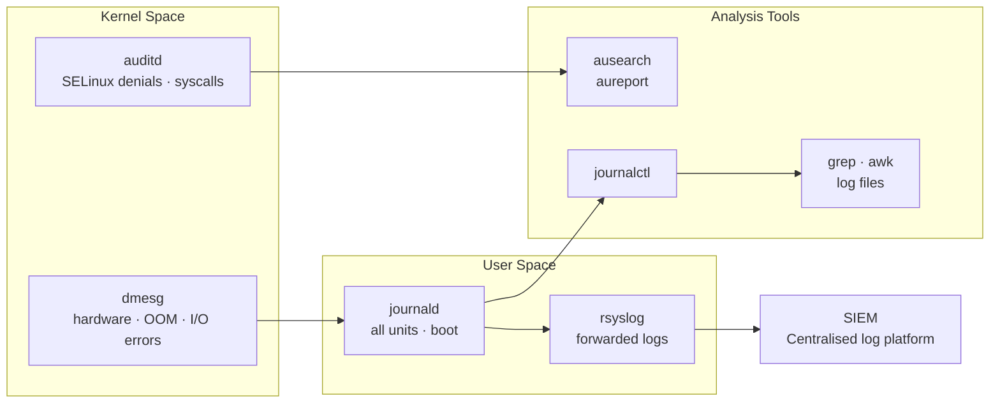

# Linux — Diagnostics

Diagnostic procedures and log analysis.

## Diagnostic Data Sources


┌───────────────────────────────────────── Linux — Diagnostics ─────────────────────────────────────────┐
│                                                                                                       │
│  Linux diagnostic tools and techniques for CPU, memory, I/O, network, and kernel issues.              │
│                                                                                                       │
│   ┌──────────────────────────────────────────────┐  ┌─────────────────────────────────────────────┐   │
│   │                CPU and Memory                │  │                   Disk I/O                  │   │
│   │           top -H: per-thread view            │  │         iostat -x 1: extended stats         │   │
│   │           perf top: hot functions            │  │            iotop: per-process I/O           │   │
│   │          vmstat 1 10: memory trend           │  │         blktrace / blkparse: tracing        │   │
│   │        strace -p <pid>: syscall trace        │  │         smartctl -a /dev/sdX: health        │   │
│   └──────────────────────────────────────────────┘  └─────────────────────────────────────────────┘   │
│                                                                                                       │
│    Start broad (top/vmstat); narrow with perf/strace for root cause                                   │
│                                                                                                       │
│                          ▼                                                 ▼                          │
│                                                                                                       │
│   ┌──────────────────────────────────────────────┐  ┌─────────────────────────────────────────────┐   │
│   │             Network Diagnostics              │  │              Kernel and System              │   │
│   │           tcpdump -i eth0 port 443           │  │          dmesg -T: timestamped msgs         │   │
│   │           nmap -sV host: port scan           │  │        journalctl -xe: recent errors        │   │
│   │        netstat -s: protocol counters         │  │         eBPF / bpftrace: deep trace         │   │
│   │        ethtool -S eth0: NIC counters         │  │          coredump: systemd-coredump         │   │
│   └──────────────────────────────────────────────┘  └─────────────────────────────────────────────┘   │
│                                                                                                       │
│  Physical Infrastructure (the hardware everything above runs on):                                     │
│  Physical or virtual server · NIC · storage controller · serial console                               │
│                                                                                                       │
│  Key terms:                                                                                           │
│                                                                                                       │
│  perf top     = live profiling; shows functions consuming most CPU cycles                             │
│  strace -p    = attach to running process; shows each syscall with args/return                        │
│  iotop        = like top but shows I/O per process; requires root                                     │
│  blktrace     = block I/O tracer; shows complete I/O lifecycle per request                            │
│  smartctl     = query drive SMART data; -a shows all attributes                                       │
│  tcpdump      = raw packet capture; -w file saves for Wireshark analysis                              │
│  ethtool -S   = NIC statistics; shows errors, drops, ring buffer usage                                │
│  netstat -s   = per-protocol counters; TCP retransmits visible here                                   │
│  eBPF         = extended Berkeley Packet Filter; safe kernel tracing                                  │
│  bpftrace     = high-level eBPF scripting language for kernel/user tracing                            │
│  coredump     = crash memory snapshot; analysed with gdb or crash tool                                │
│  journalctl -xe= show most recent journal with explanations (-x)                                      │
│                                                                                                       │
└───────────────────────────────────────────────────────────────────────────────────────────────────────┘
```

## dmesg — Kernel Ring Buffer

```bash
# Errors and warnings
dmesg --level=err,warn

# Watch in real time
dmesg -w

# Hardware errors (memory, disk, network)
dmesg | grep -iE "error|fail|reset|timeout|uncorrect" | tail -30

# Disk I/O errors
dmesg | grep -iE "sd[a-z]|nvme|blk_update_request|I/O error"

# OOM events
dmesg | grep -i "oom\|killed process\|out of memory"
```

## Audit Log (auditd)

```bash
# SELinux denials
ausearch -m avc --start recent

# Failed logins
ausearch -m USER_AUTH --success no --start today

# Changes to sensitive files
ausearch -f /etc/passwd
ausearch -f /etc/sudoers

# Commands run via sudo
ausearch -ua root --start today | grep EXECVE

# Summary report
aureport --summary
aureport --login --failed
```

## Authentication Events

```bash
# Failed SSH password attempts
journalctl _SYSTEMD_UNIT=sshd.service | grep "Failed password" | tail -30

# Successful SSH logins
journalctl _SYSTEMD_UNIT=sshd.service | grep "Accepted" | tail -20

# sudo usage today
journalctl --since today | grep sudo | tail -30

# Account lockouts
journalctl | grep "pam_tally\|account locked\|pam_unix.*authentication failure" | tail -20
```

## Log Rotation

```bash
# View rotation config
cat /etc/logrotate.conf
ls /etc/logrotate.d/

# Force rotation (testing — non-destructive)
logrotate -vf /etc/logrotate.d/<appname>

# Check when logs were last rotated
ls -la /var/log/*.1 /var/log/*.gz 2>/dev/null | head -20
```

## Remote Log Forwarding (rsyslog)

```bash
# /etc/rsyslog.d/90-remote.conf — forward all logs via TCP to centralised syslog
*.* action(type="omfwd"
    target="syslog.example.local"
    port="514"
    protocol="tcp")

# Restart rsyslog
systemctl restart rsyslog

# Verify TCP connection to syslog server
ss -tnp | grep :514
```

## Journal Size Management

```bash
# Check journal disk usage
journalctl --disk-usage

# Vacuum to keep last 7 days
journalctl --vacuum-time=7d

# Vacuum to size limit
journalctl --vacuum-size=500M

# Persistent journal size cap in /etc/systemd/journald.conf:
# SystemMaxUse=2G
systemctl restart systemd-journald
```

## Finding Events Around an Incident

```bash
# All logs ±5 minutes around a known failure time
journalctl --since "2026-05-01 14:25:00" --until "2026-05-01 14:35:00" -p warning

# Correlate kernel + service events at the same time
journalctl --since "2026-05-01 14:25:00" --until "2026-05-01 14:35:00" \
    -u myservice.service -k | sort

# Search for a specific string across all units
journalctl --since "today" | grep -i "connection refused\|timeout\|SIGKILL"
```
