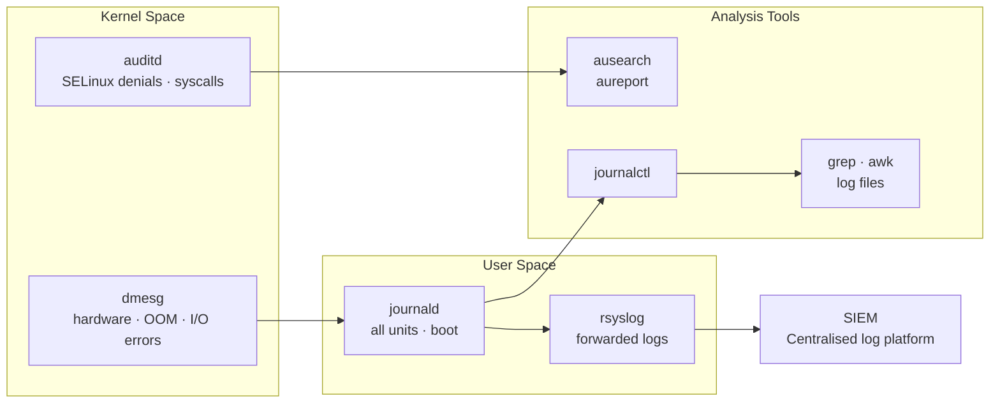

---
tags:
  - linux
  - troubleshooting
---
# Linux — Diagnostics


<div class="kb-summary">
Diagnostics reference covering Diagnostic Data Sources, dmesg — Kernel Ring Buffer, Audit Log (auditd), Authentication Events, Log Rotation and 3 more sections.

*Applies to: RHEL / Ubuntu LTS*
</div>

Diagnostic procedures and log analysis.

## Before you begin

- **Access:** root or sudo-capable account on target hosts
- **Gather first:** recent error message text, event timestamps, and affected object names
- **Scope:** confirm whether the issue affects a single object, host, cluster, or site
- **Escalation:** open a vendor support ticket before running any destructive step
- **Logging:** document each command and output — required if escalation is needed

---

## Diagnostic Data Sources


```text
┌───────────────────────────────────────── Linux — Diagnostics ─────────────────────────────────────────┐
│                                                                                                       │
│  Diagnostic tools and techniques for deep Linux system investigation.                                 │
│                                                                                                       │
│   ┌──────────────────────────────────────────────┐  ┌─────────────────────────────────────────────┐   │
│   │                 Log Analysis                 │  │               Process Tracing               │   │
│   │             journalctl -b -p err             │  │           strace -p PID: syscalls           │   │
│   │            dmesg -T: timestamped             │  │              ltrace: lib calls              │   │
│   │           /var/log/messages syslog           │  │                gdb attach PID               │   │
│   │            ausearch: audit events            │  │           lsof -p PID: open files           │   │
│   │              grep -r /var/log/               │  │           /proc/PID/: process info          │   │
│   └──────────────────────────────────────────────┘  └─────────────────────────────────────────────┘   │
│                                                                                                       │
│   ┌──────────────────────────────────────────────┐  ┌─────────────────────────────────────────────┐   │
│   │            Performance Profiling             │  │             Network Diagnostics             │   │
│   │               perf stat ./cmd                │  │           tcpdump -i eth0 port 80           │   │
│   │          perf top: live flamegraph           │  │             ss -anp: all sockets            │   │
│   │            bpftrace: eBPF scripts            │  │            nmap -sV: service scan           │   │
│   │             vmstat 1: mem/io/cpu             │  │             mtr: traceroute+ping            │   │
│   │            sar -u 1 10: CPU hist             │  │            wireshark: packet GUI            │   │
│   └──────────────────────────────────────────────┘  └─────────────────────────────────────────────┘   │
│                                                                                                       │
│  Physical Infrastructure (the hardware everything above runs on):                                     │
│  x86-64 servers · NIC · SAN storage · out-of-band IPMI · monitoring endpoints                         │
│                                                                                                       │
│  Key terms:                                                                                           │
│                                                                                                       │
│  strace      = System call tracer; shows every kernel interaction of a process                        │
│  ltrace      = Library call tracer; intercepts dynamic library function calls                         │
│  perf        = Linux profiler; samples CPU, traces events, generates flamegraphs                      │
│  bpftrace    = High-level eBPF tracing; scripts kernel and application events                         │
│  eBPF        = Extended Berkeley Packet Filter; in-kernel sandboxed programs                          │
│  lsof        = List open files; shows files, sockets, pipes held by processes                         │
│  ausearch    = Searches auditd log for specific events by user, key, syscall                          │
│  sar         = System Activity Reporter; collects and reports performance data                        │
│  vmstat      = Virtual memory statistics; shows proc, swap, io, cpu per interval                      │
│  mtr         = Combines traceroute and ping; shows per-hop latency and loss                           │
│  tcpdump     = CLI packet capture; filter by port, host, protocol                                     │
│  /proc/PID   = Virtual filesystem exposing process state: maps, fd, stat, cmdline                     │
│                                                                                                       │
└───────────────────────────────────────────────────────────────────────────────────────────────────────┘
```

## Audit Log (auditd)

```bash
# SELinux denials
ausearch -m avc --start recent

# Failed logins
ausearch -m USER_AUTH --success no --start today

# Changes to sensitive files
ausearch -f /etc/passwd
ausearch -f /etc/sudoers

# Commands run via sudo
ausearch -ua root --start today | grep EXECVE

# Summary report
aureport --summary
aureport --login --failed
```

## Authentication Events

```bash
# Failed SSH password attempts
journalctl _SYSTEMD_UNIT=sshd.service | grep "Failed password" | tail -30

# Successful SSH logins
journalctl _SYSTEMD_UNIT=sshd.service | grep "Accepted" | tail -20

# sudo usage today
journalctl --since today | grep sudo | tail -30

# Account lockouts
journalctl | grep "pam_tally\|account locked\|pam_unix.*authentication failure" | tail -20
```

## Log Rotation

```bash
# View rotation config
cat /etc/logrotate.conf
ls /etc/logrotate.d/

# Force rotation (testing — non-destructive)
logrotate -vf /etc/logrotate.d/<appname>

# Check when logs were last rotated
ls -la /var/log/*.1 /var/log/*.gz 2>/dev/null | head -20
```

## Remote Log Forwarding (rsyslog)

```bash
# /etc/rsyslog.d/90-remote.conf — forward all logs via TCP to centralised syslog
*.* action(type="omfwd"
    target="syslog.example.local"
    port="514"
    protocol="tcp")

# Restart rsyslog
systemctl restart rsyslog

# Verify TCP connection to syslog server
ss -tnp | grep :514
```

## Journal Size Management

```bash
# Check journal disk usage
journalctl --disk-usage

# Vacuum to keep last 7 days
journalctl --vacuum-time=7d

# Vacuum to size limit
journalctl --vacuum-size=500M

# Persistent journal size cap in /etc/systemd/journald.conf:
# SystemMaxUse=2G
systemctl restart systemd-journald
```

## Finding Events Around an Incident

```bash
# All logs ±5 minutes around a known failure time
journalctl --since "2026-05-01 14:25:00" --until "2026-05-01 14:35:00" -p warning

# Correlate kernel + service events at the same time
journalctl --since "2026-05-01 14:25:00" --until "2026-05-01 14:35:00" \
    -u myservice.service -k | sort

# Search for a specific string across all units
journalctl --since "today" | grep -i "connection refused\|timeout\|SIGKILL"
```
