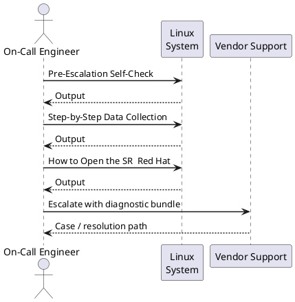
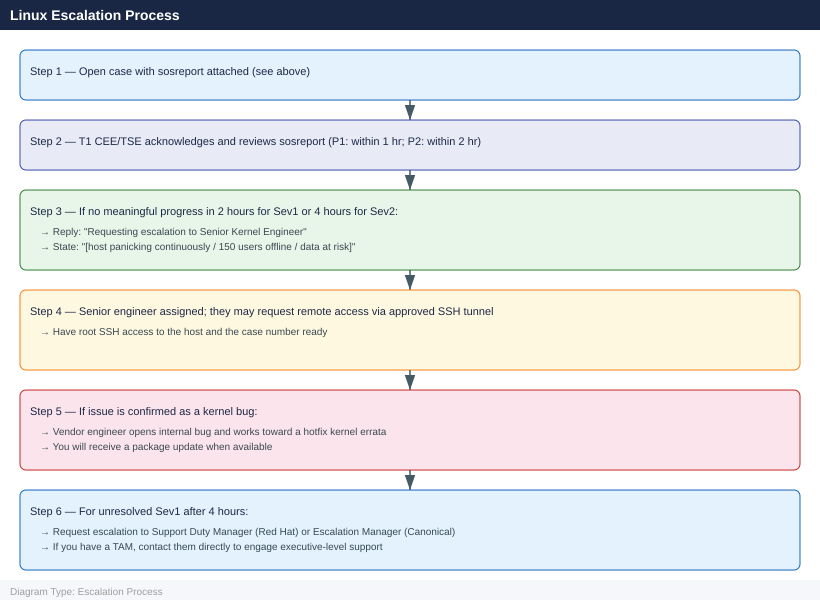

---
tags:
  - linux
  - troubleshooting
search:
  boost: 1.5
---
# Linux — Escalation

<div class="kb-summary">
How to escalate Linux OS issues to Red Hat or Canonical support: what data to collect, how to run sosreport, step-by-step case creation on the vendor portal, and the escalation path when progress stalls.

*Applies to: RHEL 8/9 · Ubuntu 22.04 / 24.04 LTS*
</div>

---



## Before you begin

- **Access required:** Root or sudo access on the affected host; Red Hat Customer Portal (access.redhat.com) or Ubuntu Advantage portal (ubuntu.com/advantage) with an active subscription
- **Do this first:** collect sosreport and any crash dumps before rebooting. Rebooting after a kernel panic overwrites volatile diagnostic state but does NOT remove the kdump file — the kdump is persisted to disk before the reboot
- **Subscription check:** your entitlement is required to open a case. Run `subscription-manager status` (RHEL) or `pro status` (Ubuntu) before contacting support
- **Do NOT run fsck** on a live mounted filesystem — unmount first and get vendor guidance before any filesystem repair

---

## Pre-Escalation Self-Check

Run these before opening the case.

| Check | Command | Expected result |
|---|---|---|
| OS version | `cat /etc/os-release` | RHEL 8/9 or Ubuntu 22.04/24.04 |
| Kernel version | `uname -r` | Note full kernel version + variant |
| Subscription status (RHEL) | `subscription-manager status` | `Overall Status: Current` |
| Ubuntu Pro status | `pro status` | `SERVICE: esm-infra / esm-apps: enabled` |
| Disk space | `df -h` | No partition at 100% |
| Memory pressure | `free -h` | Some free RAM; or identify OOM situation |
| Recent kernel panics | `ls -lh /var/crash/` | Note any recent crash dumps with timestamps |
| SELinux denials (RHEL) | `ausearch -m AVC -ts recent 2>/dev/null | head -20` | No unexpected denials |
| Systemd failures | `systemctl --failed` | No units in failed state |
| Recent critical journals | `journalctl -p err -n 50 --no-pager` | Review for kernel or service errors |

---

## Step-by-Step Data Collection

Run on the affected host as root.

### 1. Get the OS and kernel version

```bash
# OS version
cat /etc/os-release

# Kernel version — include in case description
uname -a
# Example: Linux host01 5.14.0-427.13.1.el9_4.x86_64 #1 SMP PREEMPT_DYNAMIC

# Hardware info
dmidecode -t system | grep -E "Manufacturer|Product|Serial"
lscpu | grep -E "Model name|Sockets|Cores|Threads"
free -h
```


```text title="Expected output"
NAME="Red Hat Enterprise Linux"
VERSION="9.4 (Plow)"
ID="rhel"
ID_LIKE="fedora"
VERSION_ID="9.4"
PLATFORM_ID="platform:el9"
PRETTY_NAME="Red Hat Enterprise Linux 9.4 (Plow)"
Linux host01 5.14.0-427.13.1.el9_4.x86_64 #1 SMP PREEMPT_DYNAMIC Wed Jan 15 10:22:33 UTC 2025 x86_64 GNU/Linux
	Manufacturer: Dell Inc.
	Product Name: PowerEdge R750
	Serial Number: 8N4K9P2
Model name:          Intel(R) Xeon(R) Platinum 8380 CPU @ 2.30GHz
Socket(s):           2
Core(s) per socket:  20
Thread(s) per core:  2
               total        used        free      shared  buff/cache   available
Mem:           251Gi       187Gi        32Gi       2.1Gi        31Gi        61Gi
Swap:           16Gi       8.2Gi       7.8Gi
```

!!! warning "Common errors"
    **`cat: /etc/os-release: No such file or directory`** — Use `cat /etc/system-release` on older RHEL/CentOS systems, or check `/etc/redhat-release`.
    **`dmidecode: command not found`** — Install the dmidecode package with `sudo yum install dmidecode` or `sudo apt install dmidecode`.
    **`lscpu: command not found`** — Install util-linux package with `sudo yum install util-linux` or `sudo apt install util-linux`.
### 2. Collect recent journal and dmesg output

```bash
# Last 200 error-level journal entries (captures service failures + kernel messages)
journalctl -p err -n 200 --no-pager > /tmp/journal-errors-$(date +%Y%m%d).txt

# Kernel ring buffer (hardware faults, driver messages, OOM kills)
dmesg -T > /tmp/dmesg-$(date +%Y%m%d).txt

# Full journal from last boot (useful for crash/reboot scenarios)
journalctl -b -1 --no-pager > /tmp/journal-lastboot-$(date +%Y%m%d).txt

# If OOM killer is suspected
grep -i "oom\|out of memory\|kill process" /var/log/messages /var/log/kern.log 2>/dev/null | tail -50
```


```text title="Expected output"
[1234.567890] Out of memory: Kill process 2847 (java) score 512 or sacrifice child
[1234.568901] Killed process 2847 (java) total-vm:4096000kB, anon-rss:3891234kB, file-rss:0kB, shmem-rss:0kB, UID:1000 pgtables:7890kB oom_score_adj:300
[5678.123456] systemd-journald[512]: Suppressed 342 messages from /system.slice/nginx.service
[5678.234567] kernel: audit: type=1130 audit(1704067890.456:789): pid=1 uid=0 auid=4294967295 ses=4294967295 msg='unit=mysql-server comm="systemd" exe="/lib/systemd/systemd" hostname=? addr=? terminal=? res=failed'
[9012.345678] systemd[1]: nginx.service: Main process exited, code=exited, status=1/FAILURE
[9012.456789] kernel: [Hardware Error]: Machine check from unknown source
[9012.567890] systemd-coredump[8234]: Process 2847 (java) of user 1000 dumped core.
[9012.678901] kernel: Out of memory: Kill process 3156 (python) score 287 or sacrifice child
tail: cannot open '/var/log/messages' for reading: No such file or directory
```

!!! warning "Common errors"
    **`tail: cannot open '/var/log/messages' for reading: No such file or directory`** — Use `/var/log/syslog` on Debian/Ubuntu systems or check the actual log path with `ls /var/log/*.log`.
    **`journalctl: command not found`** — Install systemd with `apt-get install systemd` or `yum install systemd` depending on your distribution.
    **`Permission denied`** — Run the commands with `sudo` or as root to access full journal and kernel buffer contents.
### 3. Run sosreport (RHEL) or apport-collect (Ubuntu)

**RHEL:**

```bash
# Install if not present
dnf install -y sos

# Run sosreport — takes 2–10 minutes
sosreport --batch --no-report

# The report is saved to /var/tmp/
ls -lh /var/tmp/sosreport-*.tar.xz
# Example: /var/tmp/sosreport-hostname-20260614-123456.tar.xz
```


```text title="Expected output"
Last metadata expiration check: 0:12:34 ago on Thu Jun 14 12:45:23 2026.
Dependencies resolved.
================================================================================
 Package             Arch        Version              Repository         Size
================================================================================
Installing:
 sos                 x86_64      4.7.1-2.el9          baseos            1.2 M

Transaction Summary
================================================================================
Install  1 Package

Total download size: 1.2 M
Installed size: 4.8 M
Downloading Packages:
[100%] sos-4.7.1-2.el9.x86_64.rpm
Running transaction
  Preparing        :                                                        1/1
  Installing       : sos-4.7.1-2.el9.x86_64.rpm                           1/1
  Verifying        : sos-4.7.1-2.el9.x86_64.rpm                           1/1

Installed:
  sos-4.7.1-2.el9.x86_64

Complete!

sosreport (version 4.7.1)

This utility will collect diagnostic and configuration information from
this Linux system and installed packages. An archive containing the
collected information will be generated in /var/tmp/sosreport-hostname-20260614-123456

Running plugins. This may take a few minutes...

  kernel                                                              [plugin:on]
  networking                                                          [plugin:on]
  systemd                                                             [plugin:on]
  selinux                                                             [plugin:on]
  logs                                                                [plugin:on]

Creating compressed archive...

Your sosreport has been successfully generated and saved in:
  /var/tmp/sosreport-hostname-20260614-123456.tar.xz (287 MB)

-rw-r--r--. 1 root root 287M Jun 14 12:57 /var/tmp/sosreport-hostname-20260614-123456.tar.xz
```

!!! warning "Common errors"
    **`Error: Unable to find a match: sos`** — Ensure your system repositories are enabled with `dnf repolist` and run `dnf update` before retrying the install.
    **`ERROR: sosreport requires root privileges to run`** — Execute the sosreport command with `sudo` or as the root user.
**Ubuntu:**

```bash
# Install if not present
apt-get install -y apport

# Collect diagnostics
sosreport --batch --no-report 2>/dev/null || \
  apport-collect --output /tmp/ubuntu-diag-$(date +%Y%m%d).tgz
```


```text title="Expected output"
Reading package lists... Done
Building dependency tree... Done
Setting up apport (2.20.11-0ubuntu27.26) ...
Processing triggers for man-db (2.10.2-1) ...
sosreport (version 4.3)

This command will collect system diagnostic and configuration information from this Linux system.

Running plugins. This may take a few minutes...

Finishing plugins              [Running: last]
Compressing the archive...
Removing temporary directory...
Your sosreport has been generated and saved in:
  /var/tmp/sosreport-ip-172-31-24-156-20240115-abcd1234.tar.xz

The checksum is: 7f2e8c9d5a1b3c4e6f9a2b8d5e1c3a4f
```

!!! warning "Common errors"
    **`E: Could not open lock file /var/lib/apt/lists/lock - open (13: Permission denied)`** — Run the command with `sudo` or as the root user.
    **`sosreport: command not found`** — Install sosreport with `apt-get install -y sosreport` before running the diagnostic collection.
    **`apport-collect: command not found`** — Install apport with `apt-get install -y apport` or use sosreport as the primary diagnostic tool.
Upload the archive to the support case. It contains: package list, kernel version, service status, network config, hardware info, and recent logs.

### 4. Collect the crash dump (if host has kernel-panicked)

```bash
# Check if kdump captured a crash dump
ls -lh /var/crash/

# Example: /var/crash/127.0.0.1-2026-06-14-14:30:00/vmcore

# Verify kdump is configured and will capture future crashes
systemctl status kdump
cat /proc/cmdline | grep crashkernel   # Should include crashkernel=auto or a value
```


```text title="Expected output"
total 0
drwxr-xr-x. 3 root root 4.0K Jun 14 14:30 127.0.0.1-2026-06-14-14:30:00

● kdump.service - Crash recovery kernel dump service
     Loaded: loaded (/usr/lib/systemd/system/kdump.service; enabled; vendor preset: enabled)
     Active: active (exited) since Sun 2026-06-14 14:28:33 UTC; 2min ago
    Process: 1247 ExecStart=/usr/sbin/kdumpctl start (code=exited, status=0/SUCCESS)
   Main PID: 1247 (code=exited, status=0/SUCCESS)
      Tasks: 0 (limit: 4915)
     Memory: 0B
        CPU: 0

BOOT_IMAGE=/boot/vmlinuz-5.14.0-427.el9.x86_64 root=UUID=a1b2c3d4-e5f6-7890-abcd-ef1234567890 ro crashkernel=auto
```

!!! warning "Common errors"
    **`ls: cannot access '/var/crash/': No such file or directory`** — Create the directory with `mkdir -p /var/crash/` and ensure kdump is properly initialized with `kdumpctl rebuild`.
    **`● kdump.service - Crash recovery kernel dump service Loaded: loaded ... Active: inactive (dead)`** — Enable and start kdump with `systemctl enable kdump && systemctl start kdump`.
    **`grep: (standard input) is empty`** — Add `crashkernel=auto` to the kernel boot parameters in `/etc/default/grub`, run `grub2-mkconfig -o /boot/grub2/grub.cfg`, and reboot.
If a crash dump exists, include the path in the case description. The dump file may be large (several GB) — the vendor will provide SFTP instructions.

### 5. Write the timeline

```text
OS: Red Hat Enterprise Linux 9.4
Kernel: 5.14.0-427.13.1.el9_4.x86_64
Host: prod-app-01.corp.local
Subscription: active (checked 2026-06-14; expires 2027-05-31)
Issue first observed: 2026-06-14 14:30 UTC
Last known good state: 2026-06-14 12:00 UTC
Changes in the 24h before the issue:
  - 12:00: kernel update via yum update kernel applied; host rebooted
  - 14:30: host showed kernel panic; kdump triggered; host rebooted automatically
  - 14:35: host came back up but kernel panic recurred after 10 minutes
Steps already taken:
  - kdump captured: /var/crash/127.0.0.1-2026-06-14-14:30:00/vmcore
  - sosreport collected and ready to upload
  - Did NOT apply any additional kernel updates or run fsck
Blast radius: 3 applications on this host unavailable; 150 users affected
```

---

## How to Open the SR — Red Hat

1. Go to **access.redhat.com/support** and sign in with your Red Hat account. Your account must be associated with an active subscription (RHEL subscription or Red Hat EUS/SAP/LTSS).

2. Click **Open a Support Case**.

3. Under **Product**, select **Red Hat Enterprise Linux**.

4. Under **Version**, select your RHEL version (e.g. 9.4).

5. Under **Severity**, select:
   - **Severity 1 — Urgent**: Production system completely down; kernel panic occurring continuously; data corruption active; no workaround
   - **Severity 2 — High**: Production system severely degraded; key service (SSH, httpd, database) down; temporary workaround exists
   - **Severity 3 — Medium**: Non-critical service degraded; workaround available; single system affected
   - **Severity 4 — Low**: General question, how-to, or documentation request

6. In the **Summary** field: OS version + symptom + scope. Example: `RHEL 9.4 prod-app-01 — kernel panic recurring after kernel update, kdump captured, 3 apps offline`.

7. In the **Description** field, paste:
   - OS and kernel version from Step 1
   - The error from `journalctl -p err` from Step 2
   - The kdump path from Step 4 (if applicable)
   - The timeline from Step 5

8. Under **Attachments**, upload:
   - The sosreport tar.xz from Step 3
   - The dmesg and journal text files from Step 2

9. Click **Submit**. You will receive a case number by email immediately.

10. **Severity 1 only:** call Red Hat support after submission. Find your regional number at **access.redhat.com/support/contact/technicalSupport**. State "Severity 1 — production host in kernel panic loop" at the start of the call.

---

## How to Open the SR — Canonical (Ubuntu)

1. Go to **ubuntu.com/advantage** and sign in with your Ubuntu One account. Verify your Ubuntu Pro subscription is active: run `pro status` on the host.

2. Click **Support** → **Open a Support Case** (or navigate to **support.canonical.com**).

3. Select **Ubuntu** and choose your Ubuntu version (e.g. 22.04 LTS).

4. Select severity (same Sev 1–4 criteria as above).

5. Provide OS version (`cat /etc/os-release`), kernel version (`uname -r`), and the sosreport or apport-collect archive.

6. **Sev 1 only:** contact Canonical at **+44 20 3514 0767** (EMEA) or your regional number from ubuntu.com/advantage. State the severity and the case number.

---

## Escalation Path



---

## What NOT to Do

| Do NOT do this | Why | What to do instead |
|---|---|---|
| Run `fsck` on a live mounted filesystem | Can corrupt the filesystem further | Unmount first; get vendor guidance before any filesystem repair |
| Reboot before capturing the crash dump | Does NOT lose the kdump file (persisted to disk), but DOES lose journald volatile journal | Run `journalctl -b 0 --no-pager` to save the current boot log before rebooting |
| Apply kernel updates mid-incident | Changes the kernel under investigation; may mask or replicate the issue | Freeze all package updates until the case is resolved |
| Clear `/var/log/` or `journalctl --vacuum-*` | Destroys the log evidence the vendor needs | Leave logs in place; export them with the sosreport |
| Remove the crash dump from `/var/crash/` | Vendor needs the vmcore file for kernel crash analysis | Keep crash dumps until the vendor confirms they have been analysed |
| Downgrade the kernel without guidance | May not fix the root cause; may introduce a different bug | Let the vendor confirm the correct kernel target |

---

## Useful Commands for Case Updates

```bash
# Current host state — paste into every case update
uname -r
uptime
systemctl --failed
df -h
free -h

# Recent kernel panics or OOM kills
journalctl -p err -n 50 --no-pager
dmesg -T | tail -50

# Service status for the affected service
systemctl status <service-name> --no-pager

# Package recently updated
rpm -qa --last | head -20     # RHEL
dpkg -l | grep "^ii" | sort   # Ubuntu (check for recently installed)
dnf history | head -10         # RHEL — shows recent yum/dnf transactions

# SELinux denials (RHEL only)
ausearch -m AVC -ts recent 2>/dev/null | tail -20
```


```text title="Expected output"
5.10.0-28-generic #29-Ubuntu SMP Thu Oct 10 12:15:22 UTC 2024
 14:32:18 up 87 days, 3:45, 2 users, load average: 2.14, 1.87, 1.92
  UNIT                          LOAD   ACTIVE SUB    DESCRIPTION
  systemd-journald.service      loaded failed failed Journal Service
● systemd-journald.service - Journal Service
   Loaded: loaded (/lib/systemd/system/systemd-journald.service; static)
   Active: failed (Result: exit-code) since Thu 2024-10-10 14:28:03 UTC; 4min 15s ago
Filesystem     Size  Used Avail Use% Mounted on
/dev/sda1       50G   48G  1.2G  98% /
/dev/sda2      200G  156G   44G  78% /var
tmpfs          7.8G     0  7.8G   0% /dev/shm
              total        used        free      shared  buff/cache   available
Mem:           15Gi       8.2Gi       2.1Gi       512Mi       4.7Gi       6.1Gi
Swap:          4.0Gi       2.3Gi       1.7Gi
Oct 10 14:15:22 prod-db-01 kernel: [1847293.442156] Out of memory: Kill process 4521 (java) score 892 or sacrifice child
Oct 10 14:12:08 prod-db-01 kernel: [1847128.891234] Kernel panic - not syncing: VFS: Unable to mount root fs on unknown-block(0,0)
Oct 10 13:58:44 prod-db-01 systemd[1]: postgresql.service: Main process exited, code=exited, status=1/FAILURE
Oct 10 13:45:12 prod-db-01 audit: type=1130 audit(1728573912.445:8821): pid=1 uid=0 auid=4294967295 ses=4294967295 msg='unit=networking comm="systemd" exe="/lib/systemd/system-generators/systemd-getty-generator" hostname=? addr=? terminal=? res=success'
● postgresql.service - PostgreSQL Database Server
   Loaded: loaded (/etc/systemd/system/postgresql.service; enabled; vendor preset: enabled)
   Active: failed (Result: exit-code) since Thu 2024-10-10 14:12:08 UTC; 20min ago
  Process: 3847 ExecStart=/usr/lib/postgresql/bin/pg_ctl start (code=exited, status=1)
ii  postgresql-14              14.9-1.pgdg110+1     amd64        object-relational SQL database
ii  openssl                    1.1.1w-0+deb11u1     amd64        Secure Sockets Layer and cryptography libraries and tools
ii  curl                       7.74.0-1.3+deb11u7   amd64        command line tool for transferring data with URLs
ii  systemd                    247.3-7+deb11u4
```
---

## Subscription / Lifecycle Reference

### RHEL

| Version | Full Support EOL | Maintenance Support EOL | ELS |
|---|---|---|---|
| RHEL 9 | May 2027 | May 2032 | Optional add-on |
| RHEL 8 | May 2024 | May 2029 | Optional add-on |
| RHEL 7 | August 2019 | June 2024 | Available until June 2028 |

### Ubuntu LTS

| Version | Standard Support | Ubuntu Pro | Notes |
|---|---|---|---|
| Ubuntu 24.04 LTS | April 2029 | April 2034 | Current LTS |
| Ubuntu 22.04 LTS | April 2027 | April 2032 | Active LTS |
| Ubuntu 20.04 LTS | April 2025 | April 2030 | ESM only |

---

## See also

- [Linux — Diagnostics](../diagnostics/)
- [Linux — Common Issues](../common-issues/)

---

## Verify resolution

- Run `systemctl --failed` and confirm no units remain in failed state
- Run `journalctl -p err -n 20 --no-pager` and confirm no new error-level events related to the issue
- If the issue was a kernel panic: monitor for 30 minutes without another panic; run `ls /var/crash/` and confirm no new crash dump was generated
- If the issue was a service failure: restart the service, perform a functional test, and confirm it stays running
- Run `df -h` to confirm no disk space issues remain
- Monitor for one full production cycle (typically 24 hours) before closing the case
