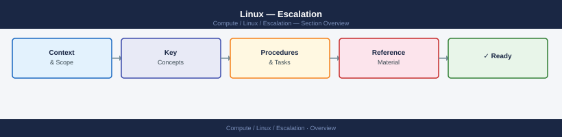
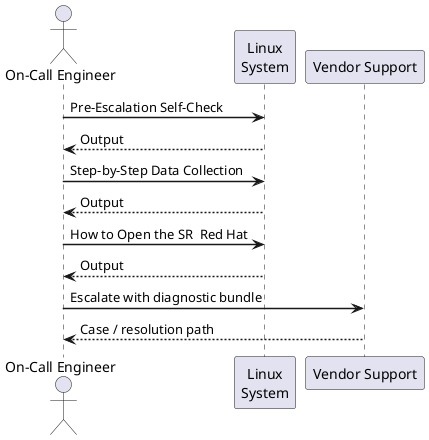

---
tags:
  - linux
  - troubleshooting
search:
  boost: 1.5
---
# Linux — Escalation

<div class="kb-summary">
How to escalate Linux OS issues to Red Hat or Canonical support: what data to collect, how to run sosreport, step-by-step case creation on the vendor portal, and the escalation path when progress stalls.

*Applies to: RHEL 8/9 · Ubuntu 22.04 / 24.04 LTS*
</div>



---



## Before you begin

- **Access required:** Root or sudo access on the affected host; Red Hat Customer Portal (access.redhat.com) or Ubuntu Advantage portal (ubuntu.com/advantage) with an active subscription
- **Do this first:** collect sosreport and any crash dumps before rebooting. Rebooting after a kernel panic overwrites volatile diagnostic state but does NOT remove the kdump file — the kdump is persisted to disk before the reboot
- **Subscription check:** your entitlement is required to open a case. Run `subscription-manager status` (RHEL) or `pro status` (Ubuntu) before contacting support
- **Do NOT run fsck** on a live mounted filesystem — unmount first and get vendor guidance before any filesystem repair

---

## Pre-Escalation Self-Check

Run these before opening the case.

| Check | Command | Expected result |
|---|---|---|
| OS version | `cat /etc/os-release` | RHEL 8/9 or Ubuntu 22.04/24.04 |
| Kernel version | `uname -r` | Note full kernel version + variant |
| Subscription status (RHEL) | `subscription-manager status` | `Overall Status: Current` |
| Ubuntu Pro status | `pro status` | `SERVICE: esm-infra / esm-apps: enabled` |
| Disk space | `df -h` | No partition at 100% |
| Memory pressure | `free -h` | Some free RAM; or identify OOM situation |
| Recent kernel panics | `ls -lh /var/crash/` | Note any recent crash dumps with timestamps |
| SELinux denials (RHEL) | `ausearch -m AVC -ts recent 2>/dev/null | head -20` | No unexpected denials |
| Systemd failures | `systemctl --failed` | No units in failed state |
| Recent critical journals | `journalctl -p err -n 50 --no-pager` | Review for kernel or service errors |

---

## Step-by-Step Data Collection

Run on the affected host as root.

### 1. Get the OS and kernel version

```bash
# OS version
cat /etc/os-release

# Kernel version — include in case description
uname -a
# Example: Linux host01 5.14.0-427.13.1.el9_4.x86_64 #1 SMP PREEMPT_DYNAMIC

# Hardware info
dmidecode -t system | grep -E "Manufacturer|Product|Serial"
lscpu | grep -E "Model name|Sockets|Cores|Threads"
free -h
```

### 2. Collect recent journal and dmesg output

```bash
# Last 200 error-level journal entries (captures service failures + kernel messages)
journalctl -p err -n 200 --no-pager > /tmp/journal-errors-$(date +%Y%m%d).txt

# Kernel ring buffer (hardware faults, driver messages, OOM kills)
dmesg -T > /tmp/dmesg-$(date +%Y%m%d).txt

# Full journal from last boot (useful for crash/reboot scenarios)
journalctl -b -1 --no-pager > /tmp/journal-lastboot-$(date +%Y%m%d).txt

# If OOM killer is suspected
grep -i "oom\|out of memory\|kill process" /var/log/messages /var/log/kern.log 2>/dev/null | tail -50
```

### 3. Run sosreport (RHEL) or apport-collect (Ubuntu)

**RHEL:**

```bash
# Install if not present
dnf install -y sos

# Run sosreport — takes 2–10 minutes
sosreport --batch --no-report

# The report is saved to /var/tmp/
ls -lh /var/tmp/sosreport-*.tar.xz
# Example: /var/tmp/sosreport-hostname-20260614-123456.tar.xz
```

**Ubuntu:**

```bash
# Install if not present
apt-get install -y apport

# Collect diagnostics
sosreport --batch --no-report 2>/dev/null || \
  apport-collect --output /tmp/ubuntu-diag-$(date +%Y%m%d).tgz
```

Upload the archive to the support case. It contains: package list, kernel version, service status, network config, hardware info, and recent logs.

### 4. Collect the crash dump (if host has kernel-panicked)

```bash
# Check if kdump captured a crash dump
ls -lh /var/crash/

# Example: /var/crash/127.0.0.1-2026-06-14-14:30:00/vmcore

# Verify kdump is configured and will capture future crashes
systemctl status kdump
cat /proc/cmdline | grep crashkernel   # Should include crashkernel=auto or a value
```

If a crash dump exists, include the path in the case description. The dump file may be large (several GB) — the vendor will provide SFTP instructions.

### 5. Write the timeline

```text
OS: Red Hat Enterprise Linux 9.4
Kernel: 5.14.0-427.13.1.el9_4.x86_64
Host: prod-app-01.corp.local
Subscription: active (checked 2026-06-14; expires 2027-05-31)
Issue first observed: 2026-06-14 14:30 UTC
Last known good state: 2026-06-14 12:00 UTC
Changes in the 24h before the issue:
  - 12:00: kernel update via yum update kernel applied; host rebooted
  - 14:30: host showed kernel panic; kdump triggered; host rebooted automatically
  - 14:35: host came back up but kernel panic recurred after 10 minutes
Steps already taken:
  - kdump captured: /var/crash/127.0.0.1-2026-06-14-14:30:00/vmcore
  - sosreport collected and ready to upload
  - Did NOT apply any additional kernel updates or run fsck
Blast radius: 3 applications on this host unavailable; 150 users affected
```

---

## How to Open the SR — Red Hat

1. Go to **access.redhat.com/support** and sign in with your Red Hat account. Your account must be associated with an active subscription (RHEL subscription or Red Hat EUS/SAP/LTSS).

2. Click **Open a Support Case**.

3. Under **Product**, select **Red Hat Enterprise Linux**.

4. Under **Version**, select your RHEL version (e.g. 9.4).

5. Under **Severity**, select:
   - **Severity 1 — Urgent**: Production system completely down; kernel panic occurring continuously; data corruption active; no workaround
   - **Severity 2 — High**: Production system severely degraded; key service (SSH, httpd, database) down; temporary workaround exists
   - **Severity 3 — Medium**: Non-critical service degraded; workaround available; single system affected
   - **Severity 4 — Low**: General question, how-to, or documentation request

6. In the **Summary** field: OS version + symptom + scope. Example: `RHEL 9.4 prod-app-01 — kernel panic recurring after kernel update, kdump captured, 3 apps offline`.

7. In the **Description** field, paste:
   - OS and kernel version from Step 1
   - The error from `journalctl -p err` from Step 2
   - The kdump path from Step 4 (if applicable)
   - The timeline from Step 5

8. Under **Attachments**, upload:
   - The sosreport tar.xz from Step 3
   - The dmesg and journal text files from Step 2

9. Click **Submit**. You will receive a case number by email immediately.

10. **Severity 1 only:** call Red Hat support after submission. Find your regional number at **access.redhat.com/support/contact/technicalSupport**. State "Severity 1 — production host in kernel panic loop" at the start of the call.

---

## How to Open the SR — Canonical (Ubuntu)

1. Go to **ubuntu.com/advantage** and sign in with your Ubuntu One account. Verify your Ubuntu Pro subscription is active: run `pro status` on the host.

2. Click **Support** → **Open a Support Case** (or navigate to **support.canonical.com**).

3. Select **Ubuntu** and choose your Ubuntu version (e.g. 22.04 LTS).

4. Select severity (same Sev 1–4 criteria as above).

5. Provide OS version (`cat /etc/os-release`), kernel version (`uname -r`), and the sosreport or apport-collect archive.

6. **Sev 1 only:** contact Canonical at **+44 20 3514 0767** (EMEA) or your regional number from ubuntu.com/advantage. State the severity and the case number.

---

## Escalation Path


---

## What NOT to Do

| Do NOT do this | Why | What to do instead |
|---|---|---|
| Run `fsck` on a live mounted filesystem | Can corrupt the filesystem further | Unmount first; get vendor guidance before any filesystem repair |
| Reboot before capturing the crash dump | Does NOT lose the kdump file (persisted to disk), but DOES lose journald volatile journal | Run `journalctl -b 0 --no-pager` to save the current boot log before rebooting |
| Apply kernel updates mid-incident | Changes the kernel under investigation; may mask or replicate the issue | Freeze all package updates until the case is resolved |
| Clear `/var/log/` or `journalctl --vacuum-*` | Destroys the log evidence the vendor needs | Leave logs in place; export them with the sosreport |
| Remove the crash dump from `/var/crash/` | Vendor needs the vmcore file for kernel crash analysis | Keep crash dumps until the vendor confirms they have been analysed |
| Downgrade the kernel without guidance | May not fix the root cause; may introduce a different bug | Let the vendor confirm the correct kernel target |

---

## Useful Commands for Case Updates

```bash
# Current host state — paste into every case update
uname -r
uptime
systemctl --failed
df -h
free -h

# Recent kernel panics or OOM kills
journalctl -p err -n 50 --no-pager
dmesg -T | tail -50

# Service status for the affected service
systemctl status <service-name> --no-pager

# Package recently updated
rpm -qa --last | head -20     # RHEL
dpkg -l | grep "^ii" | sort   # Ubuntu (check for recently installed)
dnf history | head -10         # RHEL — shows recent yum/dnf transactions

# SELinux denials (RHEL only)
ausearch -m AVC -ts recent 2>/dev/null | tail -20
```

---

## Subscription / Lifecycle Reference

### RHEL

| Version | Full Support EOL | Maintenance Support EOL | ELS |
|---|---|---|---|
| RHEL 9 | May 2027 | May 2032 | Optional add-on |
| RHEL 8 | May 2024 | May 2029 | Optional add-on |
| RHEL 7 | August 2019 | June 2024 | Available until June 2028 |

### Ubuntu LTS

| Version | Standard Support | Ubuntu Pro | Notes |
|---|---|---|---|
| Ubuntu 24.04 LTS | April 2029 | April 2034 | Current LTS |
| Ubuntu 22.04 LTS | April 2027 | April 2032 | Active LTS |
| Ubuntu 20.04 LTS | April 2025 | April 2030 | ESM only |

---

## See also

- [Linux — Diagnostics](../diagnostics/)
- [Linux — Common Issues](../common-issues/)

---

## Verify resolution

- Run `systemctl --failed` and confirm no units remain in failed state
- Run `journalctl -p err -n 20 --no-pager` and confirm no new error-level events related to the issue
- If the issue was a kernel panic: monitor for 30 minutes without another panic; run `ls /var/crash/` and confirm no new crash dump was generated
- If the issue was a service failure: restart the service, perform a functional test, and confirm it stays running
- Run `df -h` to confirm no disk space issues remain
- Monitor for one full production cycle (typically 24 hours) before closing the case
