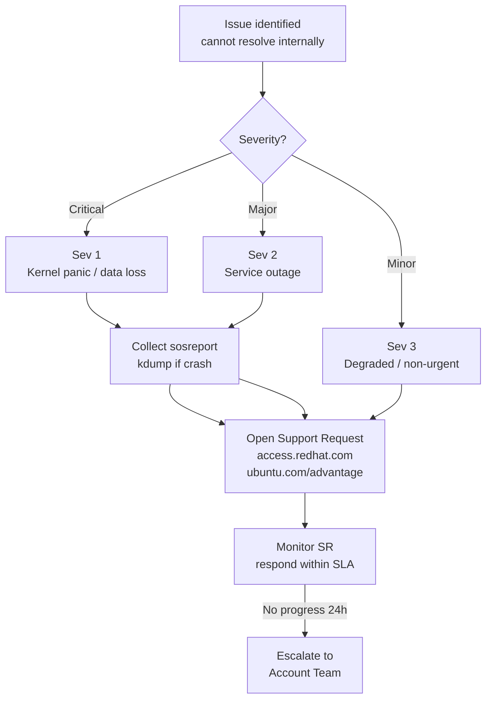

# Linux — Escalation

Vendor escalation procedures and support contacts.

## Escalation Decision Flow


┌───────────────────────────────────────── Linux — Escalation ──────────────────────────────────────────┐
│                                                                                                       │
│  Linux escalation paths: kernel panics, hardware failures, data corruption, security incidents.       │
│                                                                                                       │
│   ┌──────────────────────────────────────────────┐  ┌─────────────────────────────────────────────┐   │
│   │             Kernel Panic / Crash             │  │               Hardware Failure              │   │
│   │          1. Capture dmesg / vmcore           │  │          1. Check dmesg for errors          │   │
│   │          2. Analyse with crash tool          │  │           2. Run smartctl on disks          │   │
│   │      3. Report kernel BZ if kernel bug       │  │         3. Replace failed component         │   │
│   │            4. Patch or workaround            │  │        4. Restore from backup if data       │   │
│   └──────────────────────────────────────────────┘  └─────────────────────────────────────────────┘   │
│                                                                                                       │
│    Kernel issues → vendor support; hardware → ops team + replacement parts                            │
│                                                                                                       │
│                          ▼                                                 ▼                          │
│                                                                                                       │
│   ┌──────────────────────────────────────────────┐  ┌─────────────────────────────────────────────┐   │
│   │               Data Corruption                │  │              Security Incident              │   │
│   │          1. Stop writes immediately          │  │         1. Isolate host from network        │   │
│   │          2. Snapshot / backup image          │  │          2. Preserve logs + memory          │   │
│   │           3. fsck on unmounted FS            │  │         3. Escalate to security team        │   │
│   │       4. Restore from last good backup       │  │         4. Forensic image + analysis        │   │
│   └──────────────────────────────────────────────┘  └─────────────────────────────────────────────┘   │
│                                                                                                       │
│  Physical Infrastructure (the hardware everything above runs on):                                     │
│  Physical or virtual server · backup storage · IPMI/iDRAC · SIEM                                      │
│                                                                                                       │
│  Key terms:                                                                                           │
│                                                                                                       │
│  vmcore       = kernel crash dump; saved to /var/crash by kdump service                               │
│  kdump        = kernel crash dump mechanism; second kernel captures vmcore                            │
│  crash tool   = analyses vmcore with debug symbols; bt command shows stack                            │
│  kernel BZ    = kernel bug report to bugzilla.kernel.org or vendor tracker                            │
│  smartctl     = SMART disk health; Reallocated_Sector_Ct indicates bad blocks                         │
│  fsck         = filesystem check/repair; must run on unmounted filesystem                             │
│  Forensic image= dd or dcfldd to preserve disk state; chain of custody                                │
│  Isolate      = remove network access; preserve state without shutdown                                │
│  Preserve logs= copy /var/log before shutdown; volatile data lost on reboot                           │
│  IPMI/iDRAC   = out-of-band management; access console without network                                │
│  fsck -n      = dry-run check only; -y auto-fixes; use interactively                                  │
│  Snapshot     = VM snapshot or LVM snapshot before repair attempts                                    │
│                                                                                                       │
└───────────────────────────────────────────────────────────────────────────────────────────────────────┘
```

If the system is non-interactive (no TTY), use:
```bash
sosreport --batch --all-logs
```

### Checking Subscription Status

```bash
subscription-manager status
subscription-manager list --installed   # Verify products are registered
subscription-manager list --consumed    # Verify entitlements consumed
```

If entitlement shows `Invalid`: run `subscription-manager refresh` and check the RH portal.

### RHEL Lifecycle Dates

| Version | Full Support EOL | Maintenance Support EOL | Extended Life (RHEL ELS) |
|---|---|---|---|
| RHEL 9 | May 2027 | May 2032 | Optional |
| RHEL 8 | May 2024 | May 2029 | Optional |
| RHEL 7 | August 2019 | June 2024 | Available until June 2028 |

Track lifecycle in CMDB — alert 90 days before Full Support EOL to initiate leapp upgrade.

## Canonical (Ubuntu)

### Opening a Support Case

Support portal: [ubuntu.com/advantage](https://ubuntu.com/advantage) (Ubuntu Pro)

```bash
# Check Ubuntu Pro status
pro status
pro attach <token>   # If not yet attached
```

### Collecting Diagnostics

```bash
# Ubuntu Pro apport-collect for kernel/package issues
ubuntu-bug linux   # Interactive — opens Launchpad by default
# For non-interactive collection:
apport-collect --output /tmp/ubuntu-diag.tgz
```

### Ubuntu LTS Support Timeline

| Version | Standard Support | Ubuntu Pro (LTS) | Notes |
|---|---|---|---|
| Ubuntu 24.04 LTS | April 2029 | April 2034 | Current LTS |
| Ubuntu 22.04 LTS | April 2027 | April 2032 | Active |
| Ubuntu 20.04 LTS | April 2025 | April 2030 | ESM only |

## Escalation

| Situation | Action |
|---|---|
| Kernel panic / hang | Collect crash dump (`/var/crash/`) + sosreport; open Sev 1 SR |
| Data corruption | Do not run fsck without vendor guidance; open SR first |
| Security vulnerability (CVE) | Check Red Hat Security Advisories; apply errata; open SR if patch unavailable |
| Subscription/licensing | Contact Red Hat account team or use portal chat |

## Crash Dump Configuration

```bash
# RHEL — verify kdump is configured
systemctl status kdump
cat /etc/kdump.conf | grep path   # Default: /var/crash

# Test kdump is enabled
cat /proc/cmdline | grep crashkernel   # Should include crashkernel=auto or explicit value
```

Crash dumps must be available before opening a kernel-related SR.
