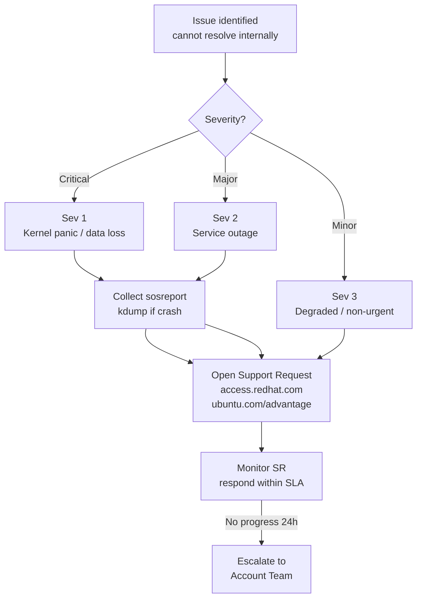

---
tags:
  - linux
  - troubleshooting
search:
  boost: 1.5
---
# Linux — Escalation


<div class="kb-summary">
Vendor escalation procedures and support contacts.

*Applies to: RHEL / Ubuntu LTS*
</div>

## Before you begin

- **Access:** root or sudo-capable account on target hosts
- **Gather first:** recent error message text, event timestamps, and affected object names
- **Scope:** confirm whether the issue affects a single object, host, cluster, or site
- **Escalation:** open a vendor support ticket before running any destructive step
- **Logging:** document each command and output — required if escalation is needed

---

## Escalation Decision Flow


```text
┌──────────────────────────────────── Linux — Escalation Procedures ────────────────────────────────────┐
│                                                                                                       │
│  Escalation paths, contacts, and runbooks when Linux issues exceed local resolution.                  │
│                                                                                                       │
│   ┌──────────────────────────────────────────────┐  ┌─────────────────────────────────────────────┐   │
│   │             Escalation Triggers              │  │               Escalation Path               │   │
│   │            Production outage >15m            │  │               L1: ops on-call               │   │
│   │           Data loss risk detected            │  │            L2: senior Linux admin           │   │
│   │            Kernel panic recurring            │  │              L3: vendor support             │   │
│   │          Security breach suspected           │  │             CISO + legal notify             │   │
│   │           Hardware fault confirmed           │  │           DC ops + hardware vendor          │   │
│   └──────────────────────────────────────────────┘  └─────────────────────────────────────────────┘   │
│                                                                                                       │
│   ┌──────────────────────────────────────────────┐  ┌─────────────────────────────────────────────┐   │
│   │            Information to Gather             │  │               Post-Escalation               │   │
│   │            hostname / kernel ver             │  │             Create RCA document             │   │
│   │           dmesg + journalctl dump            │  │                Update runbook               │   │
│   │             sar / vmstat output              │  │             File bug with vendor            │   │
│   │              Recent change log               │  │             Apply preventive fix            │   │
│   │             Network topology map             │  │             Schedule post-mortem            │   │
│   └──────────────────────────────────────────────┘  └─────────────────────────────────────────────┘   │
│                                                                                                       │
│  Physical Infrastructure (the hardware everything above runs on):                                     │
│  x86-64 servers · IPMI/iDRAC OOB · phone bridge · monitoring dashboards                               │
│                                                                                                       │
│  Key terms:                                                                                           │
│                                                                                                       │
│  escalation  = Formal handover of an issue to a higher-tier resolver or vendor                        │
│  RCA         = Root Cause Analysis; document explaining what failed and why                           │
│  post-mortem = Blameless review meeting after incident; produces action items                         │
│  runbook     = Step-by-step procedure document for known operational tasks                            │
│  P1/P2       = Priority classification; P1 = critical production impact                               │
│  on-call     = Rotation of engineers responsible for responding outside hours                         │
│  CISO        = Chief Information Security Officer; leads security escalations                         │
│  OOB         = Out-of-Band management; IPMI/iDRAC for access when OS is down                          │
│  change log  = Record of recent system changes; critical for incident correlation                     │
│  SLA         = Service Level Agreement; defines uptime and response targets                           │
│  MTTR        = Mean Time To Repair; average time to restore service after failure                     │
│  war room    = Bridge call with all stakeholders during major incident                                │
│                                                                                                       │
└───────────────────────────────────────────────────────────────────────────────────────────────────────┘
```

### Checking Subscription Status

```bash
subscription-manager status
subscription-manager list --installed   # Verify products are registered
subscription-manager list --consumed    # Verify entitlements consumed
```

If entitlement shows `Invalid`: run `subscription-manager refresh` and check the RH portal.

### RHEL Lifecycle Dates

| Version | Full Support EOL | Maintenance Support EOL | Extended Life (RHEL ELS) |
|---|---|---|---|
| RHEL 9 | May 2027 | May 2032 | Optional |
| RHEL 8 | May 2024 | May 2029 | Optional |
| RHEL 7 | August 2019 | June 2024 | Available until June 2028 |

Track lifecycle in CMDB — alert 90 days before Full Support EOL to initiate leapp upgrade.

## Canonical (Ubuntu)

### Opening a Support Case

Support portal: [ubuntu.com/advantage](https://ubuntu.com/advantage) (Ubuntu Pro)

```bash
# Check Ubuntu Pro status
pro status
pro attach <token>   # If not yet attached
```

### Collecting Diagnostics

```bash
# Ubuntu Pro apport-collect for kernel/package issues
ubuntu-bug linux   # Interactive — opens Launchpad by default
# For non-interactive collection:
apport-collect --output /tmp/ubuntu-diag.tgz
```

### Ubuntu LTS Support Timeline

| Version | Standard Support | Ubuntu Pro (LTS) | Notes |
|---|---|---|---|
| Ubuntu 24.04 LTS | April 2029 | April 2034 | Current LTS |
| Ubuntu 22.04 LTS | April 2027 | April 2032 | Active |
| Ubuntu 20.04 LTS | April 2025 | April 2030 | ESM only |

## Escalation

| Situation | Action |
|---|---|
| Kernel panic / hang | Collect crash dump (`/var/crash/`) + sosreport; open Sev 1 SR |
| Data corruption | Do not run fsck without vendor guidance; open SR first |
| Security vulnerability (CVE) | Check Red Hat Security Advisories; apply errata; open SR if patch unavailable |
| Subscription/licensing | Contact Red Hat account team or use portal chat |

## Crash Dump Configuration

```bash
# RHEL — verify kdump is configured
systemctl status kdump
cat /etc/kdump.conf | grep path   # Default: /var/crash

# Test kdump is enabled
cat /proc/cmdline | grep crashkernel   # Should include crashkernel=auto or explicit value
```

Crash dumps must be available before opening a kernel-related SR.

---

## Verify resolution

- Confirm the original symptom no longer occurs
- Check logs for any residual errors related to the issue
- Monitor for 10–15 minutes to confirm the fix is stable

---

## See also

- [Linux — Diagnostics](../diagnostics/)
- [Linux — Common Issues](../common-issues/)
