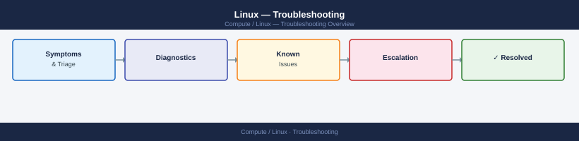

---
tags:
  - linux
  - troubleshooting
search:
  boost: 1.5
---
# Linux — Troubleshooting


<div class="kb-summary">
Linux — Troubleshooting navigation for Common Issues, Diagnostics, Escalation.

*Applies to: RHEL / Ubuntu LTS*
</div>



<div class="kb-grid kb-grid-3">
<a class="kb-card" href="common-issues/"><strong>Common Issues</strong><span>Quick reference for common problems and resolutions.</span></a>
<a class="kb-card" href="diagnostics/"><strong>Diagnostics</strong><span>Diagnostic procedures and log analysis.</span></a>
<a class="kb-card" href="escalation/"><strong>Escalation</strong><span>Vendor escalation procedures and support contacts.</span></a>
<a class="kb-card" href="high-cpu/"><strong>High CPU</strong><span>High CPU diagnosis — process-level analysis, run queues, kernel profiling, JVM threads, and remediation on Linux, Windows, and ESXi.</span></a>
</div>

```d2
direction: down

symptom: Identify Symptom {shape: diamond}
symptom_index: "Symptom Index" {shape: rectangle}
resolution: Resolve or Escalate {shape: oval}

symptom -> symptom_index: investigate
symptom_index -> resolution
```

## Symptom Index

| Symptom | Platform | Where to look |
|---|---|---|
| High CPU / load | Linux | `top`, `perf top`, `ps aux --sort=-%cpu` |
| High CPU | Windows | Task Manager → Resource Monitor → CPU tab |
| Memory exhaustion / OOM | Linux | `dmesg | grep oom`, `/var/log/messages` |
| Service won't start | Linux | `journalctl -u <svc> -n 50`, `systemctl status` |
| Service won't start | Windows | Event Viewer → Windows Logs → System/Application |
| Disk full | Linux | `df -h`, `du -sh /*` |
| Disk I/O bottleneck | Linux | `iostat -xz 1 5`, `iotop` |
| Network unreachable | Both | `ping`, `traceroute`/`tracert`, `ss -tnp`/`netstat -an` |
| DNS failure | Both | `dig @<server>`, `nslookup`, `Resolve-DnsName` |
| DB connection refused | MySQL/PG/MSSQL | Check service running, port open, firewall, pg_hba/login |
| Replication broken | MySQL/PG/MSSQL | `SHOW REPLICA STATUS` / `pg_stat_replication` / AG DMVs |
| AD login failures | Windows | `dcdiag /test:dns`, Event ID 4625 in Security log |
