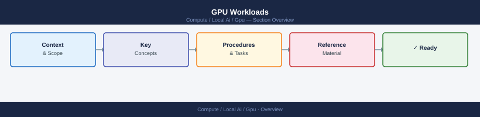

# GPU Workloads

<div class="kb-summary">
GPU compute for AI/ML workloads runs on the NVIDIA CUDA platform (driver, CUDA toolkit, cuDNN). Coverage includes GPU family selection for training vs inference, VRAM sizing, driver/CUDA compatibility, performance tuning, and monitoring thermal health and ECC errors.
</div>



<div class="kb-grid kb-grid-5">

<a class="kb-card" href="sizing/">
  <strong>Sizing</strong>
  <span>VRAM estimation for models by parameter count and precision, multi-GPU topology considerations, and instance/SKU selection guidance.</span>
</a>

<a class="kb-card" href="drivers/">
  <strong>Drivers</strong>
  <span>NVIDIA driver installation, CUDA toolkit version matrix, cuDNN requirements, and managing driver upgrades without reboots.</span>
</a>

<a class="kb-card" href="monitoring/">
  <strong>Monitoring</strong>
  <span>nvidia-smi metrics, nvtop live monitoring, DCGM for datacenter deployments, Prometheus GPU exporter, and alerting thresholds.</span>
</a>

<a class="kb-card" href="performance/">
  <strong>Performance</strong>
  <span>Batch size tuning, tensor parallelism for multi-GPU inference, quantisation impact, and throughput vs latency trade-offs.</span>
</a>

<a class="kb-card" href="troubleshooting/">
  <strong>Troubleshooting</strong>
  <span>CUDA out-of-memory errors, driver version mismatches, GPU not detected, thermal throttling, and ECC memory errors.</span>
</a>

</div>

```d2
direction: right

center: "GPU Compute" {shape: hexagon}
quick_reference: "Quick Reference" {shape: rectangle}
common_operations: "Common Operations" {shape: rectangle}
key_considerations: "Key Considerations" {shape: rectangle}

center -> quick_reference
center -> common_operations
center -> key_considerations
```

## Quick Reference

### GPU Family Reference

| GPU | Memory | Memory BW | Best For |
|---|---|---|---|
| H100 SXM | 80 GB HBM3 | 3.35 TB/s | Large model training, high-throughput inference |
| A100 SXM | 80 GB HBM2e | 2 TB/s | Training, large batch inference |
| A100 PCIe | 40 / 80 GB HBM2e | 1.6–2 TB/s | Multi-GPU inference servers |
| L40S | 48 GB GDDR6 | 864 GB/s | Cost-efficient inference, generative AI |
| L4 | 24 GB GDDR6 | 300 GB/s | Edge inference, video, small models |
| A30 | 24 GB HBM2 | 933 GB/s | Inference, mixed workloads |
| A40 | 48 GB GDDR6 | 696 GB/s | Inference, rendering, visualisation |
| T4 | 16 GB GDDR6 | 320 GB/s | Legacy inference, cost-sensitive workloads |

### CUDA Driver Version Matrix

| CUDA Version | Minimum Driver (Linux) | Minimum Driver (Windows) |
|---|---|---|
| CUDA 12.6 | 560.28.03 | 560.76 |
| CUDA 12.4 | 550.54.14 | 551.61 |
| CUDA 12.2 | 535.54.03 | 536.25 |
| CUDA 12.0 | 525.60.13 | 527.41 |
| CUDA 11.8 | 520.61.05 | 520.06 |

### VRAM Sizing Formula

```text
VRAM required ≈ (parameters × bytes_per_param) ÷ 0.85

Bytes per parameter:
  FP32  = 4 bytes
  BF16/FP16 = 2 bytes
  INT8  = 1 byte
  INT4/Q4 = 0.5 bytes

Examples:
  7B  @ FP16  = 7e9 × 2 ÷ 0.85 ≈ 16.5 GB
  13B @ FP16  = 13e9 × 2 ÷ 0.85 ≈ 30.6 GB
  70B @ INT4  = 70e9 × 0.5 ÷ 0.85 ≈ 41 GB
```

## Common Operations

```bash
# Check GPU presence, driver version, and CUDA version
nvidia-smi

# Real-time monitoring — refresh every 1 second
nvidia-smi -l 1

# Monitor key metrics in columns (dmon)
nvidia-smi dmon -s pucvmet

# Check GPU topology (NVLink, PCIe connections between GPUs)
nvidia-smi topo -m

# Check CUDA compiler version
nvcc --version

# List all GPUs with detailed info
nvidia-smi --query-gpu=index,name,driver_version,memory.total,memory.used,memory.free,utilization.gpu,temperature.gpu,power.draw --format=csv,noheader

# Watch VRAM usage live for a specific process
watch -n 1 nvidia-smi --query-compute-apps=pid,used_memory --format=csv

# Check ECC (error-correcting code memory) status
nvidia-smi --query-gpu=ecc.errors.corrected.volatile.total,ecc.errors.uncorrected.volatile.total --format=csv

# Set GPU to persistence mode (keeps driver loaded, reduces first-request latency)
sudo nvidia-smi -pm 1

# Set power limit (watts) — useful for thermal/power capping
sudo nvidia-smi --power-limit=300

# Install nvidia-container-toolkit (for Docker GPU access)
distribution=$(. /etc/os-release; echo $ID$VERSION_ID)
curl -s -L https://nvidia.github.io/libnvidia-container/gpgkey | sudo apt-key add -
curl -s -L https://nvidia.github.io/libnvidia-container/$distribution/libnvidia-container.list | \
  sudo tee /etc/apt/sources.list.d/nvidia-container-toolkit.list
sudo apt update && sudo apt install -y nvidia-container-toolkit
sudo systemctl restart docker
```

```bash
# Run a GPU-enabled Docker container
docker run --gpus all nvidia/cuda:12.4.0-base-ubuntu22.04 nvidia-smi

# Run with specific GPU (by index)
docker run --gpus '"device=0,1"' my-inference-image

# Check GPU from inside a container
python3 -c "import torch; print(torch.cuda.is_available()); print(torch.cuda.get_device_name(0))"
```

```python
import torch

# Basic GPU checks
print(f"CUDA available: {torch.cuda.is_available()}")
print(f"GPU count: {torch.cuda.device_count()}")
print(f"GPU name: {torch.cuda.get_device_name(0)}")
print(f"VRAM total: {torch.cuda.get_device_properties(0).total_memory / 1e9:.1f} GB")
print(f"VRAM free: {torch.cuda.memory_reserved(0) / 1e9:.1f} GB reserved")

# Check memory usage during inference
torch.cuda.reset_peak_memory_stats()
# ... run model ...
peak_mem = torch.cuda.max_memory_allocated(0) / 1e9
print(f"Peak VRAM used: {peak_mem:.2f} GB")
```

## Key Considerations

- **Driver and CUDA version lock-in:** The CUDA toolkit version required by a framework (PyTorch, TensorFlow) must be compatible with the installed NVIDIA driver. Always check the framework's CUDA compatibility matrix before upgrading drivers on production machines. Upgrading the driver without checking can break existing workloads.
- **VRAM is the hard limit:** Unlike system RAM, VRAM cannot be swapped. If a model doesn't fit, the process crashes with `CUDA out of memory`. Plan VRAM headroom of ~15% above the model footprint for KV cache, activations, and runtime overhead.
- **Persistence mode reduces latency:** Without persistence mode, the driver unloads between jobs, adding seconds of cold-start latency. Enable it on inference servers with `nvidia-smi -pm 1` and set it to survive reboots via systemd or a startup script.
- **Thermal throttling degrades throughput:** GPUs throttle when they approach their thermal limit (typically 83-87°C for data centre GPUs). Monitor temperature with `nvidia-smi` and ensure chassis airflow is adequate. Sustained throttling indicates a cooling problem, not a software issue.
- **ECC memory errors need attention:** Single-bit corrected errors (SBE) are usually benign but indicate VRAM degradation. Uncorrected (UBE/DBE) errors cause crashes and require GPU replacement. Monitor ECC counters and alert on any uncorrected errors.
- **Multi-GPU topology matters:** For tensor-parallel inference across multiple GPUs, NVLink bandwidth (e.g., 600 GB/s on A100) far exceeds PCIe (e.g., 64 GB/s). Use `nvidia-smi topo -m` to verify GPU-to-GPU interconnect before assuming good multi-GPU performance — PCIe-only systems may bottleneck on all-reduce operations.
