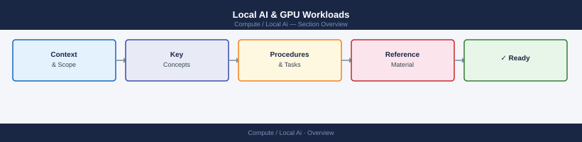

# Local AI & GPU Workloads

On-premises AI/ML compute — GPU hardware management, driver configuration, and running large language models locally with Ollama. Covers sizing, performance, and operational procedures for GPU-accelerated infrastructure.

*Applies to: Local AI*

<a class="kb-card" href="ollama/">
  <strong>Ollama (Local LLMs)</strong>
  Run LLMs locally on-prem using Ollama — model management, GPU acceleration, CLI reference, and API integration.
</a>

<a class="kb-card" href="gpu/">
  <strong>GPU Workloads</strong>
  GPU instance types, driver management, CUDA toolkits, performance tuning, and workload scheduling for AI/ML.
</a>

