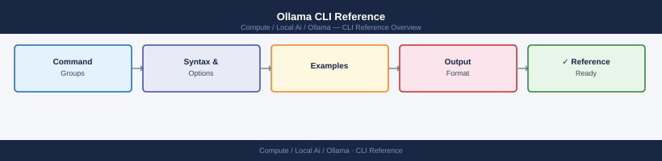

---
tags:
  - ollama
  - ai
  - local-ai
---
# Ollama CLI Reference


<div class="kb-summary">
Ollama is a tool for running large language models locally. You download models to your machine and talk to them through the `ollama` command or its built-in API server — no cloud account or API key required.

*Applies to: Ollama*
</div>



 Models are stored as layers (similar to Docker images) and run on your GPU if one is available, or fall back to CPU.

> Install on macOS with `brew install ollama` or download from ollama.com. On Linux, use the install script: `curl -fsSL https://ollama.com/install.sh | sh`. Start the server with `ollama serve` (runs automatically as a service on macOS after install).
---

```d2
direction: right

center: "Ollama" {shape: rectangle}
model_management: "Model Management" {shape: rectangle}
running_models: "Running Models" {shape: rectangle}
server: "Server" {shape: rectangle}
custom_models_modelfiles: "Custom Models (Modelfiles)" {shape: rectangle}
environment_configuration: "Environment & Configuration" {shape: rectangle}
common_patterns: "Common Patterns" {shape: rectangle}

center -> model_management
center -> running_models
center -> server
center -> custom_models_modelfiles
center -> environment_configuration
center -> common_patterns
```

## Model Management

Download, list, remove, and copy models. Models are pulled from the Ollama registry by name — use `name:tag` to pin a specific version or quantization level. If you omit the tag, you get the default (usually `latest`).

```bash
# Download a model
ollama pull llama3.2
ollama pull llama3.2:3b               # specific size variant
ollama pull llama3.2:3b-instruct-q4_K_M  # specific quantization
ollama pull mistral
ollama pull gemma3:27b
ollama pull nomic-embed-text          # embedding model (not chat)
ollama pull qwen2.5-coder:7b          # code-focused model

# List downloaded models
ollama list
ollama ls                             # alias for list

# Show model details (architecture, parameters, quantization)
ollama show llama3.2
ollama show llama3.2 --modelfile      # show the Modelfile used to create it
ollama show llama3.2 --parameters     # show sampling parameters
ollama show llama3.2 --template       # show the prompt template

# Remove a model (frees disk space)
ollama rm llama3.2
ollama rm llama3.2:3b

# Copy a model under a new name (useful before customizing)
ollama cp llama3.2 my-custom-llama

# Push a model to the Ollama registry (requires account)
ollama push my-namespace/my-model
```

---

## Running Models

Start an interactive chat session or send a one-shot prompt from the command line. The model server is started automatically when you run `ollama run` if it isn't already running.

```bash
# Start an interactive chat session
ollama run llama3.2
ollama run mistral
ollama run llama3.2:70b              # run the 70B parameter version

# Send a single prompt (non-interactive — useful in scripts)
ollama run llama3.2 "Explain what a VLAN is in one sentence"
echo "What is iSCSI?" | ollama run llama3.2

# Multiline input in interactive mode
# Use triple-quote to start a multiline block:
# >>> """
# ... line 1
# ... line 2
# ... """

# Pass an image (multimodal models only)
ollama run llava "Describe this image" /path/to/image.png

# Useful interactive session commands
# /show info        — show current model details
# /show modelfile   — show the Modelfile
# /set parameter num_ctx 4096  — change context window mid-session
# /set verbose      — show token counts and generation speed
# /bye or Ctrl-D    — exit

# Check which models are currently loaded (running in memory)
ollama ps
```

---

## Server

The Ollama server exposes a local REST API on port 11434. It manages model loading, keeps recently used models in GPU memory, and handles concurrent requests. You typically don't need to start it manually — it runs as a background service.

```bash
# Start the server manually (foreground)
ollama serve

# Start with a custom host/port
OLLAMA_HOST=0.0.0.0:11434 ollama serve   # listen on all interfaces

# Check server health (returns {"status":"ok"} if running)
curl http://localhost:11434/

# List running models via API
curl http://localhost:11434/api/ps

# Send a chat request via API
curl http://localhost:11434/api/chat \
  -d '{"model":"llama3.2","messages":[{"role":"user","content":"Hello"}]}'

# Generate (single-turn, no history) via API
curl http://localhost:11434/api/generate \
  -d '{"model":"llama3.2","prompt":"What is Terraform?","stream":false}'

# Pull a model via API
curl http://localhost:11434/api/pull \
  -d '{"name":"mistral"}'

# Generate an embedding vector
curl http://localhost:11434/api/embed \
  -d '{"model":"nomic-embed-text","input":"Some text to embed"}'
```

---

## Custom Models (Modelfiles)

A Modelfile is a plain-text recipe that defines a custom model — you can base it on any downloaded model and change the system prompt, sampling parameters, and prompt template. Think of it like a Dockerfile but for LLMs.

```bash
# Create a Modelfile
cat > Modelfile <<'EOF'
FROM llama3.2

# System prompt — sets the model's persona and constraints
SYSTEM """
You are a senior infrastructure engineer. Answer questions concisely
with a focus on production-readiness and operational impact.
"""

# Sampling parameters (optional overrides)
PARAMETER temperature 0.5       # lower = more deterministic
PARAMETER top_p 0.9
PARAMETER num_ctx 8192          # context window in tokens
PARAMETER num_predict 1024      # max tokens to generate
EOF

# Build the model from the Modelfile
ollama create infra-assistant -f Modelfile

# Test it
ollama run infra-assistant "What happens when a Fibre Channel link goes down?"

# Update a model (edit Modelfile, then recreate with same name)
ollama create infra-assistant -f Modelfile

# Modelfile FROM variants
# FROM llama3.2                  — use a registry model
# FROM ./model.gguf              — use a local GGUF file
# FROM my-namespace/my-model    — use a registry model you pushed
```

---

## Environment & Configuration

Ollama's behavior is controlled through environment variables. On macOS, set these in the service's launchd plist or export them in your shell before running `ollama serve`. On Linux (systemd), add them to `/etc/systemd/system/ollama.service.d/override.conf`.

```bash
# Common environment variables
OLLAMA_HOST=0.0.0.0:11434       # bind address for the API server (default: 127.0.0.1:11434)
OLLAMA_MODELS=/data/ollama      # custom model storage path (default: ~/.ollama/models)
OLLAMA_NUM_PARALLEL=2           # max concurrent model requests
OLLAMA_MAX_LOADED_MODELS=2      # how many models to keep in GPU memory simultaneously
OLLAMA_KEEP_ALIVE=5m            # how long to keep a model loaded after last request (default: 5m)
OLLAMA_FLASH_ATTENTION=1        # enable flash attention (better GPU memory use)
OLLAMA_GPU_OVERHEAD=0           # reserve GPU VRAM (bytes) for other processes
CUDA_VISIBLE_DEVICES=0,1        # limit to specific GPUs (NVIDIA)
ROCR_VISIBLE_DEVICES=0          # limit to specific GPUs (AMD)

# macOS: edit launchd environment to persist settings
launchctl setenv OLLAMA_HOST "0.0.0.0:11434"

# Linux (systemd): create an override to add env vars
sudo systemctl edit ollama
# Add:
# [Service]
# Environment="OLLAMA_HOST=0.0.0.0:11434"
# Environment="OLLAMA_MODELS=/data/ollama/models"
sudo systemctl daemon-reload && sudo systemctl restart ollama

# Check disk usage of model storage
du -sh ~/.ollama/models/
du -sh ~/.ollama/models/manifests/registry.ollama.ai/library/*/

# Log location
# macOS: journalctl or Console.app (system log) — Ollama logs to stderr
# Linux: journalctl -u ollama -f
journalctl -u ollama -f
journalctl -u ollama --since "1 hour ago"
```

---

## Common Patterns

```bash
# Quick model comparison — same prompt, different models
for model in llama3.2 mistral gemma3:4b; do
  echo "=== $model ===" && ollama run "$model" "What is a storage aggregate?" && echo
done

# Pipe output into another tool
ollama run llama3.2 "List 5 Linux commands for disk troubleshooting" | grep -E '^\d\.'

# Use in a shell script (non-interactive)
RESPONSE=$(ollama run llama3.2 "Summarize in one line: $INPUT")

# Keep a model warm (prevent it from being unloaded)
curl http://localhost:11434/api/generate \
  -d '{"model":"llama3.2","keep_alive":-1,"prompt":""}'

# Unload a model immediately (free GPU memory)
curl http://localhost:11434/api/generate \
  -d '{"model":"llama3.2","keep_alive":0,"prompt":""}'

# Find all GGUF files on disk (useful when importing local models)
find ~ -name "*.gguf" 2>/dev/null

# Import a local GGUF and run it
echo "FROM /path/to/model.gguf" | ollama create my-local-model -f -
ollama run my-local-model
```

## See also

- [Ollama — Overview](../../)
