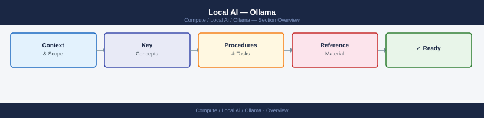

# Local AI — Ollama

<div class="kb-summary">
Ollama runs open-weight LLMs locally, exposing an OpenAI-compatible REST API with automatic model download, quantisation, and GPU offloading (NVIDIA CUDA and Apple Silicon Metal). Coverage includes VRAM sizing, quantisation selection, network binding, model management, and troubleshooting.

*Applies to: Ollama*
</div>



<div class="kb-grid kb-grid-6">

<a class="kb-card" href="cli-reference/">
  <strong>CLI Reference</strong>
  <span>ollama run, pull, push, list, copy, delete, serve, and model management commands.</span>
</a>

<a class="kb-card" href="install-notes/">
  <strong>Install Notes</strong>
  <span>Installation on Linux, macOS, and Docker; systemd service configuration; environment variable setup for model storage and GPU layers.</span>
</a>

<a class="kb-card" href="models/">
  <strong>Models</strong>
  <span>Available model families (Llama, Mistral, Phi, Gemma, CodeLlama), quantisation variants, VRAM requirements, and embedding models.</span>
</a>

<a class="kb-card" href="gpu-usage/">
  <strong>GPU Usage</strong>
  <span>CUDA and Metal GPU detection, OLLAMA_GPU_LAYERS config, VRAM usage monitoring, and CPU fallback behaviour.</span>
</a>

<a class="kb-card" href="testing/">
  <strong>Testing</strong>
  <span>REST API testing with curl and Python, OpenAI-compatible client usage, response validation, and benchmark approaches.</span>
</a>

<a class="kb-card" href="troubleshooting/">
  <strong>Troubleshooting</strong>
  <span>GPU not detected, out-of-VRAM errors, slow inference on CPU, model load failures, and API connectivity issues.</span>
</a>

</div>

## Quick Reference

### Common Models and VRAM Requirements

| Model | Tag | VRAM (Q4_K_M) | Best For |
|---|---|---|---|
| `llama3.2` | `llama3.2:3b` | ~2 GB | Fast responses, resource-constrained |
| `llama3.2` | `llama3.2:latest` (8B) | ~5 GB | General tasks, good quality |
| `llama3.1` | `llama3.1:70b` | ~40 GB | High-quality reasoning, large VRAM needed |
| `mistral` | `mistral:latest` (7B) | ~4.5 GB | Instruction following, low latency |
| `phi3` | `phi3:mini` (3.8B) | ~2.5 GB | Coding, reasoning, small footprint |
| `gemma2` | `gemma2:9b` | ~6 GB | Balanced general use |
| `codellama` | `codellama:13b` | ~8 GB | Code generation and completion |
| `nomic-embed-text` | `nomic-embed-text:latest` | ~300 MB | Embeddings for RAG pipelines |

### Key Environment Variables

| Variable | Default | Purpose |
|---|---|---|
| `OLLAMA_HOST` | `127.0.0.1:11434` | Bind address — set to `0.0.0.0:11434` to expose on network |
| `OLLAMA_MODELS` | `~/.ollama/models` | Model storage directory |
| `OLLAMA_GPU_LAYERS` | auto | Number of transformer layers to offload to GPU |
| `OLLAMA_NUM_PARALLEL` | `1` | Number of concurrent model requests |
| `OLLAMA_MAX_LOADED_MODELS` | `1` | How many models to keep loaded in VRAM |

### REST API Endpoints

| Endpoint | Method | Purpose |
|---|---|---|
| `/api/generate` | POST | Single-turn text generation |
| `/api/chat` | POST | Multi-turn chat (OpenAI messages format) |
| `/api/embed` | POST | Generate embeddings |
| `/api/tags` | GET | List locally available models |
| `/api/show` | POST | Model metadata and parameters |
| `/api/pull` | POST | Pull a model from registry |

## Common Operations

```bash
# Pull a model
ollama pull llama3.2
ollama pull nomic-embed-text

# Run interactively
ollama run llama3.2

# Run with a one-shot prompt (non-interactive)
ollama run mistral "Explain VLAN tagging in one paragraph"

# List downloaded models
ollama list

# Show running models and VRAM usage
ollama ps

# Remove a model
ollama rm codellama:13b

# Start the server manually (if not running as a service)
ollama serve

# Check API is up
curl http://localhost:11434/api/tags

# Single generate call
curl http://localhost:11434/api/generate \
  -d '{"model": "llama3.2", "prompt": "What is BGP?", "stream": false}'

# Chat endpoint (OpenAI-compatible format)
curl http://localhost:11434/api/chat \
  -d '{
    "model": "llama3.2",
    "messages": [{"role": "user", "content": "Explain subnetting"}],
    "stream": false
  }'

# Generate embeddings
curl http://localhost:11434/api/embed \
  -d '{"model": "nomic-embed-text", "input": "Text to embed"}'
```

```python
# Use Ollama via the OpenAI-compatible client
from openai import OpenAI

client = OpenAI(
    base_url="http://localhost:11434/v1",
    api_key="ollama"  # required by client, not validated by Ollama
)

response = client.chat.completions.create(
    model="llama3.2",
    messages=[{"role": "user", "content": "Summarise BGP route selection"}]
)
print(response.choices[0].message.content)

# Generate embeddings for RAG
response = client.embeddings.create(
    model="nomic-embed-text",
    input="Infrastructure as Code with Terraform"
)
vector = response.data[0].embedding
print(f"Embedding dimensions: {len(vector)}")
```

## Key Considerations

- **VRAM is the primary constraint:** A model must fit in VRAM for GPU-accelerated inference. If VRAM is insufficient, Ollama falls back to CPU for the overflow layers — this is much slower. Use `ollama ps` to see how many layers are GPU-offloaded vs CPU-resident.
- **Quantisation trade-off:** `Q4_K_M` (4-bit with medium quality) is the recommended default — it halves VRAM vs FP16 with minimal quality loss. `Q8_0` is near-FP16 quality at 8-bit. Avoid `Q2` quantisation as quality degrades significantly.
- **Network exposure:** By default Ollama binds to `127.0.0.1` only. To expose it on a network (e.g., for use by other services), set `OLLAMA_HOST=0.0.0.0:11434` and ensure firewall rules restrict access appropriately — there is no built-in authentication.
- **Model loading latency:** The first request after a model is pulled loads it into VRAM, which takes a few seconds. Subsequent requests are fast. `OLLAMA_MAX_LOADED_MODELS` controls how many models stay resident; increase this if switching between models frequently.
- **OpenAI API compatibility:** Ollama's `/v1/chat/completions` and `/v1/embeddings` endpoints are compatible with the OpenAI SDK — just change `base_url` and set a dummy `api_key`. This makes it easy to swap between local and cloud models in development.
- **Resource cleanup:** Long-running ollama processes hold models in VRAM indefinitely. On shared machines, use `ollama stop <model>` or restart the service to free VRAM after workloads complete.
