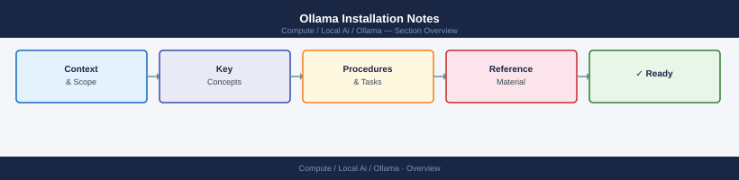

---
tags:
  - ollama
  - ai
  - local-ai
---
# Ollama Installation Notes


<div class="kb-summary">
Ollama supports Linux, macOS, and Windows. On Linux, the recommended setup is the official install script or a manually configured systemd service. Docker is also well-supported.

*Applies to: Ollama*
</div>



```d2
direction: right

center: "Ollama" {shape: hexagon}
linux_installation: "Linux Installation" {shape: rectangle}
macos_installation: "macOS Installation" {shape: rectangle}
windows_installation: "Windows Installation" {shape: rectangle}
systemd_service_configuration: "Systemd Service Configuration" {shape: rectangle}
docker_setup: "Docker Setup" {shape: rectangle}
key_environment_variables: "Key Environment Variables" {shape: rectangle}

center -> linux_installation
center -> macos_installation
center -> windows_installation
center -> systemd_service_configuration
center -> docker_setup
center -> key_environment_variables
```

## Linux Installation

```bash
# Official one-liner (installs to /usr/local/bin, creates systemd service)
curl -fsSL https://ollama.com/install.sh | sh

# Verify installation
ollama --version
systemctl status ollama

# The installer creates:
# - /usr/local/bin/ollama (binary)
# - /etc/systemd/system/ollama.service (service file)
# - ollama user and group
# - /usr/share/ollama/.ollama (model storage)
```

## macOS Installation

```bash
# Download the macOS app from ollama.com, or use Homebrew
brew install ollama

# Start as a background service
brew services start ollama

# Or run interactively
ollama serve

# Models are stored in ~/.ollama/models
```

## Windows Installation

Download the installer from [ollama.com](https://ollama.com). Ollama installs as a Windows service. Models are stored in `C:\Users\<user>\.ollama\models`.

For WSL2 users, install the Linux version inside WSL2. GPU passthrough requires WSL2 with CUDA support (Windows 11 or Windows 10 21H2+).

## Systemd Service Configuration

The default service binds to `127.0.0.1:11434`. To expose on all interfaces or a different port:

```bash
# Edit the service override
mkdir -p /etc/systemd/system/ollama.service.d
cat > /etc/systemd/system/ollama.service.d/override.conf << 'EOF'
[Service]
Environment="OLLAMA_HOST=0.0.0.0:11434"
Environment="OLLAMA_MODELS=/data/ollama/models"
Environment="OLLAMA_NUM_PARALLEL=4"
Environment="OLLAMA_MAX_LOADED_MODELS=2"
EOF

systemctl daemon-reload
systemctl restart ollama
```

## Docker Setup

```bash
# CPU only
docker run -d \
  -v ollama-models:/root/.ollama \
  -p 11434:11434 \
  --name ollama \
  ollama/ollama

# NVIDIA GPU
docker run -d \
  --gpus all \
  -v ollama-models:/root/.ollama \
  -p 11434:11434 \
  --name ollama \
  ollama/ollama

# AMD GPU (ROCm)
docker run -d \
  --device /dev/kfd --device /dev/dri \
  -v ollama-models:/root/.ollama \
  -p 11434:11434 \
  --name ollama \
  ollama/ollama:rocm

# Verify it's running
curl http://localhost:11434/api/tags
```

## Key Environment Variables

| Variable | Default | Description |
|---|---|---|
| `OLLAMA_HOST` | `127.0.0.1:11434` | Listen address and port |
| `OLLAMA_MODELS` | `~/.ollama/models` | Model storage directory |
| `OLLAMA_NUM_PARALLEL` | `1` | Concurrent request handling |
| `OLLAMA_MAX_LOADED_MODELS` | `1` | Max models in memory |
| `OLLAMA_KEEP_ALIVE` | `5m` | How long to keep model loaded |
| `OLLAMA_DEBUG` | `0` | Enable verbose debug logging |
| `OLLAMA_FLASH_ATTENTION` | `0` | Enable flash attention |
| `CUDA_VISIBLE_DEVICES` | (all) | Which GPUs to use |

## Updating Ollama

```bash
# Linux: re-run the install script
curl -fsSL https://ollama.com/install.sh | sh

# macOS with Homebrew
brew upgrade ollama
brew services restart ollama

# Docker: pull the new image
docker pull ollama/ollama
docker stop ollama && docker rm ollama
# Re-run the docker run command with the same volume
```

## Storage Planning

Models can be large. Ensure the model storage directory has sufficient space:

```bash
# Check space used by current models
du -sh ~/.ollama/models/

# List models and their sizes
ollama list

# Remove unused models
ollama rm llama2:7b
```
