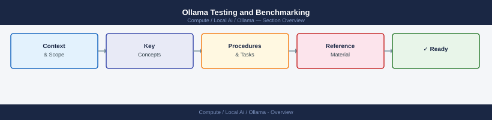

---
tags:
  - ollama
  - ai
  - local-ai
---
# Ollama Testing and Benchmarking


<div class="kb-summary">
This page covers testing Ollama with the CLI and REST API, benchmarking inference speed, comparing models, and validating API compatibility.

*Applies to: Ollama*
</div>



```d2
direction: right

center: "Ollama" {shape: hexagon}
basic_cli_testing: "Basic CLI Testing" {shape: rectangle}
rest_api_testing_with_curl: "REST API Testing with curl" {shape: rectangle}
streaming_responses: "Streaming Responses" {shape: rectangle}
benchmarking_throughput: "Benchmarking Throughput" {shape: rectangle}
model_comparison_script: "Model Comparison Script" {shape: rectangle}
performance_reference_table: "Performance Reference Table" {shape: rectangle}

center -> basic_cli_testing
center -> rest_api_testing_with_curl
center -> streaming_responses
center -> benchmarking_throughput
center -> model_comparison_script
center -> performance_reference_table
```

## Basic CLI Testing

```bash
# Interactive chat
ollama run llama3.1:8b

# Single-shot non-interactive prompt
ollama run llama3.1:8b "Explain TCP/IP in one paragraph"

# Pipe input
echo "What is 2+2?" | ollama run llama3.1:8b

# Read from file
ollama run llama3.1:8b < prompt.txt

# Multi-line prompt
ollama run llama3.1:8b "$(cat << 'EOF'
You are a helpful assistant.
Question: What are the main differences between TCP and UDP?
EOF
)"
```

## REST API Testing with curl

The Ollama REST API is compatible with the OpenAI API format.

```bash
# Generate (non-chat) completion
curl http://localhost:11434/api/generate \
  -d '{
    "model": "llama3.1:8b",
    "prompt": "What is Kubernetes?",
    "stream": false
  }' | jq '.response'

# Chat completion (OpenAI-compatible)
curl http://localhost:11434/v1/chat/completions \
  -H "Content-Type: application/json" \
  -d '{
    "model": "llama3.1:8b",
    "messages": [
      {"role": "system", "content": "You are a concise assistant."},
      {"role": "user", "content": "What is a container?"}
    ],
    "temperature": 0.7,
    "max_tokens": 256
  }' | jq '.choices[0].message.content'

# List available models
curl http://localhost:11434/api/tags | jq '.models[].name'

# Check running model status
curl http://localhost:11434/api/ps | jq
```

## Streaming Responses

```python
import requests, json

response = requests.post(
    "http://localhost:11434/api/generate",
    json={"model": "llama3.1:8b", "prompt": "Write a haiku about GPUs"},
    stream=True
)

for line in response.iter_lines():
    if line:
        chunk = json.loads(line)
        print(chunk.get("response", ""), end="", flush=True)
        if chunk.get("done"):
            print()
            print(f"\nTokens: {chunk['prompt_eval_count']} prompt, {chunk['eval_count']} generated")
            print(f"Speed: {chunk['eval_count'] / (chunk['eval_duration'] / 1e9):.1f} tokens/sec")
```

## Benchmarking Throughput

```bash
# Simple throughput test using time
time ollama run llama3.1:8b "Write 500 words about machine learning" --nowordwrap > /dev/null

# Measure tokens per second from API response stats
curl -s http://localhost:11434/api/generate \
  -d '{"model":"llama3.1:8b","prompt":"Count from 1 to 100","stream":false}' \
  | jq '{
    tokens_per_sec: (.eval_count / (.eval_duration / 1e9)),
    prompt_tokens: .prompt_eval_count,
    output_tokens: .eval_count,
    total_duration_s: (.total_duration / 1e9)
  }'
```

## Model Comparison Script

```python
import requests, time, json

MODELS = ["llama3.1:8b", "mistral:7b", "phi3:mini"]
PROMPT = "Explain what a neural network is in 3 sentences."

results = []
for model in MODELS:
    start = time.time()
    resp = requests.post(
        "http://localhost:11434/api/generate",
        json={"model": model, "prompt": PROMPT, "stream": False}
    ).json()
    elapsed = time.time() - start

    tps = resp["eval_count"] / (resp["eval_duration"] / 1e9)
    results.append({
        "model": model,
        "tokens": resp["eval_count"],
        "tokens_per_sec": round(tps, 1),
        "total_sec": round(elapsed, 2),
        "response": resp["response"][:150]
    })

# Print comparison table
print(f"{'Model':<25} {'Tokens':>7} {'T/s':>8} {'Time(s)':>9}")
print("-" * 55)
for r in results:
    print(f"{r['model']:<25} {r['tokens']:>7} {r['tokens_per_sec']:>8} {r['total_sec']:>9}")
```

## Performance Reference Table

Approximate tokens/sec on common hardware (Q4_K_M, context=2048):

| Model | RTX 3060 12GB | RTX 4090 | A10G | A100 80GB |
|---|---|---|---|---|
| 7B / 8B | ~50 t/s | ~110 t/s | ~80 t/s | ~180 t/s |
| 13B | ~28 t/s | ~65 t/s | ~45 t/s | ~120 t/s |
| 30B–34B | OOM | ~30 t/s | OOM | ~55 t/s |
| 70B | OOM | OOM | OOM | ~28 t/s |

## Embeddings API

```bash
curl http://localhost:11434/api/embed \
  -d '{
    "model": "nomic-embed-text",
    "input": "The sky is blue"
  }' | jq '.embeddings[0] | length'
```
